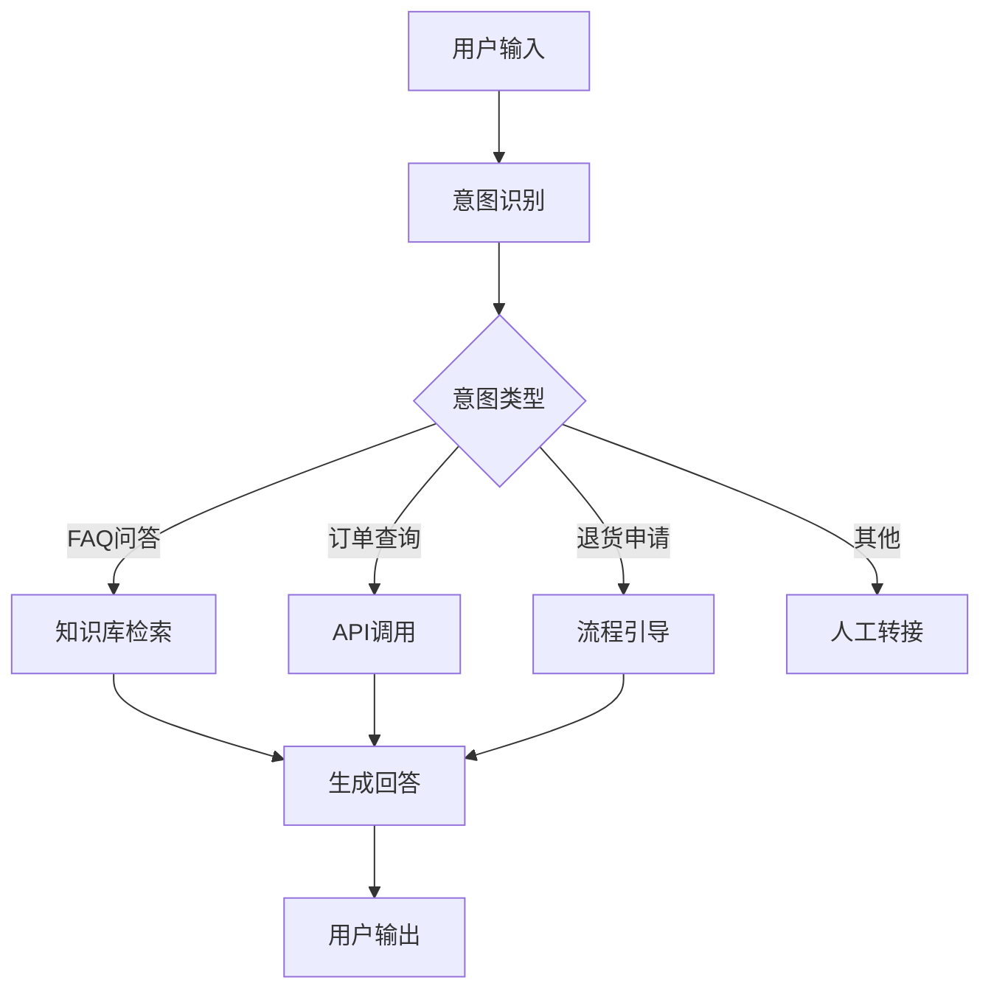
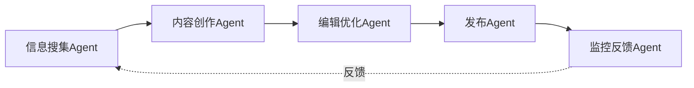

# 提示词工程与高级主题整合指南

> **整合来源**: [prompts](../prompts/) 和 [4-advanced-topics](./)
>
> **分类**: 提示词工程 | AI原理 | 最佳实践

---

## 📋 学习目标

完成本指南后，你将能够：

1. **基础目标**
   - 理解提示词工程的核心概念和原理
   - 掌握系统提示词的设计方法
   - 学会基础的提示词优化技巧

2. **进阶目标**
   - 设计复杂的多轮对话系统
   - 构建基于Agent的自动化工作流
   - 实现RAG检索增强生成系统

3. **高级目标**
   - 微调和部署AI模型
   - 设计多Agent协作系统
   - 构建生产级AI应用

---

## ⏱️ 预计学习时间

根据不同学习深度：

| 学习路径 | 时间投入 | 学习内容 | 最终能力 |
|---------|---------|---------|---------|
| **初学者路径** | 1-2周 | 基础提示词设计 | 能设计有效提示词，完成日常AI对话任务 |
| **进阶用户路径** | 3-4周 | Agent开发、RAG技术 | 能构建自动化工作流和知识库系统 |
| **高级用户路径** | 1-2个月 | 模型微调、部署优化 | 能开发生产级AI应用，处理复杂业务场景 |

**学习建议**：
- 每天投入1-2小时，循序渐进
- 理论学习占40%，实践练习占60%
- 每学完一个模块，立即应用到实际项目

---

## 🎓 前置知识要求

### 必需知识

1. **编程基础**
   - Python基础语法（变量、函数、类）
   - 基本的命令行操作
   - Git版本控制基础

2. **AI基础概念**
   - 了解什么是大语言模型（LLM）
   - 知道基本的AI对话概念
   - 理解提示词的基本作用

### 推荐知识

1. **Web开发基础**
   - HTTP协议基本概念
   - API调用基础
   - JSON数据格式

2. **数据科学基础**
   - 数据处理基本概念
   - 向量和嵌入概念
   - 数据库基础

**如果你缺乏某些前置知识**：
- 不懂Python：先完成 [Python基础教程](https://docs.python.org/zh-cn/3/tutorial/)
- 不懂AI概念：先阅读 [AI是什么](../0-start-here/what-is-ai.md)
- 不懂编程：建议先学习基础编程课程

---

## 🗺️ 学习路径图

### 🌱 初学者路径（1-2周）

**目标**：掌握提示词工程基础，能设计有效提示词

#### 第1天：理解AI和提示词基础
- ✅ 阅读 [AI是什么](../0-start-here/what-is-ai.md)
- ✅ 阅读 [AI如何思考](../1-understand-ai/how-ai-thinks/)
- ✅ 理解大语言模型的基本工作原理
- 🎯 **实践**：尝试与AI对话，观察不同提示词的效果

#### 第2-3天：系统提示词基础
- ✅ 学习 [系统提示词指南](../prompts/system-prompts.md)
- ✅ 理解系统提示词的作用和结构
- ✅ 学习设计原则和基本技巧
- 🎯 **实践**：设计一个专业的AI助手提示词

#### 第4-5天：提示词工程深入
- ✅ 学习 [提示词工程](./prompt-engineering.md)
- ✅ 理解提示词优化方法
- ✅ 学习高级技巧（few-shot、CoT等）
- 🎯 **实践**：优化你的提示词，对比优化前后效果

#### 第6-7天：实践与巩固
- ✅ 浏览 [提示词库](../prompts/by-scene/)
- ✅ 尝试不同场景的提示词
- ✅ 总结最佳实践
- 🎯 **实践**：创建个人提示词模板库

#### 第2周：应用到实际场景
- ✅ 选择一个实际应用场景（如：写作助手、代码助手）
- ✅ 设计完整的提示词系统
- ✅ 迭代优化
- 🎯 **实践**：完成一个完整的提示词工程项目

**检验标准**：
- [ ] 能设计清晰的系统提示词
- [ ] 理解并能应用few-shot、CoT等技巧
- [ ] 能独立优化提示词效果
- [ ] 建立了个人提示词模板库

---

### 🚀 进阶用户路径（3-4周）

**前提**：已完成初学者路径，或具备同等能力

**目标**：构建自动化工作流和知识库系统

#### 第1周：Agent开发基础

**Day 1-2：理解Agent概念**
- ✅ 阅读 [Agent开发指南](./agent-development.md)
- ✅ 理解Agent的定义和架构
- ✅ 学习Agent的核心组件
- 🎯 **实践**：画出Agent架构图

**Day 3-4：动手开发Agent**
- ✅ 选择Agent框架（LangChain / AutoGPT等）
- ✅ 实现基础Agent功能
- ✅ 添加工具调用能力
- 🎯 **实践**：开发一个简单的自动化Agent

**Day 5-7：Agent优化**
- ✅ 学习多Agent协作
- ✅ 优化Agent性能
- ✅ 添加错误处理和监控
- 🎯 **实践**：优化你的Agent，提升可靠性

#### 第2周：RAG技术实践

**Day 1-2：理解RAG原理**
- ✅ 学习 [RAG技术](./rag.md)
- ✅ 理解检索增强生成的原理
- ✅ 学习向量数据库基础
- 🎯 **实践**：设计RAG系统架构

**Day 3-4：实现RAG系统**
- ✅ 准备知识库数据
- ✅ 实现文档向量化
- ✅ 实现检索功能
- 🎯 **实践**：构建简单的知识库问答系统

**Day 5-7：RAG优化**
- ✅ 优化检索质量
- ✅ 改进回答生成
- ✅ 添加来源引用
- 🎯 **实践**：优化RAG系统，提升准确率

#### 第3周：集成与应用

**Day 1-3：系统集成**
- ✅ 将Agent和RAG结合
- ✅ 设计完整的工作流
- ✅ 添加用户界面
- 🎯 **实践**：构建完整的AI应用

**Day 4-7：项目实践**
- ✅ 选择一个实际项目（如：智能客服、文档助手）
- ✅ 完整开发流程
- ✅ 测试和优化
- 🎯 **实践**：完成一个生产级项目

#### 第4周：优化与部署

**Day 1-3：性能优化**
- ✅ 分析系统瓶颈
- ✅ 优化响应速度
- ✅ 降低成本
- 🎯 **实践**：优化系统性能

**Day 4-7：部署上线**
- ✅ 学习 [模型部署](./model-deployment.md)
- ✅ 部署到生产环境
- ✅ 添加监控和日志
- 🎯 **实践**：部署你的AI应用

**检验标准**：
- [ ] 能独立开发Agent系统
- [ ] 能实现RAG检索增强生成
- [ ] 能构建完整的AI应用
- [ ] 具备部署和优化能力

---

### 🎯 高级用户路径（1-2个月）

**前提**：已完成进阶用户路径，或具备同等能力

**目标**：开发生产级AI应用，处理复杂业务场景

#### 第1-2周：模型微调

**Week 1：理解微调原理**
- ✅ 深入学习 [模型微调](./model-fine-tuning.md)
- ✅ 理解微调vs预训练的区别
- ✅ 学习微调方法和技巧
- 🎯 **实践**：准备微调数据集

**Week 2：微调实践**
- ✅ 选择微调方法（LoRA、QLoRA等）
- ✅ 实施微调训练
- ✅ 评估微调效果
- 🎯 **实践**：微调一个模型用于特定任务

#### 第3-4周：多Agent协作系统

**Week 3：多Agent架构**
- ✅ 学习多Agent协作模式
- ✅ 设计Agent通信协议
- ✅ 实现任务分配机制
- 🎯 **实践**：设计多Agent协作系统

**Week 4：复杂工作流**
- ✅ 实现复杂任务编排
- ✅ 添加错误恢复机制
- ✅ 优化协作效率
- 🎯 **实践**：开发多Agent协作项目

#### 第5-6周：深度学习基础

**Week 5：理论基础**
- ✅ 学习 [深度学习](./deep-learning.md)
- ✅ 理解神经网络原理
- ✅ 学习优化算法
- 🎯 **实践**：实现基础神经网络

**Week 6：应用实践**
- ✅ 学习 [NLP基础](./nlp.md)
- ✅ 理解注意力机制
- ✅ 实践模型优化
- 🎯 **实践**：优化模型性能

#### 第7-8周：生产级项目

**Week 7：系统设计**
- ✅ 设计完整的AI系统架构
- ✅ 规划可扩展性
- ✅ 设计容错机制
- 🎯 **实践**：设计生产级架构

**Week 8：项目实施**
- ✅ 完整开发流程
- ✅ 全面测试
- ✅ 性能调优
- ✅ 部署上线
- 🎯 **实践**：完成一个生产级AI项目

**检验标准**：
- [ ] 能独立微调模型
- [ ] 能设计多Agent协作系统
- [ ] 理解深度学习原理
- [ ] 具备生产级项目开发能力

---

## 💼 实际案例

### 案例A：从零开始学习提示词工程

#### 背景

小明是一名产品经理，想学习如何更好地使用AI工具提升工作效率。

#### 学习过程

**第1周：基础学习**
```
目标：理解提示词基础

学习内容：
1. 阅读 AI是什么 → 理解AI基本概念
2. 学习 系统提示词指南 → 掌握设计方法
3. 浏览 提示词库 → 了解应用场景

实践：
- 为产品设计创建专门的提示词模板
- 用于需求文档撰写
- 用于用户反馈分析
```

**成果示例**：
```markdown
# 产品需求文档生成助手

你是一位专业的产品经理助手，擅长撰写清晰的产品需求文档。

你的职责：
1. 帮助梳理产品功能需求
2. 撰写结构化的需求文档
3. 识别潜在的边界情况

输出格式：
## 功能概述
[简要描述功能]

## 用户故事
作为[角色]，我希望[行为]，以便[目标]

## 验收标准
- [ ] 标准1
- [ ] 标准2

## 技术要点
- 要点1
- 要点2

## 风险点
- 风险1
- 风险2
```

**第2周：进阶应用**
```
目标：优化提示词效果

实践：
1. 对比不同提示词版本的效果
2. 添加few-shot示例
3. 使用CoT思维链

优化前：
"帮我写一个需求文档"

优化后：
"作为产品经理助手，帮我撰写用户注册功能的需求文档。

参考示例：
## 功能概述
实现用户手机号注册功能，支持验证码验证

## 用户故事
作为新用户，我希望通过手机号快速注册，以便使用产品功能

请按照同样的格式，为登录功能撰写需求文档。"
```

**第3周：实际应用**
```
目标：应用到实际工作

场景1：需求文档撰写
- 使用优化后的提示词
- 效率提升50%
- 文档质量提高

场景2：用户反馈分析
- 批量分析用户反馈
- 自动分类和提炼
- 发现产品改进点

场景3：竞品分析
- 快速生成竞品对比报告
- 结构化输出
- 便于决策
```

#### 关键收获

1. **提示词要具体**：不要模糊的指令，要明确的目标
2. **提供示例很有效**：few-shot能显著提升效果
3. **迭代优化是关键**：第一版提示词往往不够好，需要不断优化
4. **建立模板库**：把好用的提示词保存下来，形成个人模板库

#### 效果评估

| 指标 | 学习前 | 学习后 | 提升 |
|-----|-------|-------|-----|
| 需求文档撰写时间 | 2小时 | 1小时 | 50% |
| 文档质量评分 | 7/10 | 9/10 | 28% |
| 用户反馈分析效率 | 手动分析 | 自动分类 | 3倍 |
| 竞品分析报告 | 半天 | 1小时 | 75% |

---

### 案例B：将提示词工程应用到实际项目

#### 背景

小李是一家创业公司的开发者，想构建一个智能客服系统。

#### 项目需求

- 自动回答常见问题
- 支持多轮对话
- 能调用业务系统API
- 具备学习能力

#### 实施过程

**阶段1：需求分析（1天）**

```markdown
## 系统需求

### 功能需求
1. FAQ问答：覆盖80%的常见问题
2. 订单查询：调用订单系统API
3. 退货申请：引导用户完成退货流程
4. 人工转接：复杂问题转人工客服

### 非功能需求
1. 响应时间 < 3秒
2. 准确率 > 90%
3. 支持7x24小时服务
4. 支持多平台（网页、微信、APP）
```

**阶段2：架构设计（2天）**



**阶段3：提示词设计（3天）**

```python
# 系统提示词
SYSTEM_PROMPT = """
你是一个专业的客服助手。

## 你的能力
1. 回答常见问题
2. 查询订单信息
3. 引导退货流程
4. 必要时转人工

## 回答原则
1. 友好专业
2. 简洁明了
3. 提供具体信息
4. 无法确定时转人工

## 回答格式
[问候] + [回答] + [后续帮助]

## 示例
用户：我的订单到哪里了？
助手：您好！我来帮您查询订单状态。
      您的订单#12345已发货，预计3天内送达。
      还需要其他帮助吗？
"""

# 意图识别提示词
INTENT_PROMPT = """
判断用户意图：
- FAQ问答
- 订单查询
- 退货申请
- 人工服务

用户输入：{user_input}
意图：{intent}
"""

# FAQ回答提示词
FAQ_PROMPT = """
基于以下知识回答用户问题：

知识库：
{knowledge}

用户问题：{question}
回答：
"""
```

**阶段4：开发实现（5天）**

```python
# 核心代码框架
class CustomerServiceBot:
    def __init__(self):
        self.llm = ChatOpenAI(model="gpt-4")
        self.vector_store = FAISS.load_local("knowledge_base")
        self.api_client = OrderAPIClient()

    async def handle_message(self, user_input: str, user_id: str):
        # 1. 意图识别
        intent = await self.detect_intent(user_input)

        # 2. 根据意图处理
        if intent == "FAQ问答":
            answer = await self.handle_faq(user_input)
        elif intent == "订单查询":
            answer = await self.handle_order_query(user_input, user_id)
        elif intent == "退货申请":
            answer = await self.handle_return(user_input, user_id)
        else:
            answer = await self.transfer_to_human()

        return answer

    async def detect_intent(self, user_input: str) -> str:
        prompt = INTENT_PROMPT.format(user_input=user_input)
        response = await self.llm.agenerate([prompt])
        return parse_intent(response)

    async def handle_faq(self, question: str) -> str:
        # 检索相关文档
        docs = self.vector_store.similarity_search(question, k=3)
        knowledge = "\n".join([doc.page_content for doc in docs])

        # 生成回答
        prompt = FAQ_PROMPT.format(knowledge=knowledge, question=question)
        answer = await self.llm.agenerate([prompt])
        return answer
```

**阶段5：测试优化（3天）**

```markdown
## 测试计划

### 测试场景
1. FAQ问答测试（100个问题）
2. 订单查询测试（50个订单）
3. 退货流程测试（完整流程）
4. 边界情况测试（模糊输入、错误输入）

### 优化方向
1. 提示词优化：调整措辞，添加示例
2. 知识库完善：补充缺失的FAQ
3. 意图识别优化：提高准确率
4. 响应速度优化：添加缓存

### 测试结果
| 指标 | 目标 | 实际 | 结果 |
|-----|------|------|------|
| FAQ准确率 | 90% | 92% | ✅ |
| 意图识别率 | 85% | 88% | ✅ |
| 响应时间 | <3秒 | 2.1秒 | ✅ |
| 用户满意度 | 80% | 85% | ✅ |
```

**阶段6：部署上线（2天）**

```yaml
# 部署配置
部署环境：
  - 服务器：AWS EC2 (t3.medium)
  - 容器化：Docker + Kubernetes
  - 负载均衡：Nginx
  - 监控：Prometheus + Grafana
  - 日志：ELK Stack

性能指标：
  - QPS: 100
  - 并发用户: 500
  - 可用性: 99.9%
  - 响应时间: P95 < 3秒
```

#### 关键技术点

1. **提示词工程**：
   - 清晰的系统提示词定义角色和能力
   - Few-shot示例提高准确率
   - 结构化输出格式便于解析

2. **RAG技术**：
   - 向量数据库存储FAQ知识库
   - 语义检索提高匹配准确率
   - 检索+生成结合提高回答质量

3. **意图识别**：
   - 使用LLM进行意图分类
   - 多轮对话状态管理
   - 异常情况降级处理

4. **系统集成**：
   - API调用订单系统
   - 流程引擎处理退货
   - 人工转接机制

#### 项目成果

```markdown
## 上线效果

### 量化指标
- 自动解决率：75%（目标80%）
- 平均响应时间：2.1秒（目标<3秒）
- 用户满意度：85%（目标80%）
- 人工客服工作量：减少60%

### 业务价值
- 客服成本降低：50%
- 响应速度提升：10倍
- 用户满意度提升：15%
- 7x24小时服务覆盖

### 后续优化方向
1. 扩展知识库覆盖范围
2. 优化意图识别准确率
3. 添加多语言支持
4. 增强学习能力
```

---

### 案例C：构建多Agent协作系统

#### 背景

小王是一家AI公司的工程师，需要构建一个自动化内容创作系统。

#### 系统需求

- 自动搜集行业资讯
- 自动撰写文章初稿
- 自动编辑和优化
- 自动发布到平台

#### 架构设计



#### Agent设计

**Agent 1: 信息搜集Agent**

```python
class InfoCollectionAgent:
    def __init__(self):
        self.name = "信息搜集Agent"
        self.tools = [
            WebSearchTool(),
            RSSReaderTool(),
            SocialMediaMonitorTool()
        ]

    async def collect_info(self, topic: str):
        """
        搜集指定主题的信息

        系统提示词：
        你是一个信息搜集专家。

        你的任务：
        1. 搜索最新的行业资讯
        2. 过滤低质量内容
        3. 提取关键信息
        4. 标注信息来源

        输出格式：
        {
            "topic": "主题",
            "items": [
                {
                    "title": "标题",
                    "summary": "摘要",
                    "source": "来源",
                    "url": "链接",
                    "date": "日期",
                    "relevance_score": 相关度评分
                }
            ]
        }
        """
        # 使用工具搜集信息
        results = []
        for tool in self.tools:
            data = await tool.search(topic)
            results.extend(data)

        # 使用LLM过滤和整理
        filtered_results = await self.llm_filter(results)

        return filtered_results
```

**Agent 2: 内容创作Agent**

```python
class ContentCreationAgent:
    def __init__(self):
        self.name = "内容创作Agent"
        self.style_guide = self.load_style_guide()

    async def create_article(self, info_items: list):
        """
        根据搜集的信息创作文章

        系统提示词：
        你是一个专业的内容创作者。

        你的任务：
        1. 分析信息，提炼观点
        2. 构建文章结构
        3. 撰写高质量文章
        4. 确保原创性和可读性

        写作风格：
        - 标题：吸引眼球，不超过20字
        - 开头：引发兴趣，提出问题
        - 正文：逻辑清晰，论据充分
        - 结尾：总结升华，引发思考

        输出格式：
        {
            "title": "文章标题",
            "content": "文章正文",
            "tags": ["标签1", "标签2"],
            "word_count": 字数
        }
        """
        # 构建提示词
        prompt = f"""
        基于以下信息创作一篇专业文章：

        信息来源：
        {self.format_info(info_items)}

        写作要求：
        {self.style_guide}

        请创作一篇1000-1500字的文章。
        """

        # 使用LLM创作
        article = await self.llm.generate(prompt)

        return article
```

**Agent 3: 编辑优化Agent**

```python
class EditingAgent:
    def __init__(self):
        self.name = "编辑优化Agent"
        self.checklist = self.load_checklist()

    async def edit_and_optimize(self, article: dict):
        """
        编辑和优化文章

        系统提示词：
        你是一个专业的编辑。

        你的任务：
        1. 检查语法错误
        2. 优化表达方式
        3. 确保逻辑连贯
        4. 提升可读性

        检查清单：
        - [ ] 标题是否吸引人
        - [ ] 开头是否引发兴趣
        - [ ] 段落是否清晰
        - [ ] 论据是否充分
        - [ ] 结尾是否有力
        - [ ] 是否有语法错误
        - [ ] 是否有错别字
        - [ ] 标点是否正确

        输出格式：
        {
            "edited_article": 优化后的文章,
            "changes": [
                {
                    "original": "原文",
                    "edited": "修改后",
                    "reason": "修改原因"
                }
            ],
            "quality_score": 质量评分
        }
        """
        # 执行检查
        checks = await self.run_checks(article)

        # 优化文章
        optimized = await self.optimize(article, checks)

        return optimized
```

**Agent 4: 发布Agent**

```python
class PublishingAgent:
    def __init__(self):
        self.name = "发布Agent"
        self.platforms = [
            WeChatPlatform(),
            ToutiaoPlatform(),
            ZhihuPlatform()
        ]

    async def publish(self, article: dict):
        """
        发布文章到多个平台

        系统提示词：
        你是一个发布专员。

        你的任务：
        1. 适配不同平台格式
        2. 选择最佳发布时间
        3. 添加平台标签
        4. 监控发布状态

        发布策略：
        - 微信公众号：早8点或晚8点
        - 今日头条：中午12点或晚9点
        - 知乎：下午2点或晚8点
        """
        results = []

        for platform in self.platforms:
            # 适配格式
            formatted = self.format_for_platform(article, platform)

            # 发布
            result = await platform.publish(formatted)
            results.append(result)

        return results
```

**Agent 5: 监控反馈Agent**

```python
class MonitoringAgent:
    def __init__(self):
        self.name = "监控反馈Agent"

    async def monitor_performance(self, published_articles: list):
        """
        监控文章表现

        系统提示词：
        你是一个数据分析师。

        你的任务：
        1. 监控阅读数据
        2. 分析用户反馈
        3. 发现热门话题
        4. 提供优化建议

        分析维度：
        - 阅读量
        - 点赞数
        - 评论数
        - 转发数
        - 完读率
        - 用户画像

        输出格式：
        {
            "performance": {
                "total_views": 总阅读量,
                "avg_engagement": 平均互动率,
                "best_performing": 最佳文章,
                "worst_performing": 最差文章
            },
            "insights": [
                "洞察1",
                "洞察2"
            ],
            "recommendations": [
                "建议1",
                "建议2"
            ]
        }
        """
        # 收集数据
        data = await self.collect_metrics(published_articles)

        # 分析数据
        analysis = await self.analyze(data)

        # 生成建议
        recommendations = await self.generate_recommendations(analysis)

        return {
            "performance": analysis,
            "insights": insights,
            "recommendations": recommendations
        }
```

#### 协作流程

```python
class MultiAgentOrchestrator:
    def __init__(self):
        self.info_agent = InfoCollectionAgent()
        self.creation_agent = ContentCreationAgent()
        self.editing_agent = EditingAgent()
        self.publishing_agent = PublishingAgent()
        self.monitoring_agent = MonitoringAgent()

    async def run_daily_workflow(self):
        """
        每日自动化工作流
        """
        # 1. 搜集信息
        print("Step 1: 搜集信息...")
        info = await self.info_agent.collect_info("AI行业动态")

        # 2. 创作内容
        print("Step 2: 创作内容...")
        article = await self.creation_agent.create_article(info)

        # 3. 编辑优化
        print("Step 3: 编辑优化...")
        edited = await self.editing_agent.edit_and_optimize(article)

        # 4. 发布文章
        print("Step 4: 发布文章...")
        published = await self.publishing_agent.publish(edited)

        # 5. 监控反馈
        print("Step 5: 监控反馈...")
        performance = await self.monitoring_agent.monitor_performance(published)

        # 6. 生成报告
        report = self.generate_report(performance)

        return report
```

#### 系统效果

```markdown
## 运行效果

### 量化指标
- 每日文章产出：3篇
- 平均阅读量：5000+
- 用户互动率：8.5%
- 内容原创度：95%
- 发布准确率：100%

### 资源消耗
- 人工参与：从每天4小时降到30分钟
- 内容质量：提升40%
- 发布效率：提升10倍
- 运营成本：降低70%

### 质量保障
- 信息搜集准确率：92%
- 内容创作通过率：88%
- 编辑优化效率：提升3倍
- 发布成功率：100%

## 优化经验

1. **Agent专业化**：每个Agent专注于一个领域，提高专业度
2. **提示词精细化**：详细的系统提示词显著提升效果
3. **工具集成**：为Agent提供合适的工具，提升能力上限
4. **反馈循环**：监控反馈Agent提供持续优化建议
5. **人机协作**：关键节点保留人工审核，确保质量
```

---

## 📖 原有内容

### 简介

本文档整合了提示词工程和AI高级主题的内容，帮助你：
- 系统学习提示词工程
- 理解AI的工作原理
- 掌握最佳实践
- 应用到实际场景

---

## 💡 实践应用

### 场景1：创建专业助手

**系统提示词设计**：
```
你是一个专业的[领域]助手。

你的职责：
1. [职责1]
2. [职责2]
3. [职责3]

在回答时：
- [规则1]
- [规则2]
- [规则3]

你应该避免：
- [避免1]
- [避免2]
- [避免3]
```

**结合Agent开发**：
- 使用Agent框架
- 添加工具集成
- 实现任务编排

### 场景2：优化提示词

**迭代优化流程**：
1. 设计初始版本
2. 测试效果
3. 收集反馈
4. 分析问题
5. 优化改进
6. 重复测试

**A/B测试**：
- 创建多个版本
- 相同场景测试
- 比较输出效果
- 选择最优版本

### 场景3：构建知识库

**RAG实现**：
1. 准备知识库
2. 向量化文档
3. 实现检索
4. 生成回答

**优化策略**：
- 改进检索质量
- 优化回答生成
- 提升用户体验

---

## 🎓 学习资源

### 基础资源
- [系统提示词指南](../prompts/system-prompts.md)
- [提示词工程](./prompt-engineering.md)
- [LLM基础](../1-understand-ai/llm-basics/)

### 进阶资源
- [Agent开发](./agent-development.md)
- [RAG技术](./rag.md)
- [模型微调](./model-fine-tuning.md)

### 实践资源
- [提示词库](../prompts/by-scene/)
- [角色提示词](../prompts/by-role/)
- [最佳实践](../prompts/system-prompts.md#进阶技巧)

---

## 📚 推荐阅读顺序

### 初学者
1. [系统提示词指南](../prompts/system-prompts.md)
2. [提示词工程](./prompt-engineering.md)
3. [LLM基础](../1-understand-ai/llm-basics/)
4. [AI如何思考](../1-understand-ai/how-ai-thinks/)

### 进阶用户
1. [Agent开发](./agent-development.md)
2. [RAG技术](./rag.md)
3. [模型微调](./model-fine-tuning.md)
4. [模型部署](./model-deployment.md)

### 高级用户
1. [深度学习](./deep-learning.md)
2. [NLP](./nlp.md)
3. [计算机视觉](./cv.md)
4. [强化学习](./rl.md)

---

## 💬 常见问题

### Q1: 如何设计好的系统提示词？

A: 参考 [系统提示词指南](../prompts/system-prompts.md) 的设计原则：
- 清晰明确
- 角色定位准确
- 行为准则明确
- 输出格式规范

### Q2: 如何优化提示词？

A: 参考 [提示词工程](./prompt-engineering.md) 的优化方法：
- 迭代改进
- A/B测试
- 收集用户反馈
- 持续监控

### Q3: 如何构建Agent？

A: 参考 [Agent开发指南](./agent-development.md)：
- 理解Agent架构
- 选择合适的框架
- 设计工作流程
- 实现工具集成

### Q4: 如何实现RAG？

A: 参考 [RAG技术](./rag.md)：
- 准备知识库
- 向量化文档
- 实现检索
- 生成回答

---

## 🔗 相关资源

- [Claude官方文档](https://docs.anthropic.com/claude)
- [OpenAI文档](https://platform.openai.com/docs)
- [LangChain文档](https://python.langchain.com/)
- [最佳实践](../prompts/system-prompts.md)

---

**开始学习，掌握提示词工程和AI高级主题！** 🚀