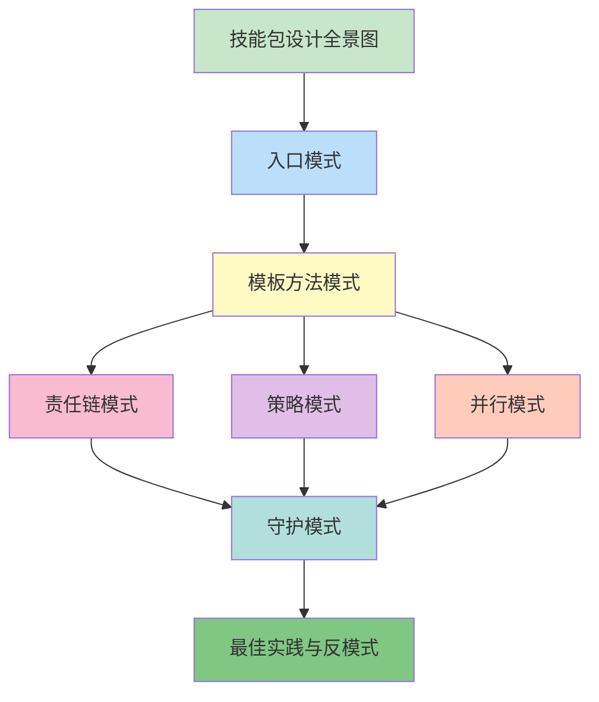

# 📚 技能包设计模式：从理论到实践

> **掌握AI技能包的核心设计理念，构建可扩展、可协作的技能生态系统**

## 课程简介

本课程深入剖析现代AI技能包的设计理念、架构模式和最佳实践。通过解析 Superpowers 和 Gstack 两大技能包的实际实现，你将学会如何设计高质量、可复用的技能系统。

### 目标读者

- **有经验的开发者** - 希望深入理解AI工具的设计原理
- **技能包开发者** - 想要构建自己的技能生态系统
- **架构师** - 需要设计可扩展的AI工具链

### 学习路径

```
第1章：技能包设计全景图
  ↓
第2章：入口模式 - 统一调度中心
  ↓
第3章：模板方法模式 - 流程编排
  ↓
第4章：责任链模式 - 质量保障
  ↓
第5章：策略模式 - 灵活决策
  ↓
第6章：并行模式 - 效率最大化
  ↓
第7章：守护模式 - 安全边界
  ↓
第8章：最佳实践与反模式
```

---

## 📖 课程章节

### 第1章：技能包设计全景图

**⏱️ 预计时长**：45分钟
**🎯 难度**：入门
**📋 内容概览**：
- 什么是技能包生态系统
- 五层架构设计（入口、流程、工具、收尾、守护）
- 职责分离与协作编排原则
- Superpowers vs Gstack 定位对比

**🔗 快速链接**：
- [中文版](./skills-package-design-patterns.md)
- [English Version](./en/skills-package-design-patterns.md)

**✅ 学习目标**：
- 理解技能包生态系统的价值
- 掌握五层架构的设计理念
- 了解 Superpowers 和 Gstack 的定位差异

---

### 第2章：入口模式 - 统一调度中心

**⏱️ 预计时长**：60分钟
**🎯 难度**：中级
**📋 内容概览**：
- 为什么需要统一入口
- `using-superpowers` 的路由逻辑
- 三种触发机制（描述触发、显式调用、链式唤醒）
- 如何设计自己的入口技能

**🔗 快速链接**：
- [中文版](./chapter-02-entry-pattern.md)
- [English Version](./en/chapter-02-entry-pattern.md)

**✅ 学习目标**：
- 掌握入口模式的设计理念
- 理解三种触发机制的区别
- 能够设计自己的入口技能

---

### 第3章：模板方法模式 - 流程编排的艺术

**⏱️ 预计时长**：75分钟
**🎯 难度**：中级
**📋 内容概览**：
- 固定骨架、可变细节的设计理念
- `writing-plans` 的五步骨架设计
- 技能调用机制（browse、design-consultation、plan-*-review）
- Superpowers 流程链 vs Gstack 工具调用对比

**🔗 快速链接**：
- [中文版](./chapter-03-template-method-pattern.md)
- [English Version](./en/chapter-03-template-method-pattern.md)

**✅ 学习目标**：
- 掌握模板方法模式的应用
- 理解如何在固定流程中保留灵活性
- 能够设计自己的模板方法技能

---

### 第4章：责任链模式 - 质量保障链

**⏱️ 预计时长**：70分钟
**🎯 难度**：中级
**📋 内容概览**：
- 层层把关的质量保障机制
- verification → review → qa → design-review 完整链条
- 每个节点的职责边界设计
- Superpowers 验证链 vs Gstack 质量链对比

**🔗 快速链接**：
- [中文版](./chapter-04-chain-of-responsibility.md)
- [English Version](./en/chapter-04-chain-of-responsibility.md)

**✅ 学习目标**：
- 掌握责任链模式的应用
- 理解质量保障链的设计原理
- 能够设计自己的责任链技能

---

### 第5章：策略模式 - 灵活决策机制

**⏱️ 预计时长**：65分钟
**🎯 难度**：中级
**📋 内容概览**：
- 根据场景选择不同策略
- `finishing-branch` 的三种合并策略
- 策略判断机制（分支类型、依赖关系、紧急程度）
- Superpowers 分支策略 vs 传统 Git 工作流对比

**🔗 快速链接**：
- [中文版](./chapter-05-strategy-pattern.md)
- [English Version](./en/chapter-05-strategy-pattern.md)

**✅ 学习目标**：
- 掌握策略模式的应用
- 理解如何设计灵活的决策机制
- 能够设计自己的策略模式技能

---

### 第6章：并行模式 - 效率最大化

**⏱️ 预计时长**：60分钟
**🎯 难度**：高级
**📋 内容概览**：
- 独立任务并行执行
- `dispatching-parallel-agents` 的实现机制
- 任务分解、Agent 调度、结果聚合
- 并行执行 vs 顺序执行的权衡

**🔗 快速链接**：
- [中文版](./chapter-06-parallel-pattern.md)
- [English Version](./en/chapter-06-parallel-pattern.md)

**✅ 学习目标**：
- 掌握并行模式的应用
- 理解如何识别可并行化的任务
- 能够设计自己的并行模式技能

---

### 第7章：守护模式 - 安全边界设计

**⏱️ 预计时长**：55分钟
**🎯 难度**：中级
**📋 内容概览**：
- 防御性编程理念
- careful, freeze, guard 三级防护
- 危险操作识别与拦截
- 设计自己的安全守护技能

**🔗 快速链接**：
- [中文版](./chapter-07-08-guardian-and-best-practices.md)
- [English Version](./en/chapter-07-08-guardian-and-best-practices.md)

**✅ 学习目标**：
- 掌握守护模式的设计理念
- 理解三级防护机制
- 能够设计自己的守护技能

---

### 第8章：最佳实践与反模式 - 经验总结

**⏱️ 预计时长**：50分钟
**🎯 难度**：中级
**📋 内容概览**：
- 技能设计的8大原则
- 10种常见反模式与规避方法
- 如何设计自己的技能包生态系统
- 技能包协作的未来趋势

**🔗 快速链接**：
- [中文版](./chapter-08-best-practices.md)
- [English Version](./en/chapter-08-best-practices.md)

**✅ 学习目标**：
- 掌握技能设计的核心原则
- 识别并避免常见反模式
- 能够设计完整的技能包生态系统

---

## 🗺️ 学习路径推荐

### 路径 A：快速入门（4小时）

适合：时间有限，想快速了解核心概念

1. **第1章**：技能包设计全景图（45分钟）
2. **第2章**：入口模式（60分钟）
3. **第8章**：最佳实践与反模式（50分钟）

**收获**：建立整体概念，了解核心模式

---

### 路径 B：深度学习（8小时）

适合：想系统学习，深入理解每个模式

按顺序学习全部8章

**收获**：全面掌握技能包设计，能够设计自己的技能系统

---

### 路径 C：实战导向（6小时）

适合：有项目需求，想边学边做

1. **第1章**：技能包设计全景图（45分钟）
2. **第3章**：模板方法模式（75分钟）
3. **第4章**：责任链模式（70分钟）
4. **第5章**：策略模式（65分钟）
5. **第6章**：并行模式（60分钟）
6. **第8章**：最佳实践与反模式（50分钟）

**收获**：掌握实战中最常用的模式

---

## 📊 知识图谱



---

## 🎯 设计模式速查表

| 模式 | 核心技能 | 关键价值 | 适用场景 |
|------|---------|---------|---------|
| 入口模式 | using-superpowers | 统一调度，智能路由 | 需要统一管理多个技能 |
| 模板方法模式 | writing-plans | 固定骨架，可变细节 | 标准化流程，保留灵活性 |
| 责任链模式 | verification → review | 层层把关，质量保障 | 需要多级验证的任务 |
| 策略模式 | finishing-branch | 灵活决策，动态选择 | 根据场景选择不同方案 |
| 并行模式 | dispatching-parallel-agents | 效率最大化，任务并行 | 独立任务可同时执行 |
| 守护模式 | careful, freeze, guard | 安全边界，分级保护 | 需要防止误操作 |

---

## 💡 学习建议

### 对于初学者

1. **从第1章开始**，建立整体概念
2. **边学边练**，每个模式都动手实践
3. **多做练习题**，巩固理解
4. **结合实际项目**，应用所学知识

### 对于有经验的开发者

1. **可以直接跳到感兴趣的模式**
2. **重点关注源码解析部分**
3. **对比分析不同技能包的实现**
4. **思考如何应用到自己的项目中**

### 对于技能包开发者

1. **深入学习每个模式的实现细节**
2. **研究 Superpowers 和 Gstack 的源码**
3. **设计自己的技能包生态系统**
4. **持续迭代和优化**

---

## 🔗 相关资源

### 官方文档

- [Claude Skills 官方文档](https://docs.anthropic.com/claude/docs/skills)
- [Superpowers GitHub](https://github.com/superpower/skills)
- [Gstack GitHub](https://github.com/garrytan/gstack)

### 推荐书籍

- [设计模式：可复用面向对象软件的基础](https://book.douban.com/subject/1052241/)
- [代码整洁之道](https://book.douban.com/subject/4199741/)
- [程序员修炼之道](https://book.douban.com/subject/1152111/)

### 社区资源

- [awesome-claude-skills](https://github.com/ComposioHQ/awesome-claude-skills)
- [Claude Code Discord](https://discord.gg/anthropic)

---

## 📝 练习与作业

### 基础练习

1. **概念理解**：用自己的话解释每个模式的核心价值
2. **模式识别**：分析一个现有的技能包，识别其中的设计模式
3. **对比分析**：对比两个相似模式（如责任链 vs 管道）的区别

### 进阶练习

1. **设计实践**：为自己的工作流程设计一个技能包
2. **代码实现**：实现一个简单的技能包原型
3. **性能优化**：分析一个技能包的性能瓶颈并提出优化方案

### 高级项目

1. **技能包生态系统**：设计一个完整的技能包生态系统架构
2. **跨平台技能**：设计一个可以在多个AI平台使用的技能包
3. **智能编排系统**：设计一个能够自动选择技能的编排系统

---

## 📈 学习进度追踪

使用以下清单追踪你的学习进度：

- [ ] 第1章：技能包设计全景图
  - [ ] 中文版
  - [ ] 英文版
  - [ ] 练习题完成

- [ ] 第2章：入口模式
  - [ ] 中文版
  - [ ] 英文版
  - [ ] 练习题完成

- [ ] 第3章：模板方法模式
  - [ ] 中文版
  - [ ] 英文版
  - [ ] 练习题完成

- [ ] 第4章：责任链模式
  - [ ] 中文版
  - [ ] 英文版
  - [ ] 练习题完成

- [ ] 第5章：策略模式
  - [ ] 中文版
  - [ ] 英文版
  - [ ] 练习题完成

- [ ] 第6章：并行模式
  - [ ] 中文版
  - [ ] 英文版
  - [ ] 练习题完成

- [ ] 第7章：守护模式
  - [ ] 中文版
  - [ ] 英文版
  - [ ] 练习题完成

- [ ] 第8章：最佳实践与反模式
  - [ ] 中文版
  - [ ] 英文版
  - [ ] 练习题完成

---

## 🎓 结业标准

完成以下内容即可视为课程结业：

1. ✅ 完成全部8章学习
2. ✅ 理解每个模式的核心概念
3. ✅ 完成80%以上的练习题
4. ✅ 能够识别技能包中的设计模式
5. ✅ 能够设计简单的技能包

---

## 🤝 反馈与贡献

### 问题反馈

如果你在学习过程中遇到问题，可以：
- 在 GitHub Issues 中提问
- 在社区论坛中讨论
- 查阅官方文档

### 内容贡献

如果你发现内容错误或有改进建议：
- 欢迎提交 Pull Request
- 提供改进建议
- 分享你的学习心得

---

## 📜 更新日志

- **2024-03-24**：课程首发，完成全部8章中英文双语内容
- **未来计划**：
  - 添加视频教程
  - 增加实战案例
  - 开发在线练习平台

---

## 📄 许可证

本课程内容采用 [CC BY-NC-SA 4.0](https://creativecommons.org/licenses/by-nc-sa/4.0/) 许可证。

---

**开始你的学习之旅吧！** 🚀

记住：实践出真知，时间是检验真理的唯一标准。用AI，但不盲从，辩证统一，不神话不妖魔化。