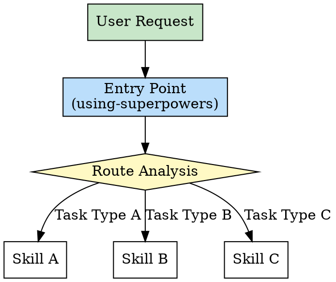
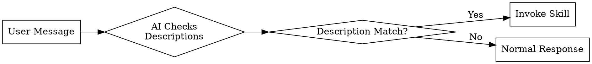
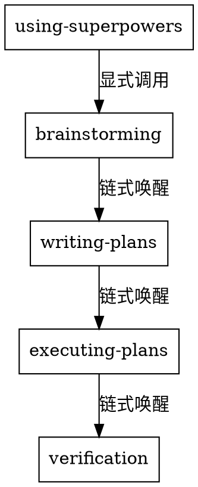

# 第2章：入口模式 - 统一调度中心

> **单一入口点，智能路由，确保流程连贯**

## 本章导读

入口模式是技能包生态系统的"门面"，它决定了用户如何与整个系统交互。一个设计良好的入口能降低认知负担、避免技能冲突、提供全局视角。本章将深入解析入口模式的设计理念、实现方式和最佳实践。

### 你将学到

- ✅ 为什么需要统一入口
- ✅ 入口模式的三种触发机制
- ✅ `using-superpowers` 的路由逻辑
- ✅ 如何设计自己的入口技能

---

## 2.1 概念：为什么需要统一入口

### 问题背景：没有入口的混乱

假设一个技能包系统有 20 个技能，如果没有统一入口，用户会面临：

```
❌ 问题场景 1：选择困难

用户："我想开发一个新功能"

AI："好的，我可以使用以下技能：
     - brainstorming
     - writing-plans
     - executing-plans
     - tdd
     - verification
     ...
     请问你想用哪个？"

用户："...我不知道，我是新手"
```

```
❌ 问题场景 2：技能冲突

用户："帮我写一个登录功能"

技能 A："我可以帮你规划"
技能 B："我可以直接写代码"
技能 C："我可以先做架构设计"

三个技能同时响应，造成混乱
```

```
❌ 问题场景 3：流程断裂

用户使用 brainstorming 后
不知道下一步该做什么

结果：创意有了，但没有后续动作
任务半途而废
```

### 解决方案：统一入口

**入口模式** 提供一个统一的调度中心：



### 入口的核心价值

| 价值维度 | 没有入口 | 有入口 |
|---------|---------|--------|
| **用户体验** | 需要记住所有技能名称 | 只需要描述需求 |
| **决策负担** | 用户自己选择技能 | 系统自动路由 |
| **流程连贯** | 容易断裂 | 自动衔接下一步 |
| **技能冲突** | 多个技能同时响应 | 统一调度，避免冲突 |
| **可维护性** | 新增技能影响面大 | 只需更新路由规则 |

### 入口的三大职责

**1. 接收请求**

```markdown
# 入口接收所有用户请求

用户："帮我开发一个登录功能"
用户："测试这个网页"
用户："重构这个模块"

入口不关心具体实现，只负责理解意图
```

**2. 分析意图**

```markdown
# 意图分析

用户："开发一个登录功能"
  → 分析：这是一个开发任务
  → 子类型：新功能开发
  → 特征：需要从创意到实现完整流程

用户："测试这个网页"
  → 分析：这是一个测试任务
  → 子类型：浏览器测试
  → 特征：需要浏览器自动化工具
```

**3. 路由决策**

```markdown
# 根据意图选择技能路径

开发任务 → brainstorming → writing-plans → ...
测试任务 → browse → qa → ...
重构任务 → first-principles → writing-plans → ...
```

---

## 2.2 实现：using-superpowers 的路由逻辑

### 技能概览

**技能名称**：`using-superpowers`

**描述**：Use when starting any conversation - establishes how to find and use skills, requiring Skill tool invocation before ANY response including clarifying questions

**定位**：超级技能包的入口守门人

### YAML Frontmatter 分析

```yaml
---
name: using-superpowers
description: Use when starting any conversation - establishes how to find and use skills, requiring Skill tool invocation before ANY response including clarifying questions
---

# 核心内容
```

**关键信息解读**：

1. **触发条件**：`starting any conversation` - 每次对话开始时触发
2. **核心职责**：`how to find and use skills` - 教会系统如何发现和调用技能
3. **强制要求**：`before ANY response` - 必须在响应前调用，优先级最高

### 路由逻辑详解

#### 步骤 1：检查是否有技能匹配

```markdown
# using-superpowers 伪代码

IF 用户请求匹配某个技能的描述:
    Invoke Skill tool with skill name
ELSE:
    Continue normal conversation
```

**匹配规则**：

| 用户请求关键词 | 匹配的技能 | 理由 |
|--------------|-----------|------|
| "开发"、"实现"、"创建功能" | brainstorming | 创意任务，需要探索方案 |
| "测试"、"验证" | verification | 验证任务，检查结果 |
| "重构"、"优化" | first-principles | 需要从第一性原理思考 |
| "部署"、"上线" | land-and-deploy | 部署任务 |
| "写一个..." | tdd | 开发任务，测试先行 |

#### 步骤 2：判断任务类型

```markdown
# 任务类型分类

IF 创意任务:
  → brainstorming (superpowers)
  → plan-design-review (gstack)

IF 开发任务:
  → writing-plans (superpowers)
  → plan-eng-review (gstack)
  → executing-plans (superpowers)
  → tdd (superpowers)
  → browse (gstack, 需要浏览器时)

IF 质量任务:
  → verification (superpowers)
  → review (gstack)
  → qa (gstack)
  → design-review (gstack)

IF 部署任务:
  → finishing-branch (superpowers)
  → land-and-deploy (gstack)
  → canary (gstack)
```

#### 步骤 3：构建执行链

```markdown
# 构建技能执行链

开发任务完整流程：
  using-superpowers
    ↓
  brainstorming
    ↓ (自动调用)
  writing-plans
    ↓ (自动调用)
  executing-plans
    ↓ (自动调用)
  tdd
    ↓ (自动调用)
  verification
```

### 实际案例演示

**案例 1：新功能开发**

```
用户："帮我开发一个用户认证系统"

using-superpowers 分析：
  1. 检测关键词："开发" → 开发任务
  2. 子类型判断："用户认证系统" → 新功能
  3. 确定流程：完整开发流程

执行链：
  → brainstorming (探索方案)
    思考：JWT vs Session？OAuth？
  → writing-plans (制定计划)
    规划：数据库设计 → API 开发 → 前端集成
  → executing-plans (执行)
    实现：逐步完成每个子任务
  → tdd (测试驱动)
    测试：单元测试 + 集成测试
  → verification (验证)
    确认：是否满足原始需求
```

**案例 2：Bug 修复**

```
用户："登录页面有个bug，点击按钮没反应"

using-superpowers 分析：
  1. 检测关键词："bug"、"没反应" → 问题调试
  2. 子类型判断：前端交互问题
  3. 确定流程：调试流程

执行链：
  → systematic-debugging (系统化调试)
    调查：定位问题根因
    假设：可能的事件监听器问题
    验证：检查代码
  → tdd (修复后测试)
    测试：确保修复不破坏其他功能
  → verification (验证)
    确认：bug 是否真正修复
```

**案例 3：代码审查**

```
用户："帮我审查这段代码"

using-superpowers 分析：
  1. 检测关键词："审查" → 质量任务
  2. 子类型判断：代码审查
  3. 确定流程：质量保障流程

执行链：
  → requesting-code-review (请求代码审查)
    审查：代码质量、安全、性能
  → (如果需要改进)
    → systematic-debugging (修复问题)
  → verification (验证)
    确认：代码是否达到质量标准
```

---

## 2.3 源码解析：三种触发机制

### 触发机制概述

技能包有三种触发方式：

```
1. 描述触发 (Description-based Triggering)
   - 依赖 YAML frontmatter 中的 description
   - AI 自动判断何时调用

2. 显式调用 (Explicit Invocation)
   - 用户或技能通过 Skill 工具显式调用
   - 明确指定技能名称

3. 链式唤醒 (Chain Invocation)
   - 技能内部调用其他技能
   - 形成执行链
```

### 触发机制详解

#### 机制 1：描述触发

**原理**：Claude 根据技能描述自动判断是否调用

```yaml
---
name: brainstorming
description: You MUST use this before any creative work - creating features, building components, adding functionality, or modifying behavior
TRIGGER when: creating features, building components, adding functionality
DO NOT TRIGGER when: reading files, simple queries, bug fixes
---

# brainstorming skill content
```

**触发流程**：



**优点**：
- ✅ 用户无需记忆技能名称
- ✅ 自动化程度高
- ✅ 降低使用门槛

**缺点**：
- ⚠️ 依赖描述的准确性
- ⚠️ 可能误判
- ⚠️ 描述过长时影响 token 消耗

**最佳实践**：

```yaml
# 好的描述

description: "Trigger when user asks to create new features or modify existing functionality"

# 糟糕的描述

description: "This is a very useful skill that can help you with many things..."  # 太模糊
```

#### 机制 2：显式调用

**原理**：通过 Skill 工具明确调用

```markdown
# 用户显式调用

User: "/brainstorming"
或
User: "Use brainstorming skill to help me design..."

# 技能显式调用

**Next Steps**:
- Call Skill tool with skill="brainstorming"
```

**调用方式**：

**方式 1：斜杠命令**

```
User: /brainstorming

Claude: Launching skill: brainstorming
[执行 brainstorming 技能]
```

**方式 2：自然语言**

```
User: Use brainstorming skill to help me design the user authentication system

Claude: [调用 brainstorming 技能]
```

**方式 3：技能链调用**

```markdown
# writing-plans 技能内部

执行完成后：

**Next Steps**:
- Call /executing-plans to start implementation
```

**优点**：
- ✅ 精确控制
- ✅ 无歧义
- ✅ 适合高级用户

**缺点**：
- ⚠️ 用户需要知道技能名称
- ⚠️ 增加记忆负担

#### 机制 3：链式唤醒

**原理**：技能内部调用其他技能，形成执行链

```markdown
# brainstorming 技能内部逻辑

完成创意探索后：

**Next Steps**:
1. Call /writing-plans to create implementation plan
2. Then proceed to /executing-plans
3. Finally use /verification to validate results
```

**链式调用流程**：



**实现方式**：

```markdown
# 技能文件中的链式调用

---
name: brainstorming
---

# Brainstorming Ideas Into Designs

[技能主体内容]

## After the Design

**Implementation:**

- Invoke the writing-plans skill to create a detailed implementation plan
- Do NOT invoke any other skill. writing-plans is the next step.
```

**关键设计原则**：

1. **明确下一步**
   ```markdown
   ✅ Good: "Then invoke /writing-plans"
   ❌ Bad: "Then do something else"  # 模糊
   ```

2. **单一继承**
   ```markdown
   ✅ Good: "After this, call skill A"
   ❌ Bad: "After this, call skill A and skill B"  # 分叉
   ```

3. **避免循环**
   ```markdown
   ❌ Bad:
   Skill A → Skill B → Skill A  # 死循环
   ```

### 三种机制对比

| 维度 | 描述触发 | 显式调用 | 链式唤醒 |
|------|---------|---------|---------|
| **触发者** | AI 自动判断 | 用户/技能明确指定 | 上一个技能 |
| **用户感知** | 无感知 | 需要知道技能名 | 自动流转 |
| **精确度** | 中等（依赖描述） | 高 | 高 |
| **灵活性** | 高 | 中 | 低（固定链路） |
| **适用场景** | 新手用户、简单任务 | 高级用户、精确控制 | 标准化流程 |

### 组合使用策略

**策略 1：入口用描述触发**

```yaml
# using-superpowers
description: Use when starting any conversation
```

**理由**：入口需要自动触发，降低使用门槛

**策略 2：中间技能用链式唤醒**

```markdown
# brainstorming 完成后
Next: writing-plans
```

**理由**：确保流程连贯，避免用户手动选择

**策略 3：工具技能用显式调用**

```markdown
# 当需要浏览器时
Call /browse explicitly
```

**理由**：工具技能可能在不同流程中复用，需要灵活调用

---

## 2.4 对比：不同技能包的入口设计

### Superpowers 的入口设计

**入口技能**：`using-superpowers`

**设计理念**：**入口即路由**

```markdown
# using-superpowers 核心逻辑

1. 接收用户请求
2. 分析任务类型
3. 选择技能路径
4. 调用第一个技能
5. 后续技能自动链式唤醒
```

**特点**：
- ✅ 单一入口点
- ✅ 智能路由
- ✅ 流程自动化
- ⚠️ 入口技能较为复杂

### Gstack 的入口设计

**入口技能**：无统一入口

**设计理念**：**按需调用**

```markdown
# Gstack 的调用方式

用户直接调用具体技能：
- /browse - 需要浏览器时
- /qa - 需要质量检查时
- /land-and-deploy - 需要部署时
```

**特点**：
- ✅ 灵活性高
- ✅ 技能独立性强
- ⚠️ 用户需要知道技能名称
- ⚠️ 缺少流程编排

### 设计对比分析

| 对比维度 | Superpowers | Gstack | 分析 |
|---------|------------|--------|------|
| **入口数量** | 单一入口 | 多个独立技能 | Superpowers 更统一 |
| **用户认知负担** | 低 | 中 | Superpowers 对新手友好 |
| **流程连贯性** | 高 | 低 | Superpowers 自动编排 |
| **灵活性** | 中 | 高 | Gstack 更灵活 |
| **技能复用性** | 低（固定链路） | 高（独立调用） | Gstack 更易复用 |
| **维护成本** | 高（入口复杂） | 低（技能独立） | Gstack 更易维护 |

### 最佳实践：混合模式

**场景**：既需要流程编排，又需要工具灵活性

**解决方案**：双层入口

```
Layer 1: 流程入口（Superpowers）
  → using-superpowers
  → 自动编排流程

Layer 2: 工具入口（Gstack）
  → browse, qa, land-and-deploy
  → 可被流程入口调用，也可独立使用
```

**实现示例**：

```markdown
# using-superpowers 混合模式

IF 开发任务:
  → brainstorming (superpowers, 流程技能)
  → writing-plans (superpowers, 流程技能)
  → executing-plans (superpowers, 流程技能)
  → browse (gstack, 工具技能，显式调用)
  → qa (gstack, 工具技能，显式调用)
  → verification (superpowers, 流程技能)
```

**优势**：
- ✅ 流程自动化（流程技能）
- ✅ 工具灵活性（工具技能）
- ✅ 职责清晰
- ✅ 易于维护

---

## 2.5 实战：设计自己的入口技能

### 设计步骤

#### Step 1：明确职责边界

```markdown
# 入口技能应该做的

✅ 接收所有用户请求
✅ 分析任务类型和意图
✅ 选择合适的技能路径
✅ 调用第一个技能

# 入口技能不应该做的

❌ 实现具体业务逻辑
❌ 直接操作文件或数据库
❌ 包含太多条件分支
```

#### Step 2：定义任务类型

```markdown
# 根据你的项目定义任务类型

示例：内容创作平台

任务类型：
1. 内容创作 → brainstorming → writing → editing
2. 内容审核 → content-review → feedback
3. 内容发布 → publishing → promotion
4. 数据分析 → data-collection → analysis → report
```

#### Step 3：编写 YAML Frontmatter

```yaml
---
name: content-platform-entry
description: |
  Use when starting any conversation about content creation, review, or publishing.

  TRIGGER when:
  - User asks to create content
  - User asks to review content
  - User asks to publish content
  - User asks to analyze data

  DO NOT TRIGGER when:
  - Simple questions about the platform
  - User is just browsing
---
```

#### Step 4：实现路由逻辑

```markdown
# content-platform-entry 技能内容

## Welcome to Content Platform

I'm here to help you with content-related tasks.

## Task Routing

### Content Creation Tasks

IF user wants to create content:
  1. Invoke /brainstorming to generate ideas
  2. Then use /content-writing to draft
  3. Finally use /editing to polish

### Content Review Tasks

IF user wants to review content:
  1. Invoke /content-review to check quality
  2. If issues found, use /feedback-generator
  3. Track changes with /version-control

### Publishing Tasks

IF user wants to publish:
  1. Invoke /publishing to prepare content
  2. Use /promotion to distribute
  3. Track performance with /analytics

### Data Analysis Tasks

IF user wants to analyze data:
  1. Invoke /data-collection to gather metrics
  2. Use /analysis to process data
  3. Generate /report with insights
```

#### Step 5：测试和优化

```markdown
# 测试清单

□ 测试描述触发是否准确
  - 用户说"写一篇文章" → 触发内容创作流程
  - 用户说"审核这篇文章" → 触发内容审核流程

□ 测试路由是否正确
  - 创作任务 → brainstorming → writing → editing
  - 审核任务 → content-review → feedback

□ 测试链式唤醒是否流畅
  - brainstorming 完成后自动调用 writing
  - writing 完成后自动调用 editing

□ 测试错误处理
  - 无法识别的任务类型 → 提示用户
  - 技能调用失败 → 回退方案
```

### 常见陷阱

#### 陷阱 1：入口过于复杂

```markdown
❌ 错误示例：

IF 任务类型 A:
  IF 子类型 A1:
    IF 紧急程度高:
      调用技能 X
    ELSE:
      调用技能 Y
  ELIF 子类型 A2:
    ...

问题：
- 逻辑过于复杂
- 难以维护
- 容易出错
```

```markdown
✅ 正确示例：

IF 任务类型 A:
  调用技能 A-handler
ELSE IF 任务类型 B:
  调用技能 B-handler

每个技能内部处理自己的逻辑
```

#### 陷阱 2：入口包含业务逻辑

```markdown
❌ 错误示例：

IF 内容创作:
  1. 分析用户意图
  2. 生成内容大纲
  3. 编写正文
  4. 添加图片

问题：
- 入口承担了太多职责
- 违反单一职责原则
```

```markdown
✅ 正确示例：

IF 内容创作:
  调用 /content-creation-pipeline

content-creation-pipeline 技能负责：
  1. 分析意图
  2. 生成大纲
  3. 编写正文
  4. 添加图片
```

#### 陷阱 3：缺少错误处理

```markdown
❌ 错误示例：

IF 任务类型 A:
  调用技能 A
ELSE:
  # 没有默认处理

问题：
- 未识别的任务会卡住
- 用户体验差
```

```markdown
✅ 正确示例：

IF 任务类型 A:
  调用技能 A
ELSE:
  回复用户：
    "抱歉，我暂时无法处理这类任务。
     我擅长处理：
     - 内容创作
     - 内容审核
     - 内容发布
     请告诉我你想做什么？"
```

---

## 本章小结

本章深入解析了入口模式：

1. **为什么需要入口** - 解决选择困难、技能冲突、流程断裂三大问题
2. **入口的核心职责** - 接收请求、分析意图、路由决策
3. **三种触发机制** - 描述触发、显式调用、链式唤醒
4. **Superpowers vs Gstack** - 单一入口 vs 多入口的设计差异
5. **设计自己的入口** - 五步法与常见陷阱

入口模式是技能包生态系统的"门面"，设计良好的入口能让用户无感使用复杂技能系统。

---

## 延伸阅读

- [Superpowers: using-superpowers 源码](https://github.com/superpower/skills/blob/main/using-superpowers.md)
- [设计模式：门面模式（Facade Pattern）](https://en.wikipedia.org/wiki/Facade_pattern)
- [路由算法最佳实践](https://martinfowler.com/articles/richardsonMaturityModel.html)

## 练习题

1. **思考题**：在你的项目中，是否需要统一入口？为什么？
2. **实践题**：设计一个简单的入口技能，定义 3 种任务类型的路由规则。
3. **讨论题**：Superpowers 的单一入口设计有什么缺点？如何改进？

---

**下一章预告**：第3章将深入探讨模板方法模式，解析 `writing-plans` 如何实现流程编排。