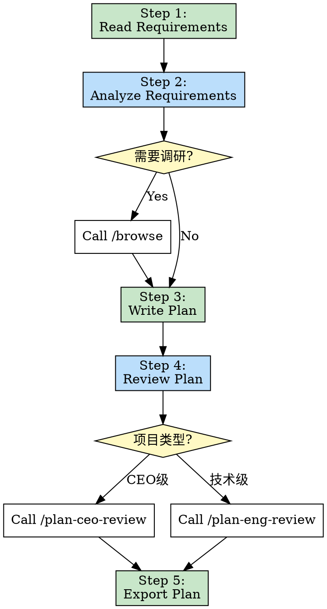
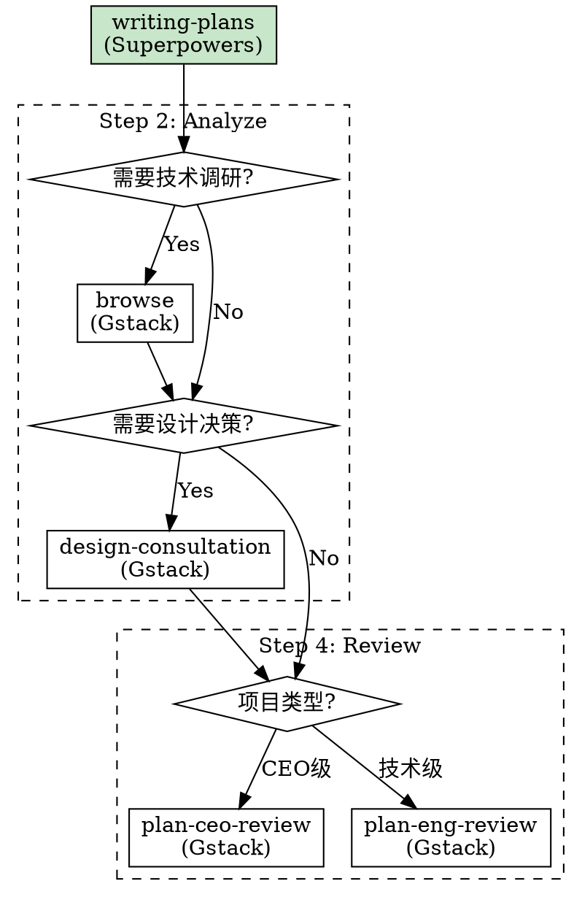

# 第3章：模板方法模式 - 流程编排的艺术

> **固定骨架，可变细节，确保流程标准化**

## 本章导读

模板方法模式是技能包流程编排的核心模式。它定义了一个操作中的算法骨架，将某些步骤延迟到子类中实现。在技能包系统中，这个模式确保了流程的标准化，同时保留了灵活调整的空间。本章将深入解析模板方法模式在技能包中的应用。

### 你将学到

- ✅ 模板方法模式的核心概念
- ✅ `writing-plans` 的骨架设计
- ✅ 如何在固定流程中保留灵活性
- ✅ 多技能包协作的模板方法实现

---

## 3.1 概念：固定骨架，可变细节

### 设计模式回顾

**模板方法模式（Template Method Pattern）** 是一种行为设计模式：

> **定义一个操作中的算法骨架，将某些步骤延迟到子类中实现**

**经典案例**：

```java
// 传统面向对象实现

abstract class DataProcessor {
    // 模板方法：定义算法骨架
    public final void process() {
        readData();      // 固定步骤
        processData();   // 可变步骤（子类实现）
        writeData();     // 固定步骤
    }

    // 固定步骤：具体实现
    private void readData() {
        System.out.println("读取数据...");
    }

    // 可变步骤：抽象方法，子类实现
    protected abstract void processData();

    // 固定步骤：具体实现
    private void writeData() {
        System.out.println("写入数据...");
    }
}

// 子类1：文本处理
class TextProcessor extends DataProcessor {
    @Override
    protected void processData() {
        System.out.println("处理文本数据...");
    }
}

// 子类2：图像处理
class ImageProcessor extends DataProcessor {
    @Override
    protected void processData() {
        System.out.println("处理图像数据...");
    }
}
```

**执行流程**：

```
TextProcessor:
  readData() → processData() [文本处理] → writeData()

ImageProcessor:
  readData() → processData() [图像处理] → writeData()
```

### 在技能包中的应用

**技能包中的模板方法**：

```markdown
# writing-plans 作为模板方法

固定骨架：
  1. Read requirements
  2. Analyze requirements
  3. Write plan
  4. Review plan
  5. Export plan

可变细节：
  - 如何分析需求？（可选调用 browse 技能调研）
  - 如何审查计划？（可选调用 plan-ceo-review 或 plan-eng-review）
  - 输出什么格式？（Markdown, JSON, etc.）
```

### 核心价值

| 价值维度 | 没有模板方法 | 有模板方法 |
|---------|-------------|-----------|
| **流程一致性** | 每次都手动规划 | 标准化流程 |
| **学习成本** | 高（需要记住所有步骤） | 低（只需调用一个技能） |
| **质量保证** | 容易遗漏步骤 | 确保所有步骤都执行 |
| **灵活性** | 高（完全自由） | 中（骨架固定，细节可变） |
| **可维护性** | 低（逻辑分散） | 高（逻辑集中） |

### 模板方法 vs 策略模式

**对比**：两种容易混淆的模式

| 对比维度 | 模板方法模式 | 策略模式 |
|---------|------------|---------|
| **关注点** | 算法骨架 | 算法实现 |
| **变化点** | 步骤的实现 | 整个算法 |
| **继承关系** | 子类继承父类 | 组合关系 |
| **典型应用** | 固定流程，可变步骤 | 同一任务，不同策略 |
| **技能包示例** | writing-plans | finishing-branch |

**技能包中的对比**：

```markdown
# 模板方法模式：writing-plans

固定流程：
  1. Read requirements
  2. Analyze
  3. Write plan
  4. Review

可变步骤：
  - Step 2: 可选调用 browse
  - Step 4: 可选调用 plan-ceo-review 或 plan-eng-review
```

```markdown
# 策略模式：finishing-branch

根据不同情况选择不同策略：

IF 功能完整且独立:
  Strategy: 创建新 PR

ELIF 小修复或依赖其他 PR:
  Strategy: 合并到现有分支

ELIF 紧急修复:
  Strategy: 直接提交并部署
```

---

## 3.2 实现：writing-plans 的骨架设计

### 技能概览

**技能名称**：`writing-plans`

**描述**：Use when you have a spec or requirements for a multi-step task, before touching code

**定位**：计划制定的标准化流程

### 完整骨架解析

```markdown
# writing-plans 技能完整骨架

---
name: writing-plans
description: Use when you have a spec or requirements for a multi-step task, before touching code
---

# Writing Plans

## 模板方法骨架

### Step 1: Read Requirements (固定步骤)

Read the spec or requirements document.

### Step 2: Analyze Requirements (可变步骤)

IF 需要技术调研:
  Call /browse (gstack)

IF 需要设计决策:
  Call /design-consultation (gstack)

Analyze requirements and identify:
- Key components
- Technical constraints
- Dependencies

### Step 3: Write Plan (固定步骤)

Create a detailed implementation plan:

1. Break down into tasks
2. Identify dependencies
3. Estimate effort
4. Define milestones

### Step 4: Review Plan (可变步骤)

IF 是 CEO 关注的项目:
  Call /plan-ceo-review (gstack)

ELIF 是技术项目:
  Call /plan-eng-review (gstack)

### Step 5: Export Plan (固定步骤)

Save the plan to:
- `task_plan.md` (implementation plan)
- `findings.md` (research findings)
- `progress.md` (tracking progress)
```

### 骨架可视化



### 固定步骤 vs 可变步骤

**固定步骤**：

```markdown
# 这些步骤每个计划都必须执行

✅ Step 1: Read Requirements
   - 必须先了解需求

✅ Step 3: Write Plan
   - 必须编写计划

✅ Step 5: Export Plan
   - 必须输出结果
```

**可变步骤**：

```markdown
# 这些步骤根据情况选择性执行

🔄 Step 2: Analyze Requirements
   - 简单需求：直接分析
   - 复杂需求：调用 browse 技术调研
   - 设计问题：调用 design-consultation

🔄 Step 4: Review Plan
   - CEO 级项目：plan-ceo-review
   - 技术项目：plan-eng-review
   - 小项目：自动审查
```

### Hook 方法设计

**Hook 方法**：模板方法中的"钩子"，允许子类（或技能调用者）自定义行为

```markdown
# writing-plans 中的 Hook 方法

## Hook 1: beforeAnalyze

调用时机：在分析需求之前

用法：
  IF 需要额外准备工作:
    Call custom skill

示例：
  - 调用 /setup-environment 准备环境
  - 调用 /install-dependencies 安装依赖

## Hook 2: afterPlanWritten

调用时机：在计划编写完成后

用法：
  IF 需要额外验证:
    Call custom skill

示例：
  - 调用 /security-check 安全检查
  - 调用 /cost-estimation 成本估算

## Hook 3: afterReview

调用时机：在审查完成后

用法：
  IF 需要额外处理:
    Call custom skill

示例：
  - 调用 /stakeholder-approval 获取利益相关者批准
  - 调用 /resource-allocation 分配资源
```

**Hook 方法的价值**：

```
扩展性：可以在不修改骨架的情况下扩展功能

示例：

基础流程：
  Read → Analyze → Write → Review → Export

扩展流程（添加 Hook）：
  Read → beforeAnalyze → Analyze → Write → afterPlanWritten → Review → afterReview → Export

特点：
  - 骨架不变
  - 功能增强
  - 灵活可控
```

---

## 3.3 源码解析：如何调用其他技能形成完整流程

### 技能调用策略

**writing-plans** 需要调用多个技能完成计划制定：

```
内部技能（Superpowers）：
  - 无（writing-plans 是独立的）

外部技能（Gstack）：
  - browse（技术调研）
  - design-consultation（设计咨询）
  - plan-ceo-review（CEO 审查）
  - plan-eng-review（工程师审查）
```

### 调用时机与方式

#### 场景 1：技术调研（调用 browse）

**触发条件**：需求涉及不熟悉的技术栈

```markdown
# writing-plans 内部逻辑

## Step 2: Analyze Requirements

IF 需求涉及新技术或不熟悉的技术栈:

  **Action**: Call /browse skill

  Example:
    "需求：使用 GraphQL 实现用户查询功能"

    writing-plans 判断：
      - GraphQL 是新技术
      - 需要技术调研

    调用方式：
      - Skill tool with skill="browse"
      - Args: "research GraphQL best practices"

  **Result**:
    - 了解 GraphQL 最佳实践
    - 确定技术方案
    - 识别潜在风险
```

**实现代码**：

```markdown
# writing-plans 技能文件片段

### Step 2: Analyze Requirements

Analyze the requirements to identify:

1. Key technical challenges
2. Dependencies and integrations
3. Potential risks

**IF you encounter unfamiliar technology or need technical research:**

- Use the Skill tool to invoke `browse` from gstack
- Research best practices and patterns
- Document findings in `findings.md`

Example invocation:
```
Call /browse to research GraphQL best practices for user queries
```
```

#### 场景 2：设计咨询（调用 design-consultation）

**触发条件**：需求涉及复杂的设计决策

```markdown
# writing-plans 内部逻辑

## Step 2: Analyze Requirements

IF 需求涉及复杂的用户体验或产品设计:

  **Action**: Call /design-consultation skill

  Example:
    "需求：重新设计用户注册流程"

    writing-plans 判断：
      - 这是 UX 设计问题
      - 需要设计专家意见

    调用方式：
      - Skill tool with skill="design-consultation"
      - Args: "redesign user registration flow"

  **Result**:
    - 获得设计方案建议
    - 用户体验优化建议
    - 竞品分析
```

**实现代码**：

```markdown
# writing-plans 技能文件片段

### Step 2: Analyze Requirements

**IF the project involves significant UX or product design decisions:**

- Invoke `design-consultation` skill from gstack
- Get expert design recommendations
- Consider user experience implications

Example:
```
Call /design-consultation for user registration flow redesign
```
```

#### 场景 3：计划审查（调用 plan-*-review）

**触发条件**：计划需要专家审查

```markdown
# writing-plans 内部逻辑

## Step 4: Review Plan

IF 是 CEO 关注的高优先级项目:

  **Action**: Call /plan-ceo-review skill

  Example:
    "项目：新产品核心功能开发"

    writing-plans 判断：
      - 这是 CEO 级项目
      - 需要高层视角审查

    调用方式：
      - Skill tool with skill="plan-ceo-review"

  **Result**:
    - 商业价值评估
    - 战略对齐检查
    - 资源优先级建议

ELIF 是技术密集型项目:

  **Action**: Call /plan-eng-review skill

  Example:
    "项目：微服务架构重构"

    writing-plans 判断：
      - 这是技术项目
      - 需要工程师视角审查

    调用方式：
      - Skill tool with skill="plan-eng-review"

  **Result**:
    - 技术可行性评估
    - 架构合理性检查
    - 性能与安全建议
```

**实现代码**：

```markdown
# writing-plans 技能文件片段

### Step 4: Review Plan

**Review the plan based on project importance:**

**IF this is a CEO-level priority project:**

- Invoke `plan-ceo-review` from gstack
- Focus on business value and strategic alignment
- Get resource allocation recommendations

**ELSE IF this is a technical project:**

- Invoke `plan-eng-review` from gstack
- Focus on technical feasibility and architecture
- Get implementation recommendations

**ELSE:**

- Self-review the plan
- Check for completeness and clarity
```

### 调用流程图



### 调用协议

**显式调用协议**：明确指定技能名称和参数

```markdown
# 调用格式

Use the Skill tool with:
  - skill: "skill-name"
  - args: "optional arguments"

# 示例

**Call browse skill:**
Use the Skill tool with skill="browse" to research GraphQL best practices.

**Call plan-eng-review skill:**
Use the Skill tool with skill="plan-eng-review" for technical review.
```

**返回值处理**：

```markdown
# 技能调用后的处理

## 调用 browse 后

Result: 技术调研结果

Processing:
  1. 提取关键信息
  2. 更新 findings.md
  3. 调整技术方案

## 调用 plan-eng-review 后

Result: 审查意见

Processing:
  1. 阅读审查意见
  2. 更新计划
  3. 记录修改原因
```

---

## 3.4 对比：Superpowers 的流程链 vs Gstack 的工具调用

### Superpowers 的模板方法实现

**特点**：**流程驱动**

```markdown
# brainstorming → writing-plans 链

brainstorming 完成后:
  自动调用 writing-plans

writing-plans 完成后:
  自动调用 executing-plans

executing-plans 完成后:
  自动调用 tdd
```

**设计理念**：
- ✅ 流程连贯
- ✅ 自动化程度高
- ⚠️ 灵活性较低

**示例**：

```markdown
# brainstorming 技能内部

## After the Design

**Implementation:**

- Invoke the writing-plans skill to create a detailed implementation plan
- Do NOT invoke any other skill. writing-plans is the next step.
```

**调用方式**：**链式唤醒**

```
brainstorming 完成后自动调用 writing-plans
（用户无需干预）
```

### Gstack 的工具调用实现

**特点**：**按需调用**

```markdown
# writing-plans 调用 gstack 技能

IF 需要技术调研:
  显式调用 browse

IF 需要设计决策:
  显式调用 design-consultation

IF 需要审查:
  显式调用 plan-*-review
```

**设计理念**：
- ✅ 高度灵活
- ✅ 工具独立性强
- ⚠️ 需要显式调用

**示例**：

```markdown
# writing-plans 技能内部

### Step 2: Analyze Requirements

**IF you encounter unfamiliar technology:**

- Invoke `browse` skill from gstack
- Research best practices

调用方式：显式调用
（由 writing-plans 主动判断和调用）
```

### 两种模式对比

| 对比维度 | Superpowers 链式调用 | Gstack 工具调用 |
|---------|---------------------|----------------|
| **调用时机** | 固定（完成后自动调用） | 灵活（按需调用） |
| **调用方式** | 链式唤醒 | 显式调用 |
| **用户感知** | 无感知 | 可选感知 |
| **流程连贯性** | 高（固定链路） | 中（按需组装） |
| **工具复用性** | 低（固定在链路中） | 高（独立工具） |
| **适用场景** | 标准化流程 | 灵活工具组合 |

### 最佳实践：混合模式

**策略**：**流程骨架 + 工具插槽**

```markdown
# writing-plans 混合模式

## 固定骨架（Superpowers 风格）

Step 1: Read Requirements
Step 2: Analyze Requirements
Step 3: Write Plan
Step 4: Review Plan
Step 5: Export Plan

## 工具插槽（Gstack 风格）

在 Step 2 和 Step 4 中预留插槽：

Step 2 插槽：
  - browse（技术调研）
  - design-consultation（设计咨询）

Step 4 插槽：
  - plan-ceo-review（CEO 审查）
  - plan-eng-review（工程师审查）

## 链式调用（Superpowers 风格）

writing-plans 完成后:
  自动调用 executing-plans
```

**优势**：

```
✅ 流程标准化（固定骨架）
✅ 工具灵活性（可插拔工具）
✅ 自动化流转（链式调用）
✅ 易于维护（职责分离）
```

**实现示例**：

```markdown
# writing-plans 混合模式实现

## 模板方法骨架（固定）

### Step 1: Read Requirements (固定)
Read the spec or requirements.

### Step 2: Analyze Requirements (可变，含工具插槽)
Analyze requirements.

**Tool Slots:**
- IF need technical research → Call /browse (Gstack)
- IF need design consultation → Call /design-consultation (Gstack)

### Step 3: Write Plan (固定)
Write the implementation plan.

### Step 4: Review Plan (可变，含工具插槽)
Review the plan.

**Tool Slots:**
- IF CEO-level project → Call /plan-ceo-review (Gstack)
- IF technical project → Call /plan-eng-review (Gstack)

### Step 5: Export Plan (固定)
Export plan to files.

## After Completion (链式调用)

**Next Steps:**
- Automatically invoke /executing-plans to start implementation
```

---

## 3.5 实战：设计自己的模板方法技能

### 设计步骤

#### Step 1：定义算法骨架

```markdown
# 示例：设计一个内容发布流程技能

## 任务：发布一篇博客文章

固定骨架：

Step 1: 接收内容
  - 接收用户提交的博客文章

Step 2: 内容检查
  - 检查文章是否符合发布标准

Step 3: 内容优化
  - 优化文章格式和SEO

Step 4: 发布
  - 发布到平台

Step 5: 推广
  - 自动推广到社交媒体
```

#### Step 2：识别可变步骤

```markdown
# 识别哪些步骤需要灵活处理

固定步骤（必须执行）：
  ✅ Step 1: 接收内容
  ✅ Step 4: 发布
  ✅ Step 5: 推广

可变步骤（根据情况调整）：
  🔄 Step 2: 内容检查
     - 简单文章：自动检查
     - 重要文章：人工审查

  🔄 Step 3: 内容优化
     - SEO需求：调用 SEO-optimizer
     - 格式需求：调用 format-fixer
     - 无需求：跳过
```

#### Step 3：设计 Hook 方法

```markdown
# 为可变步骤设计 Hook

## Hook 1: beforeCheck

调用时机：内容检查之前

用途：
  - 自动标记敏感词
  - 检测版权问题

## Hook 2: afterCheck

调用时机：内容检查之后

用途：
  - 如果检查失败，调用编辑技能修改
  - 如果检查通过，进入优化步骤

## Hook 3: beforePublish

调用时机：发布之前

用途：
  - 最后的确认
  - 设置发布时间
```

#### Step 4：编写技能文件

```markdown
---
name: content-publishing-pipeline
description: |
  Use when publishing blog content to platform.

  TRIGGER when:
  - User submits blog article for publishing
  - User asks to publish content

  DO NOT TRIGGER when:
  - User is just drafting content
  - User is editing content
---

# Content Publishing Pipeline

## Step 1: Receive Content (固定)

Receive the blog article from user.

## Step 2: Content Check (可变)

Check if the content meets publishing standards.

**IF simple article:**
- Auto-check for:
  - Grammar errors
  - Formatting issues
  - Link validity

**IF important article:**
- Invoke /manual-review for human review

**Hook: afterCheck**
- IF check fails → Invoke /content-editor to fix issues
- IF check passes → Proceed to Step 3

## Step 3: Content Optimization (可变)

Optimize content for better reach.

**IF SEO needed:**
- Invoke /seo-optimizer
- Add meta tags, keywords

**IF format issues:**
- Invoke /format-fixer
- Fix formatting problems

**ELSE:**
- Skip optimization

## Step 4: Publish (固定)

Publish the content to platform.

Steps:
1. Upload to CMS
2. Set URL and categories
3. Go live

## Step 5: Promote (固定)

Promote to social media.

Steps:
1. Generate social media posts
2. Share to Twitter, LinkedIn
3. Track engagement

## After Completion

**Next Steps:**
- Automatically invoke /analytics-tracker to monitor performance
```

#### Step 5：测试和优化

```markdown
# 测试清单

□ 测试固定步骤是否都执行
  - 接收 → 发布 → 推广，这三个步骤是否都执行了？

□ 测试可变步骤的分支
  - 简单文章 → 自动检查
  - 重要文章 → 人工审查
  - 分支是否正确？

□ 测试 Hook 方法
  - afterCheck 是否在检查后调用？
  - 检查失败是否触发编辑技能？

□ 测试链式调用
  - 发布完成后是否自动调用分析追踪？

□ 测试错误处理
  - 发布失败是否有回退方案？
  - 检查失败是否能恢复？
```

### 常见陷阱

#### 陷阱 1：骨架过于复杂

```markdown
❌ 错误示例：

Step 1: 接收内容
  Step 1.1: 验证格式
    Step 1.1.1: 检查标题
    Step 1.1.2: 检查正文
  Step 1.2: 验证元数据
    Step 1.2.1: 检查标签
    Step 1.2.2: 检查分类

问题：
- 骨架太细，失去了模板方法的意义
- 应该将子步骤封装在单独的技能中
```

```markdown
✅ 正确示例：

Step 1: 接收并验证内容
  (调用 content-validator 技能处理所有验证逻辑)

优势：
- 骨架清晰
- 职责单一
```

#### 陷阱 2：可变步骤过多

```markdown
❌ 错误示例：

Step 1: 接收内容 (可变)
Step 2: 内容检查 (可变)
Step 3: 内容优化 (可变)
Step 4: 发布 (可变)
Step 5: 推广 (可变)

问题：
- 所有步骤都可变，失去了骨架的意义
- 模板方法变成了策略模式
```

```markdown
✅ 正确示例：

Step 1: 接收内容 (固定)
Step 2: 内容检查 (可变)
Step 3: 内容优化 (可变)
Step 4: 发布 (固定)
Step 5: 推广 (固定)

优势：
- 保留核心流程的稳定性
- 在关键点提供灵活性
```

#### 陷阱 3：缺少错误处理

```markdown
❌ 错误示例：

Step 1: 接收内容
Step 2: 内容检查
  IF 检查失败:
    [没有处理]

问题：
- 检查失败后流程中断
- 用户不知道发生了什么
```

```markdown
✅ 正确示例：

Step 1: 接收内容
Step 2: 内容检查
  IF 检查失败:
    - 记录失败原因
    - 调用 /content-editor 修复
    - 重新检查（循环最多3次）
  IF 仍然失败:
    - 通知用户，提供失败详情
    - 建议人工介入

优势：
- 完整的错误处理
- 自动修复机制
- 用户友好的反馈
```

---

## 本章小结

本章深入解析了模板方法模式：

1. **模式概念** - 固定骨架，可变细节
2. **writing-plans 实现** - 五步骨架设计与可变步骤
3. **技能调用机制** - 如何在模板方法中调用其他技能
4. **Superpowers vs Gstack** - 流程驱动 vs 按需调用的差异
5. **设计自己的模板方法** - 五步法与常见陷阱

模板方法模式是流程编排的核心，它确保了标准化流程的同时保留了灵活性。

---

## 延伸阅读

- [设计模式：模板方法模式](https://en.wikipedia.org/wiki/Template_method_pattern)
- [Superpowers: writing-plans 源码](https://github.com/superpower/skills/blob/main/writing-plans.md)
- [Martin Fowler: Workflow Patterns](https://www.workflowpatterns.com/)

## 练习题

1. **思考题**：模板方法模式和策略模式有什么区别？在什么场景下选择哪个？
2. **实践题**：设计一个数据处理流程技能，定义固定骨架和可变步骤。
3. **讨论题**：writing-plans 的骨架设计有哪些可以改进的地方？

---

**下一章预告**：第4章将深入探讨责任链模式，解析质量保障链的设计与实现。