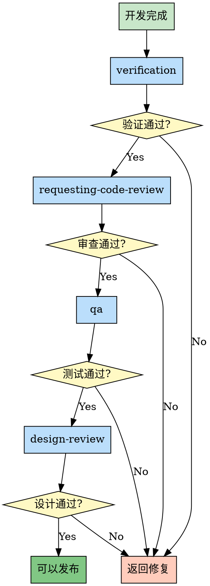
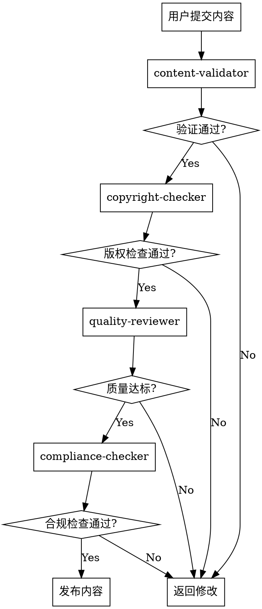

# 第4章：责任链模式 - 质量保障链

> **层层把关，逐级验证，确保结果可靠**

## 本章导读

责任链模式是技能包质量保障的核心模式。它将处理请求的对象连成一条链，沿着链传递请求，直到有对象处理它为止。在技能包系统中，这个模式构建了完整的质量保障体系，确保每个环节都经过严格验证。本章将深入解析责任链模式在质量保障中的应用。

### 你将学到

- ✅ 责任链模式的核心概念
- ✅ 技能包质量保障链的设计
- ✅ verification → review → qa 的协作机制
- ✅ 如何设计自己的责任链

---

## 4.1 概念：层层把关，逐级验证

### 设计模式回顾

**责任链模式（Chain of Responsibility Pattern）** 是一种行为设计模式：

> **将请求沿着处理链传递，直到有处理者处理它**

**经典案例**：

```java
// 传统面向对象实现

abstract class Handler {
    private Handler next;

    public Handler setNext(Handler next) {
        this.next = next;
        return next;
    }

    public abstract boolean handle(Request request);

    protected boolean passToNext(Request request) {
        if (next != null) {
            return next.handle(request);
        }
        return true; // 链末端，默认通过
    }
}

// 具体处理者1：格式检查
class FormatHandler extends Handler {
    @Override
    public boolean handle(Request request) {
        if (!isValidFormat(request)) {
            return false; // 格式错误，终止传递
        }
        return passToNext(request); // 格式正确，传递给下一个
    }
}

// 具体处理者2：安全检查
class SecurityHandler extends Handler {
    @Override
    public boolean handle(Request request) {
        if (hasSecurityRisk(request)) {
            return false; // 有安全风险，终止传递
        }
        return passToNext(request); // 安全，传递给下一个
    }
}

// 具体处理者3：性能检查
class PerformanceHandler extends Handler {
    @Override
    public boolean handle(Request request) {
        if (isPerformanceIssue(request)) {
            return false; // 性能问题，终止传递
        }
        return passToNext(request); // 性能良好，传递给下一个
    }
}

// 使用
Handler chain = new FormatHandler()
    .setNext(new SecurityHandler())
    .setNext(new PerformanceHandler());

boolean isValid = chain.handle(request);
```

**执行流程**：

```
Request → FormatHandler → SecurityHandler → PerformanceHandler
             ↓                  ↓                   ↓
           检查格式           检查安全            检查性能
             ↓                  ↓                   ↓
          通过/失败          通过/失败          通过/失败
```

### 在技能包中的应用

**技能包中的责任链**：

```markdown
# 质量保障责任链

Request: 代码/功能是否达到发布标准？

Handler 1: verification
  → 验证是否通过测试
  → 验证是否满足需求
  → 通过？传递给下一个

Handler 2: requesting-code-review
  → 代码质量审查
  → 安全审查
  → 通过？传递给下一个

Handler 3: qa
  → 自动化测试
  → 边界条件测试
  → 通过？传递给下一个

Handler 4: design-review
  → UI/UX 审查
  → 用户体验检查
  → 通过？可以发布

任何一环失败 → 返回修复
```

### 核心价值

| 价值维度 | 没有责任链 | 有责任链 |
|---------|-----------|---------|
| **质量保障** | 靠人工记忆，容易遗漏 | 标准化流程，确保每步验证 |
| **职责分离** | 一个检查做所有事 | 每个环节职责单一 |
| **可扩展性** | 添加检查需要修改代码 | 添加处理者即可 |
| **错误定位** | 难以定位问题环节 | 明确知道哪个环节失败 |
| **可配置性** | 固定检查流程 | 可以动态调整链的组成 |

### 责任链 vs 管道模式

**对比**：两种容易混淆的模式

| 对比维度 | 责任链模式 | 管道模式 |
|---------|-----------|---------|
| **传递方式** | 链式传递，任意节点可终止 | 管道流动，所有节点都执行 |
| **返回值** | 布尔值（成功/失败） | 数据转换后的结果 |
| **典型应用** | 验证、审批 | 数据处理、转换 |
| **终止条件** | 任一节点失败即终止 | 所有节点都执行完 |
| **技能包示例** | verification → review | 浏览器自动化流水线 |

**技能包中的对比**：

```markdown
# 责任链模式：质量保障链

verification → review → qa → design-review

特点：
- 任一环节失败，整个链终止
- 返回失败原因
- 修复后重新走链
```

```markdown
# 管道模式：浏览器测试流水线

navigate → interact → verify → screenshot

特点：
- 所有步骤都执行
- 每一步转换数据
- 最终输出测试结果
```

---

## 4.2 实现：verification → review → qa → design-review

### 完整质量保障链解析

```markdown
# 质量保障链完整流程

┌─────────────────────────────────────────────────────────┐
│                    质量保障责任链                         │
├─────────────────────────────────────────────────────────┤
│                                                           │
│  【Handler 1: verification】                             │
│   ├─ 检查：代码是否通过测试？                              │
│   ├─ 检查：是否满足原始需求？                              │
│   ├─ 检查：文档是否更新？                                  │
│   └─ 结果：通过 → 传递给 review                          │
│            失败 → 返回缺失项列表                          │
│                                                           │
│  【Handler 2: requesting-code-review】                   │
│   ├─ 检查：代码质量                                       │
│   ├─ 检查：安全漏洞                                       │
│   ├─ 检查：性能问题                                       │
│   └─ 结果：通过 → 传递给 qa                              │
│            失败 → 返回审查意见                            │
│                                                           │
│  【Handler 3: qa】                                        │
│   ├─ 测试：自动化测试                                     │
│   ├─ 测试：边界条件测试                                   │
│   ├─ 测试：集成测试                                       │
│   └─ 结果：通过 → 传递给 design-review                   │
│            失败 → 返回测试失败报告                        │
│                                                           │
│  【Handler 4: design-review】                            │
│   ├─ 检查：UI/UX 设计                                     │
│   ├─ 检查：用户体验                                       │
│   ├─ 检查：视觉一致性                                     │
│   └─ 结果：通过 → 可以发布 ✅                            │
│            失败 → 返回设计修改建议                        │
│                                                           │
└─────────────────────────────────────────────────────────┘
```

### 链条可视化



### 每个处理者的职责

#### 处理者 1：verification

**职责**：验证开发是否完成，是否满足原始需求

```markdown
# verification 技能

---
name: verification-before-completion
description: Use when about to claim work is complete, fixed, or passing, before committing or creating PRs
---

## Core Checks

### Check 1: Tests Pass

**Action**: Run tests

**IF tests fail:**
- Return: List of failing tests
- Stop chain

**IF tests pass:**
- Continue to next check

### Check 2: Requirements Met

**Action**: Compare against original requirements

**IF requirements not met:**
- Return: List of missing requirements
- Stop chain

**IF requirements met:**
- Continue to next check

### Check 3: Documentation Updated

**Action**: Check if docs are updated

**IF docs outdated:**
- Return: List of outdated docs
- Stop chain

**IF docs updated:**
- Pass to next handler: requesting-code-review
```

#### 处理者 2：requesting-code-review

**职责**：代码质量和安全审查

```markdown
# requesting-code-review 技能

---
name: requesting-code-review
description: Use when completing tasks, implementing major features, or before merging to verify work meets requirements
---

## Review Areas

### Area 1: Code Quality

Check:
- Code style and formatting
- Naming conventions
- Code complexity
- DRY violations

**IF issues found:**
- Return: Code quality issues list
- Stop chain

### Area 2: Security

Check:
- SQL injection vulnerabilities
- XSS vulnerabilities
- Authentication/authorization issues
- Sensitive data exposure

**IF issues found:**
- Return: Security vulnerabilities list
- Stop chain

### Area 3: Performance

Check:
- N+1 queries
- Memory leaks
- Inefficient algorithms
- Missing indexes

**IF issues found:**
- Return: Performance issues list
- Stop chain

**IF all pass:**
- Pass to next handler: qa
```

#### 处理者 3：qa

**职责**：全面测试

```markdown
# qa 技能

---
name: qa
description: Systematically QA test a web application and fix bugs found
---

## Test Types

### Type 1: Automated Tests

Run:
- Unit tests
- Integration tests
- E2E tests

**IF tests fail:**
- Return: Test failure report
- Stop chain

### Type 2: Edge Case Tests

Test:
- Boundary conditions
- Invalid inputs
- Race conditions
- Error handling

**IF tests fail:**
- Return: Edge case failure report
- Stop chain

### Type 3: Cross-browser Tests

Test on:
- Chrome
- Firefox
- Safari
- Mobile browsers

**IF tests fail:**
- Return: Browser compatibility issues
- Stop chain

**IF all pass:**
- Pass to next handler: design-review
```

#### 处理者 4：design-review

**职责**：设计和用户体验审查

```markdown
# design-review 技能

---
name: design-review
description: Designer's eye QA - finds visual inconsistency, spacing issues, hierarchy problems
---

## Design Checks

### Check 1: Visual Consistency

Check:
- Font sizes
- Colors
- Spacing
- Alignment

**IF inconsistencies found:**
- Return: Visual inconsistency report
- Stop chain

### Check 2: UX Issues

Check:
- Navigation flow
- Accessibility
- Responsive design
- Loading states

**IF issues found:**
- Return: UX issues list
- Stop chain

### Check 3: Interaction Quality

Check:
- Hover states
- Click feedback
- Animation smoothness
- Error messages

**IF issues found:**
- Return: Interaction issues list
- Stop chain

**IF all pass:**
- **Chain Complete** ✅
- Ready for deployment
```

### 处理者间的协作

```markdown
# 处理者之间的数据传递

## verification → requesting-code-review

传递数据：
  - 原始需求文档
  - 测试报告
  - 修改的文件列表

传递方式：
  - 显式调用 Skill tool
  - 或自动链式唤醒

## requesting-code-review → qa

传递数据：
  - 代码审查意见
  - 已修复的问题列表
  - 需要关注的区域

传递方式：
  - 显式调用 Skill tool

## qa → design-review

传递数据：
  - 测试报告
  - 已通过的测试列表
  - 边界条件处理结果

传递方式：
  - 显式调用 Skill tool
```

---

## 4.3 源码解析：每个节点的职责边界

### 节点职责划分原则

**原则 1：单一职责**

```markdown
# 每个节点只做一件事

verification:
  只负责验证是否完成，不负责修复

requesting-code-review:
  只负责审查，不负责测试

qa:
  只负责测试，不负责设计检查

design-review:
  只负责设计审查，不负责功能测试

✅ 优势：
- 职责清晰
- 易于维护
- 可独立测试
```

**原则 2：明确输入输出**

```markdown
# 每个节点的输入输出

## verification

输入：
  - 目标文件路径
  - AI 自评完成情况

输出：
  - 验证结果（通过/失败）
  - 缺失项列表（如果失败）

## requesting-code-review

输入：
  - 代码文件路径
  - 审查范围

输出：
  - 审查意见
  - 问题列表（如果有）

## qa

输入：
  - 应用 URL
  - 测试范围

输出：
  - 测试报告
  - 失败用例列表（如果有）

## design-review

输入：
  - 设计稿 URL
  - 实现页面 URL

输出：
  - 设计审查意见
  - 不一致项列表（如果有）
```

**原则 3：无状态设计**

```markdown
# 节点不应维护状态

❌ 错误示例：

verification 记录：
  - 之前失败的次数
  - 历史验证结果
  - 用户行为

问题：
  - 状态管理复杂
  - 难以测试
  - 并发问题

✅ 正确示例：

verification 每次都是独立的：
  - 不记录历史
  - 只关注当前状态
  - 纯函数式处理

优势：
  - 易于测试
  - 可并发执行
  - 结果可预测
```

### 边界条件处理

#### 场景 1：某个节点执行失败

```markdown
# verification 失败处理

verification 执行：
  发现测试未通过

处理：
  1. 立即终止责任链
  2. 返回失败原因：
     - 哪些测试失败了
     - 错误信息是什么
  3. 建议修复方案
  4. 不继续传递给下一个节点

用户操作：
  1. 阅读失败原因
  2. 修复代码
  3. 重新触发责任链
  4. 从 verification 开始重新验证
```

#### 场景 2：某个节点无法执行

```markdown
# qa 无法执行（例如：应用未启动）

qa 技能需要访问应用 URL

但应用未启动，无法访问

处理：
  1. 节点返回错误信息：
     "应用未启动，无法执行 QA 测试"
  2. 终止责任链
  3. 建议用户先启动应用

用户操作：
  1. 启动应用
  2. 重新触发责任链
  3. 可以从 qa 开始（如果前面已通过）
```

#### 场景 3：跳过某个节点

```markdown
# 某些场景可以跳过节点

场景：纯后端 API 开发

design-review 主要关注前端 UI/UX

处理：
  IF 是纯后端项目:
    跳过 design-review
    qa 完成后直接标记为"可以发布"

实现方式：
  ```markdown
  # qa 技能内部

  ### After Tests Pass

  IF 是前端项目:
    Pass to next handler: design-review

  ELIF 是后端项目:
    Mark as ready for deployment ✅
  ```
```

### 错误恢复机制

```markdown
# 责任链的错误恢复

## 策略 1：从头开始

任何节点失败 → 从第一个节点重新开始

优点：
  - 简单
  - 确保所有检查都通过

缺点：
  - 效率低
  - 重复工作

## 策略 2：从失败节点继续

记录已通过的节点 → 从失败节点重新开始

优点：
  - 效率高
  - 减少重复

缺点：
  - 需要状态管理
  - 实现复杂

## 推荐策略

简单项目 → 策略 1（从头开始）

复杂项目 → 策略 2（从失败节点继续）
  + 人工确认是否需要重新验证已通过的节点
```

---

## 4.4 对比：Superpowers 的验证链 vs Gstack 的质量链

### Superpowers 的责任链实现

**特点**：**流程控制**

```markdown
# Superpowers 质量保障链

verification (Superpowers)
  ↓ 通过
requesting-code-review (Superpowers)
  ↓ 通过
finishing-branch (Superpowers)

设计理念：
  - 流程驱动
  - 强制验证
  - 自动流转
```

**实现方式**：

```markdown
# verification 技能内部

## After Verification

**IF verification passes:**

**Next Steps:**
- Invoke /requesting-code-review to get code review
- Then proceed to /finishing-branch for merge decision

**IF verification fails:**

- Return missing items list
- User must fix issues
- Re-invoke /verification after fixes
```

**优势**：
- ✅ 流程标准化
- ✅ 自动流转
- ✅ 用户体验一致

**劣势**：
- ⚠️ 固定链路，难以定制
- ⚠️ 缺少灵活性

### Gstack 的责任链实现

**特点**：**工具独立**

```markdown
# Gstack 质量保障链

review (Gstack)
  ↓ 通过
qa (Gstack)
  ↓ 通过
benchmark (Gstack)
  ↓ 通过
canary (Gstack)

设计理念：
  - 工具独立
  - 按需调用
  - 灵活组合
```

**实现方式**：

```markdown
# 没有自动链式调用

用户需要显式调用每个工具：

Step 1: Call /review
Step 2: Call /qa
Step 3: Call /benchmark
Step 4: Call /canary

或者通过其他技能编排：
  land-and-deploy 会自动调用 canary
```

**优势**：
- ✅ 高度灵活
- ✅ 工具独立
- ✅ 可任意组合

**劣势**：
- ⚠️ 需要手动编排
- ⚠️ 流程容易断裂

### 两种模式对比

| 对比维度 | Superpowers 流程控制 | Gstack 工具独立 |
|---------|---------------------|----------------|
| **链式调用** | 自动链式唤醒 | 手动显式调用 |
| **流程连贯性** | 高（固定链路） | 低（需要编排） |
| **灵活性** | 低（固定链路） | 高（任意组合） |
| **工具独立性** | 低（嵌入链路） | 高（独立工具） |
| **用户负担** | 低（自动流转） | 高（需要了解流程） |
| **适用场景** | 标准化流程 | 灵活工具组合 |

### 最佳实践：混合模式

**策略**：**核心链路 + 可选工具**

```markdown
# 混合质量保障链

## 核心链路（Superpowers，自动流转）

verification → requesting-code-review → finishing-branch

自动链式调用，确保基本质量

## 可选工具（Gstack，按需调用）

在 verification 和 review 之间：
  - 可选调用 /qa (Gstack)
  - 可选调用 /benchmark (Gstack)

在 finishing-branch 之后：
  - 自动调用 /land-and-deploy (Gstack)
  - 自动调用 /canary (Gstack)
```

**实现示例**：

```markdown
# verification 技能混合模式

## After Verification

**Core Chain (Automatic):**
- Invoke /requesting-code-review (Superpowers)

**Optional Tools (Conditional):**

**IF project needs comprehensive testing:**
- Invoke /qa (Gstack)

**IF project needs performance benchmarking:**
- Invoke /benchmark (Gstack)

**After all checks pass:**
- Invoke /finishing-branch (Superpowers)
```

**优势**：

```
✅ 核心流程标准化（Superpowers）
✅ 工具灵活性（Gstack）
✅ 自动流转（降低用户负担）
✅ 可扩展性强（可选工具）
```

---

## 4.5 实战：设计自己的责任链

### 设计步骤

#### Step 1：定义处理节点

```markdown
# 示例：设计内容发布审核链

场景：用户发布内容到平台

处理节点：
1. content-validator
   - 检查内容是否符合规范
   - 检查敏感词

2. copyright-checker
   - 检查版权问题
   - 检查原创性

3. quality-reviewer
   - 检查内容质量
   - 评分系统

4. compliance-checker
   - 检查合规性
   - 检查法律法规
```

#### Step 2：定义每个节点的职责

```markdown
# Node 1: content-validator

职责：
  - 检查格式规范
  - 过滤敏感词
  - 检查字数限制

输入：
  - 内容文本
  - 内容类型

输出：
  - 验证结果（通过/失败）
  - 违规项列表（如果失败）

失败处理：
  - 自动标记敏感词
  - 建议修改方案

---

# Node 2: copyright-checker

职责：
  - 检查是否抄袭
  - 检查图片版权
  - 检查引用规范

输入：
  - 内容文本
  - 图片列表

输出：
  - 版权检查结果
  - 侵权项列表（如果有）

失败处理：
  - 标记侵权内容
  - 提供原创来源

---

# Node 3: quality-reviewer

职责：
  - 内容质量评分
  - 可读性检查
  - 专业性评估

输入：
  - 内容文本

输出：
  - 质量评分（0-100）
  - 改进建议

失败处理：
  - 如果评分 < 60：
    - 返回改进建议
    - 终止链

---

# Node 4: compliance-checker

职责：
  - 法律合规检查
  - 行业规范检查
  - 平台规则检查

输入：
  - 内容文本
  - 内容类型

输出：
  - 合规性结果
  - 违规项列表（如果有）

失败处理：
  - 标记违规内容
  - 提供法律依据
```

#### Step 3：设计链式调用

```markdown
# 内容发布审核链流程

---
name: content-publishing-chain
description: Use when user wants to publish content to platform
---

# Content Publishing Chain

## Step 1: Content Validation

Invoke /content-validator

**IF validation fails:**
- Return: Content validation failed
- Show: Violations list
- Stop chain

**IF validation passes:**
- Continue to Step 2

## Step 2: Copyright Check

Invoke /copyright-checker

**IF copyright check fails:**
- Return: Copyright issues found
- Show: Infringement list
- Stop chain

**IF copyright check passes:**
- Continue to Step 3

## Step 3: Quality Review

Invoke /quality-reviewer

**IF quality score < 60:**
- Return: Content quality insufficient
- Show: Improvement suggestions
- Stop chain

**IF quality score >= 60:**
- Continue to Step 4

## Step 4: Compliance Check

Invoke /compliance-checker

**IF compliance check fails:**
- Return: Compliance issues found
- Show: Violations list
- Stop chain

**IF compliance check passes:**
- **Chain Complete** ✅
- Publish content
```

#### Step 4：可视化链条



#### Step 5：测试和优化

```markdown
# 测试清单

□ 测试每个节点的独立功能
  - content-validator 是否能检测敏感词？
  - copyright-checker 是否能发现抄袭？
  - quality-reviewer 评分是否准确？
  - compliance-checker 是否能发现违规内容？

□ 测试链式调用
  - 节点之间是否正确传递？
  - 失败是否正确终止链？

□ 测试错误处理
  - 某个节点失败是否有清晰的错误信息？
  - 用户知道如何修复吗？

□ 测试边界条件
  - 空内容如何处理？
  - 特殊字符如何处理？
  - 超长内容如何处理？

□ 测试性能
  - 整个链条执行需要多长时间？
  - 是否可以并行化某些节点？
```

### 常见陷阱

#### 陷阱 1：节点职责重叠

```markdown
❌ 错误示例：

content-validator 检查：
  - 敏感词
  - 版权问题
  - 内容质量

copyright-checker 检查：
  - 版权问题
  - 法律合规

问题：
  - 版权检查重复
  - 职责不清晰
  - 维护困难
```

```markdown
✅ 正确示例：

content-validator 检查：
  - 敏感词
  - 格式规范

copyright-checker 检查：
  - 版权问题

quality-reviewer 检查：
  - 内容质量

compliance-checker 检查：
  - 法律合规

优势：
  - 职责单一
  - 无重叠
  - 易维护
```

#### 陷阱 2：缺少错误信息

```markdown
❌ 错误示例：

content-validator:
  IF 检查失败:
    Return: "验证失败"

问题：
  - 用户不知道为什么失败
  - 无法修复
```

```markdown
✅ 正确示例：

content-validator:
  IF 检查失败:
    Return:
      - 验证失败原因
      - 违规内容位置
      - 建议修改方案
      - 相关规则说明

优势：
  - 清晰的错误信息
  - 用户可以修复
  - 提升用户体验
```

#### 陷阱 3：无法跳过节点

```markdown
❌ 错误示例：

所有节点都必须执行，无法跳过

问题：
  - 某些场景不需要所有检查
  - 效率低
```

```markdown
✅ 正确示例：

允许根据内容类型跳过某些节点：

IF 内容类型 == "转载":
  跳过 quality-reviewer
  直接进入 compliance-checker

IF 内容类型 == "原创":
  执行完整链条

优势：
  - 灵活
  - 提高效率
  - 适应不同场景
```

---

## 本章小结

本章深入解析了责任链模式：

1. **模式概念** - 层层把关，逐级验证
2. **质量保障链实现** - verification → review → qa → design-review
3. **节点职责边界** - 单一职责、明确输入输出、无状态设计
4. **Superpowers vs Gstack** - 流程控制 vs 工具独立
5. **设计自己的责任链** - 五步法与常见陷阱

责任链模式是质量保障的核心，确保每个环节都经过严格验证。

---

## 延伸阅读

- [设计模式：责任链模式](https://en.wikipedia.org/wiki/Chain-of-responsibility_pattern)
- [Quality Assurance Best Practices](https://www.guru99.com/software-testing.html)
- [Continuous Integration and Quality Gates](https://martinfowler.com/articles/continuousIntegration.html)

## 练习题

1. **思考题**：责任链模式和管道模式有什么区别？在什么场景下选择哪个？
2. **实践题**：设计一个用户注册审核责任链，定义至少3个处理节点。
3. **讨论题**：verification → review → qa → design-review 的顺序是否合理？是否可以调整？

---

**下一章预告**：第5章将深入探讨策略模式，解析灵活决策机制的设计与实现。