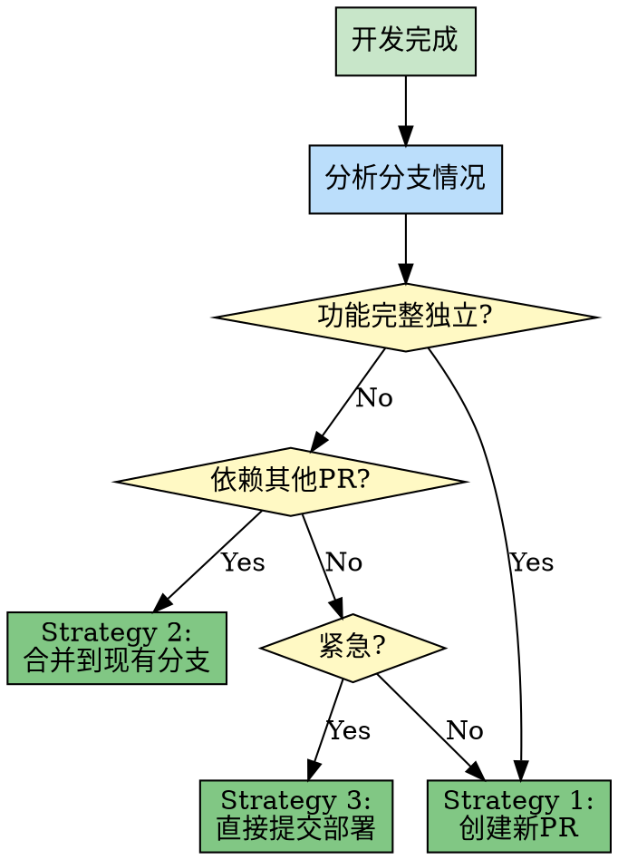

# 第5章：策略模式 - 灵活决策机制

> **根据场景选择不同策略，动态调整行为**

## 本章导读

策略模式是技能包决策机制的核心模式。它定义了一系列算法，将每个算法封装起来，并使它们可以互相替换。在技能包系统中，这个模式让系统能够根据不同的场景选择最合适的处理策略，提供了极大的灵活性。本章将深入解析策略模式在技能包决策中的应用。

### 你将学到

- ✅ 策略模式的核心概念
- ✅ finishing-branch 的合并策略选择
- ✅ 如何设计灵活的决策机制
- ✅ 策略模式与模板方法模式的配合使用

---

## 5.1 概念：根据场景选择不同策略

### 设计模式回顾

**策略模式（Strategy Pattern）** 是一种行为设计模式：

> **定义一系列算法，将每个算法封装起来，并使它们可以互换**

**经典案例**：

```java
// 传统面向对象实现

// 策略接口
interface PaymentStrategy {
    void pay(int amount);
}

// 具体策略1：信用卡支付
class CreditCardStrategy implements PaymentStrategy {
    @Override
    public void pay(int amount) {
        System.out.println("使用信用卡支付: $" + amount);
    }
}

// 具体策略2：PayPal 支付
class PayPalStrategy implements PaymentStrategy {
    @Override
    public void pay(int amount) {
        System.out.println("使用 PayPal 支付: $" + amount);
    }
}

// 具体策略3：微信支付
class WeChatPayStrategy implements PaymentStrategy {
    @Override
    public void pay(int amount) {
        System.out.println("使用微信支付: ¥" + amount);
    }
}

// 上下文类
class PaymentContext {
    private PaymentStrategy strategy;

    public void setStrategy(PaymentStrategy strategy) {
        this.strategy = strategy;
    }

    public void executePayment(int amount) {
        strategy.pay(amount);
    }
}

// 使用
PaymentContext context = new PaymentContext();

// 场景1：国际用户使用信用卡
context.setStrategy(new CreditCardStrategy());
context.executePayment(100);

// 场景2：欧洲用户使用 PayPal
context.setStrategy(new PayPalStrategy());
context.executePayment(100);

// 场景3：中国用户使用微信支付
context.setStrategy(new WeChatPayStrategy());
context.executePayment(100);
```

**执行流程**：

```
用户选择支付方式 → 设置对应策略 → 执行策略

不同用户：
  国际用户 → CreditCardStrategy
  欧洲用户 → PayPalStrategy
  中国用户 → WeChatPayStrategy
```

### 在技能包中的应用

**技能包中的策略模式**：

```markdown
# finishing-branch 的合并策略

Context: 开发完成，如何处理代码合并？

Strategy 1: 创建新 PR
  适用场景：
    - 功能完整且独立
    - 需要审查
    - 非紧急

Strategy 2: 合并到现有分支
  适用场景：
    - 小修复
    - 依赖其他 PR
    - 相关功能

Strategy 3: 直接提交并部署
  适用场景：
    - 紧急修复
    - 关键 bug
    - 已经审查过
```

### 核心价值

| 价值维度 | 没有策略模式 | 有策略模式 |
|---------|-------------|-----------|
| **灵活性** | 固定一种做法 | 多种策略可选 |
| **可扩展性** | 新增策略需要修改代码 | 新增策略类即可 |
| **条件分支** | 大量 if-else | 策略封装，清晰分离 |
| **测试性** | 难以测试不同情况 | 每个策略独立测试 |
| **维护性** | 策略耦合在一起 | 策略独立，易于维护 |

### 策略模式 vs 模板方法模式

**对比**：两种经常配合使用的模式

| 对比维度 | 策略模式 | 模板方法模式 |
|---------|---------|------------|
| **关注点** | 整个算法的可替换性 | 算法骨架的固定性 |
| **变化点** | 整个策略 | 步骤的实现 |
| **继承关系** | 组合关系（接口） | 继承关系（父类） |
| **灵活性** | 高（运行时切换） | 中（编译时确定） |
| **典型应用** | 不同场景选择不同策略 | 固定流程，可变步骤 |

**技能包中的配合使用**：

```markdown
# 配合使用示例

## 模板方法定义流程骨架

writing-plans (模板方法):
  Step 1: Read Requirements (固定)
  Step 2: Analyze Requirements (可变)
  Step 3: Write Plan (固定)
  Step 4: Review Plan (可变)
  Step 5: Export Plan (固定)

## 策略模式处理可变步骤

Step 2 的分析策略：
  Strategy A: 简单分析（无工具调用）
  Strategy B: 技术调研（调用 browse）
  Strategy C: 设计咨询（调用 design-consultation）

Step 4 的审查策略：
  Strategy A: CEO 审查（plan-ceo-review）
  Strategy B: 工程师审查（plan-eng-review）
  Strategy C: 自动审查（self-review）
```

---

## 5.2 实现：finishing-branch 的合并策略选择

### 技能概览

**技能名称**：`finishing-a-development-branch`

**描述**：Use when implementation is complete, all tests pass, and you need to decide how to integrate the work

**定位**：分支合并决策中心

### 完整策略解析

```markdown
# finishing-branch 技能完整策略

---
name: finishing-a-development-branch
description: Use when implementation is complete, all tests pass, and you need to decide how to integrate the work
---

# Finishing a Development Branch

## Context Analysis

Analyze the branch situation:

1. Branch type (feature, bugfix, refactor)
2. Branch dependencies
3. Urgency level
4. Review status

## Strategy Selection

### Strategy 1: Create New PR

**When to use:**
- Feature is complete and independent
- No dependencies on other PRs
- Not urgent
- Needs review

**Steps:**
1. Push branch to remote
2. Create pull request
3. Request code review
4. Wait for approval
5. Merge to main

**Pros:**
- ✅ Proper review process
- ✅ Clean git history
- ✅ Easy to track

**Cons:**
- ⚠️ Takes time (review process)
- ⚠️ May need multiple iterations

---

### Strategy 2: Merge to Existing Branch

**When to use:**
- Small fix or enhancement
- Depends on another PR
- Related to existing work
- Can bypass new review

**Steps:**
1. Identify target branch
2. Merge into target branch
3. Run tests on target branch
4. Update target branch PR

**Pros:**
- ✅ Faster than new PR
- ✅ Keeps related work together

**Cons:**
- ⚠️ Harder to track individually
- ⚠️ May complicate existing PR

---

### Strategy 3: Direct Commit and Deploy

**When to use:**
- Emergency hotfix
- Critical bug fix
- Already reviewed
- Urgent deployment needed

**Steps:**
1. Commit directly to main
2. Push to remote
3. Trigger CI/CD
4. Deploy immediately
5. Create retrospective PR (optional)

**Pros:**
- ✅ Fastest deployment
- ✅ Immediate fix

**Cons:**
- ⚠️ Bypasses review
- ⚠️ Higher risk
- ⚠️ Should use sparingly
```

### 策略选择流程



### 策略决策逻辑

#### 决策因素分析

```markdown
# 影响策略选择的因素

## Factor 1: 分支类型

Feature Branch:
  - 通常是新功能
  - 应该创建新 PR

Bugfix Branch:
  - 小修复
  - 可以合并到相关 PR

Refactor Branch:
  - 代码重构
  - 应该创建新 PR

Hotfix Branch:
  - 紧急修复
  - 可能需要直接部署

## Factor 2: 依赖关系

独立:
  - 不依赖其他 PR
  - 可以独立合并

依赖:
  - 依赖未合并的 PR
  - 应该合并到该 PR

被依赖:
  - 其他 PR 依赖此分支
  - 应该先合并此分支

## Factor 3: 紧急程度

普通:
  - 可以走正常流程

紧急:
  - 需要快速上线
  - 可以跳过部分流程

关键:
  - 生产环境问题
  - 立即部署

## Factor 4: 审查状态

已审查:
  - 已经通过代码审查
  - 可以更快合并

未审查:
  - 需要完整审查流程
  - 必须创建 PR
```

#### 决策矩阵

```markdown
# 策略选择决策矩阵

| 分支类型 | 依赖关系 | 紧急程度 | 审查状态 | 推荐策略 |
|---------|---------|---------|---------|---------|
| Feature | 独立 | 普通 | 未审查 | Strategy 1: 新 PR |
| Feature | 独立 | 紧急 | 已审查 | Strategy 1: 新 PR (加速) |
| Bugfix | 依赖 | 普通 | 未审查 | Strategy 2: 合并到现有分支 |
| Bugfix | 独立 | 普通 | 已审查 | Strategy 1: 新 PR |
| Bugfix | 独立 | 紧急 | 已审查 | Strategy 3: 直接部署 |
| Hotfix | 独立 | 关键 | 已审查 | Strategy 3: 直接部署 |
| Refactor | 独立 | 普通 | 未审查 | Strategy 1: 新 PR |
```

### 策略实现细节

#### Strategy 1: Create New PR

```markdown
# 创建新 PR 的详细步骤

## Step 1: 准备分支

```bash
# 确保在正确的分支上
git checkout feature-branch

# 确保代码是最新的
git pull origin feature-branch

# 运行所有测试
npm test
```

## Step 2: 推送到远程

```bash
# 推送分支到远程仓库
git push origin feature-branch
```

## Step 3: 创建 Pull Request

使用 gh CLI 创建 PR：

```bash
gh pr create \
  --title "Add user authentication feature" \
  --body "## Summary
- Implemented JWT-based authentication
- Added login/logout endpoints
- Added password encryption

## Test plan
- [ ] Unit tests pass
- [ ] Integration tests pass
- [ ] Manual testing completed
" \
  --base main
```

## Step 4: 请求代码审查

```bash
# 指定审查者
gh pr edit --add-reviewer username1,username2
```

## Step 5: 等待审查

- 监控 PR 状态
- 回复审查意见
- 必要时修改代码

## Step 6: 合并 PR

审查通过后：

```bash
# 合并 PR
gh pr merge --squash
```
```

#### Strategy 2: Merge to Existing Branch

```markdown
# 合并到现有分支的详细步骤

## Step 1: 识别目标分支

确定要合并到哪个分支：

```bash
# 查看相关 PR
gh pr list --state open

# 或查看分支依赖关系
git log --oneline --graph --all
```

## Step 2: 合并分支

```bash
# 切换到目标分支
git checkout target-branch

# 合并当前分支
git merge --no-ff feature-branch

# 推送更新
git push origin target-branch
```

## Step 3: 运行测试

```bash
# 确保测试通过
npm test

# 如果有 CI，检查 CI 状态
gh pr checks
```

## Step 4: 更新目标分支的 PR

如果目标分支有 PR：

```bash
# 更新 PR 描述
gh pr edit target-pr-number \
  --body "Updated: Merged feature-branch"
```
```

#### Strategy 3: Direct Commit and Deploy

```markdown
# 直接提交并部署的详细步骤

⚠️ **警告：仅用于紧急情况！**

## Step 1: 确认紧急程度

确认这确实是紧急情况：
- 生产环境故障
- 关键 bug 影响
- 无其他替代方案

## Step 2: 准备提交

```bash
# 切换到 main 分支
git checkout main

# 拉取最新代码
git pull origin main

# 应用修复
git cherry-pick commit-hash
# 或直接提交
git commit -m "hotfix: fix critical login bug"
```

## Step 3: 推送并触发部署

```bash
# 推送到 main
git push origin main

# 这会自动触发 CI/CD
```

## Step 4: 监控部署

```bash
# 检查 CI/CD 状态
gh run list --branch main --limit 1

# 查看部署日志
gh run view run-id
```

## Step 5: 创建回溯 PR（可选但推荐）

```bash
# 创建分支记录此次修复
git checkout -b hotfix/login-bug

# 创建 PR 记录
gh pr create \
  --title "Hotfix: Fix critical login bug" \
  --body "Emergency fix for production issue"
```
```

---

## 5.3 源码解析：如何判断使用哪种策略

### 策略选择算法

```markdown
# finishing-branch 的策略选择逻辑

## 伪代码实现

```python
def select_strategy(branch_info):
    """
    根据分支信息选择最合适的策略
    """

    # 检查是否是关键紧急修复
    if branch_info.urgency == "critical":
        if branch_info.reviewed:
            return Strategy.DIRECT_DEPLOY
        else:
            # 即使紧急，也需要快速审查
            return Strategy.NEW_PR_EXPEDITED

    # 检查是否有依赖关系
    if branch_info.has_dependencies():
        # 合并到依赖的分支
        return Strategy.MERGE_TO_EXISTING

    # 检查分支类型
    if branch_info.type == "feature":
        # 新功能必须走 PR 流程
        return Strategy.NEW_PR

    elif branch_info.type == "bugfix":
        if branch_info.size == "small" and branch_info.reviewed:
            # 小修复且已审查，可以快速合并
            return Strategy.NEW_PR_EXPEDITED
        else:
            return Strategy.NEW_PR

    elif branch_info.type == "hotfix":
        if branch_info.reviewed:
            return Strategy.DIRECT_DEPLOY
        else:
            # 即使 hotfix 也需要审查
            return Strategy.NEW_PR_EXPEDITED

    elif branch_info.type == "refactor":
        # 重构需要完整审查
        return Strategy.NEW_PR

    # 默认：创建新 PR
    return Strategy.NEW_PR
```

## 策略枚举

```python
class Strategy(Enum):
    NEW_PR = "create_new_pr"
    NEW_PR_EXPEDITED = "create_new_pr_expedited"
    MERGE_TO_EXISTING = "merge_to_existing_branch"
    DIRECT_DEPLOY = "direct_commit_and_deploy"
```
```

### 分支信息收集

```markdown
# 如何收集决策所需的信息

## 收集分支类型

方法1：从分支名称推断

```
feature/user-auth → Feature
bugfix/login-error → Bugfix
hotfix/critical-fix → Hotfix
refactor/api-structure → Refactor
```

方法2：从 commit 消息推断

```
feat: add user auth → Feature
fix: resolve login error → Bugfix
hotfix: critical security fix → Hotfix
refactor: reorganize API → Refactor
```

方法3：询问用户

```
无法确定分支类型时：
  Ask user: "这是什么类型的变更？
    A. 新功能
    B. Bug 修复
    C. 紧急修复
    D. 代码重构"
```

## 检查依赖关系

方法1：分析 PR 描述

```
PR 描述中提到：
  "Depends on #123"
  → 有依赖关系

PR 描述中提到：
  "Related to #456"
  → 可能有依赖关系
```

方法2：分析代码变更

```bash
# 查看修改的文件
git diff --name-only main...branch

# 如果修改的文件在其他 PR 中也被修改
# 可能有依赖关系
```

方法3：分析分支历史

```bash
# 查看分支历史
git log --oneline --graph --all

# 如果分支是从另一个分支创建的
# 可能有依赖关系
```

## 判断紧急程度

方法1：从 commit 消息推断

```
"fix: critical production issue" → Critical
"hotfix: security vulnerability" → Critical
"feat: new feature" → Normal
```

方法2：询问用户

```
Ask user: "这个变更有多紧急？
  A. 关键（生产环境问题）
  B. 紧急（需要尽快上线）
  C. 普通（正常流程）"
```

方法3：从时间戳推断

```
在非工作时间提交 → 可能紧急
在工作时间提交 → 可能普通
```

## 检查审查状态

方法1：查询 GitHub API

```bash
# 检查 PR 审查状态
gh pr view pr-number --json reviews

# 如果有 approved 状态的审查
# → 已审查
```

方法2：检查 commit 标签

```
commit 消息中包含：
  "Reviewed-by: ..." → 已审查
  "Co-Authored-By: ..." → 已审查
```

方法3：询问用户

```
Ask user: "这个代码是否已经过审查？
  A. 是，已审查并通过
  B. 否，需要审查"
```
```

### 策略执行封装

```markdown
# 每个策略的执行封装

## Strategy 1: Create New PR

```markdown
# create_new_pr.md

## Input
- branch_name: 分支名称
- pr_title: PR 标题
- pr_body: PR 描述
- reviewers: 审查者列表（可选）

## Steps
1. Push branch to remote
2. Create PR using gh CLI
3. Add reviewers if specified
4. Return PR URL

## Output
- pr_url: 创建的 PR 链接

## Error Handling
- IF push fails → Return error with reason
- IF PR creation fails → Return error with reason
- IF reviewers not found → Continue without reviewers
```

## Strategy 2: Merge to Existing Branch

```markdown
# merge_to_existing_branch.md

## Input
- source_branch: 源分支
- target_branch: 目标分支
- target_pr: 目标 PR 编号（可选）

## Steps
1. Checkout target branch
2. Merge source branch
3. Push to remote
4. Run tests
5. Update target PR if exists

## Output
- merge_commit: 合并的 commit hash

## Error Handling
- IF merge conflicts → Return conflict details
- IF tests fail → Rollback merge, return test failures
- IF push fails → Return error with reason
```

## Strategy 3: Direct Deploy

```markdown
# direct_deploy.md

## Input
- commit_message: 提交消息
- deploy_command: 部署命令（可选）

## Steps
1. ⚠️ Confirm urgency with user
2. Checkout main branch
3. Cherry-pick commit or create new commit
4. Push to main
5. Monitor CI/CD status
6. Create retrospective PR

## Output
- deploy_status: 部署状态
- deployment_url: 部署环境 URL

## Error Handling
- IF CI fails → Alert immediately
- IF deploy fails → Rollback, alert immediately
- IF monitoring fails → Alert for manual check
```
```

---

## 5.4 对比：Superpowers 的分支策略 vs 传统 Git 工作流

### Superpowers 的分支策略

**特点**：**智能决策 + 标准化流程**

```markdown
# Superpowers 分支策略

特点：
  - 自动分析分支情况
  - 智能选择合并策略
  - 标准化流程指导
  - 减少人为错误

优势：
  ✅ 降低决策负担
  ✅ 确保流程正确
  ✅ 适合新手
  ✅ 减少错误

劣势：
  ⚠️ 灵活性较低
  ⚠️ 可能不完全符合团队规范
```

### 传统 Git 工作流

**特点**：**人工决策 + 灵活执行**

```markdown
# 传统 Git 工作流

特点：
  - 开发者根据经验决策
  - 手动执行 Git 命令
  - 团队自定义规范
  - 高度灵活

优势：
  ✅ 完全灵活
  ✅ 可定制
  ✅ 适应各种团队规范

劣势：
  ⚠️ 依赖经验
  ⚠️ 容易出错
  ⚠️ 新手门槛高
```

### 对比分析

| 对比维度 | Superpowers 策略模式 | 传统 Git 工作流 |
|---------|---------------------|---------------|
| **决策方式** | 自动分析 | 人工判断 |
| **流程指导** | 详细的步骤指导 | 依赖经验和文档 |
| **错误率** | 低（标准化） | 中（依赖人为因素） |
| **灵活性** | 中（预设策略） | 高（完全自由） |
| **学习曲线** | 低（技能指导） | 高（需要经验） |
| **团队适应性** | 中（需要符合规范） | 高（可定制） |

### 最佳实践：结合使用

**策略**：**智能建议 + 人工确认**

```markdown
# 结合使用的工作流

## Step 1: 技能分析

finishing-branch 分析分支情况：
  - 分支类型: Feature
  - 依赖关系: 独立
  - 紧急程度: 普通
  - 审查状态: 未审查

## Step 2: 策略建议

建议策略: Strategy 1 (创建新 PR)

理由：
  - 功能完整且独立
  - 没有依赖关系
  - 不紧急
  - 需要审查

## Step 3: 人工确认

Ask user: "我建议创建新 PR，是否继续？
  A. 是，创建新 PR
  B. 不，我要合并到现有分支
  C. 不，这是紧急修复，需要直接部署"

## Step 4: 执行

根据用户选择执行对应策略：
  - 如果选择 A → 执行 Strategy 1
  - 如果选择 B → 重新分析，执行 Strategy 2
  - 如果选择 C → 确认紧急性，执行 Strategy 3
```

**优势**：

```
✅ 降低决策负担（自动分析）
✅ 保留人工控制（最终确认）
✅ 提供专业建议（最佳实践）
✅ 灵活可调整（可覆盖建议）
✅ 减少错误（标准化流程）
```

---

## 5.5 实战：设计自己的策略模式技能

### 设计步骤

#### Step 1：识别策略变化点

```markdown
# 示例：设计代码审查策略

场景：根据代码类型选择不同的审查方式

策略变化点：
  - 前端代码 → UI/UX 审查
  - 后端代码 → 性能和安全审查
  - 数据库代码 → 数据库专家审查
  - 测试代码 → 测试专家审查
```

#### Step 2：定义策略接口

```markdown
# 策略接口定义

每个审查策略必须实现：

## Required Methods

1. analyze(code_path) → AnalysisResult
   - 分析代码
   - 返回分析结果

2. generate_review() → ReviewReport
   - 生成审查报告
   - 包含问题和建议

3. suggest_fixes() → FixList
   - 提供修复建议
   - 可选的自动修复

## Common Interface

所有策略共享相同的接口：
  - Input: code_path, review_scope
  - Output: review_report
```

#### Step 3：实现具体策略

```markdown
# Strategy A: Frontend Review

```markdown
---
name: frontend-code-review
description: Review frontend code with focus on UI/UX
---

## Focus Areas

1. UI/UX Quality
   - Component structure
   - Responsive design
   - Accessibility

2. Performance
   - Bundle size
   - Render performance
   - Lazy loading

3. Best Practices
   - React/Vue conventions
   - State management
   - Component reusability

## Review Process

1. Analyze component structure
2. Check responsive design
3. Test accessibility
4. Measure performance
5. Generate report
```

# Strategy B: Backend Review

```markdown
---
name: backend-code-review
description: Review backend code with focus on performance and security
---

## Focus Areas

1. Performance
   - Database queries
   - API response time
   - Caching strategy

2. Security
   - SQL injection
   - Authentication
   - Authorization
   - Data validation

3. Architecture
   - API design
   - Microservices patterns
   - Error handling

## Review Process

1. Analyze API endpoints
2. Check database queries
3. Test security vulnerabilities
4. Measure performance
5. Generate report
```

# Strategy C: Database Review

```markdown
---
name: database-code-review
description: Review database code with focus on performance and integrity
---

## Focus Areas

1. Performance
   - Query optimization
   - Index usage
   - Join efficiency

2. Data Integrity
   - Foreign keys
   - Constraints
   - Transactions

3. Security
   - User permissions
   - Data encryption
   - SQL injection

## Review Process

1. Analyze SQL queries
2. Check indexes
3. Test query performance
4. Verify constraints
5. Generate report
```
```

#### Step 4：实现策略选择器

```markdown
# 策略选择器

```markdown
---
name: code-review-selector
description: Select appropriate review strategy based on code type
---

# Code Review Selector

## Analyze Code Type

Determine the type of code to review:

1. Check file extensions
   - .jsx, .tsx, .vue → Frontend
   - .js, .ts, .py, .go → Backend
   - .sql → Database

2. Check directory structure
   - /frontend/ → Frontend
   - /backend/ or /api/ → Backend
   - /migrations/ or /sql/ → Database

3. Ask user if ambiguous

## Select Strategy

Based on code type:

**IF frontend code:**
- Invoke /frontend-code-review

**ELIF backend code:**
- Invoke /backend-code-review

**ELIF database code:**
- Invoke /database-code-review

**ELSE:**
- Default to /backend-code-review

## Execute Strategy

Call selected strategy:

```
Use Skill tool with:
  skill: selected_strategy_name
  args: code_path
```
```
```

#### Step 5：测试和优化

```markdown
# 测试清单

□ 测试策略识别
  - 前端代码是否识别为 frontend？
  - 后端代码是否识别为 backend？
  - 数据库代码是否识别为 database？

□ 测试策略执行
  - 每个策略是否正确执行？
  - 是否生成正确的报告？

□ 测试策略切换
  - 能否根据不同代码类型切换策略？
  - 切换是否流畅？

□ 测试边界条件
  - 混合代码如何处理？
  - 无法识别类型如何处理？

□ 测试性能
  - 策略选择是否快速？
  - 审查是否高效？
```

### 常见陷阱

#### 陷阱 1：策略过于相似

```markdown
❌ 错误示例：

frontend-review 和 backend-review 完全相同
  - 都检查代码风格
  - 都检查性能
  - 都检查安全

问题：
  - 没有区分度
  - 失去策略模式的意义
```

```markdown
✅ 正确示例：

frontend-review:
  重点关注：
    - UI/UX
    - 组件结构
    - 响应式设计

backend-review:
  重点关注：
    - API 设计
    - 数据库性能
    - 安全性

优势：
  - 每个策略有独特的价值
  - 真正的多态性
```

#### 陷阱 2：策略选择过于复杂

```markdown
❌ 错误示例：

策略选择逻辑：
  IF 代码行数 > 100:
    IF 包含数据库:
      IF 性能关键:
        策略 A
      ELSE:
        策略 B
    ELSE:
      IF 有前端:
        策略 C
      ELSE:
        策略 D
  ELSE:
    ...

问题：
  - 过度复杂
  - 难以理解
  - 容易出错
```

```markdown
✅ 正确示例：

策略选择逻辑：
  IF 前端代码:
    策略 A (frontend-review)
  ELIF 后端代码:
    策略 B (backend-review)
  ELIF 数据库代码:
    策略 C (database-review)
  ELSE:
    默认策略

优势：
  - 简单清晰
  - 易于理解
  - 易于维护
```

#### 陷阱 3：缺少默认策略

```markdown
❌ 错误示例：

IF frontend:
  策略 A
ELIF backend:
  策略 B

没有 ELSE 分支

问题：
  - 无法识别的类型怎么办？
  - 系统会崩溃或报错
```

```markdown
✅ 正确示例：

IF frontend:
  策略 A
ELIF backend:
  策略 B
ELSE:
  默认策略（例如：backend-review）

优势：
  - 健壮性强
  - 总是有策略可用
  - 优雅降级
```

---

## 本章小结

本章深入解析了策略模式：

1. **模式概念** - 根据场景选择不同策略
2. **finishing-branch 实现** - 三种合并策略的智能选择
3. **策略判断机制** - 如何分析分支情况并选择策略
4. **Superpowers vs 传统 Git 工作流** - 智能决策 vs 人工判断
5. **设计自己的策略模式** - 五步法与常见陷阱

策略模式为技能包提供了灵活的决策机制，让系统能够根据不同场景选择最合适的处理方式。

---

## 延伸阅读

- [设计模式：策略模式](https://en.wikipedia.org/wiki/Strategy_pattern)
- [Git Flow 工作流](https://nvie.com/posts/a-successful-git-branching-model/)
- [GitHub Flow 工作流](https://docs.github.com/en/get-started/quickstart/github-flow)

## 练习题

1. **思考题**：策略模式和模板方法模式有什么区别？如何配合使用？
2. **实践题**：设计一个部署策略技能，定义至少3种部署策略。
3. **讨论题**：finishing-branch 的三种策略是否足够？是否需要添加其他策略？

---

**下一章预告**：第6章将深入探讨并行模式，解析效率最大化的设计与实现。