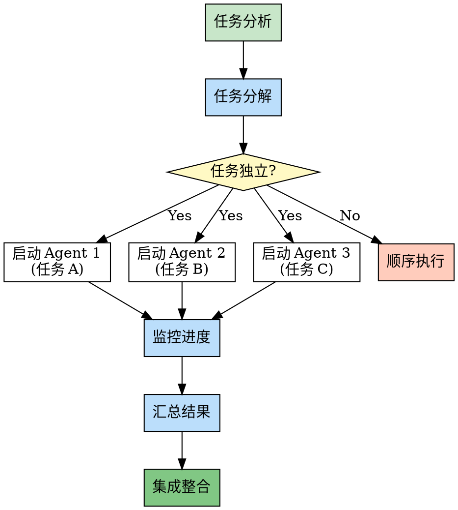

# 第6章：并行模式 - 效率最大化

> **独立任务并行执行，最大化效率**

## 本章导读

并行模式是技能包提升效率的核心模式。它允许系统同时执行多个独立任务，大幅缩短总体执行时间。在技能包系统中，这个模式通过智能任务分解和并行执行，实现了效率的质的飞跃。本章将深入解析并行模式在技能包中的应用。

### 你将学到

- ✅ 并行模式的核心概念
- ✅ dispatching-parallel-agents 的实现机制
- ✅ 如何识别可并行化的任务
- ✅ 并行执行的风险与控制

---

## 6.1 概念：独立任务并行执行

### 设计理念

**并行模式（Parallel Pattern）** 的核心理念：

> **将多个独立任务同时执行，而不是顺序执行**

**对比**：

```
顺序执行（Sequential）：

任务 A (3秒) → 任务 B (2秒) → 任务 C (4秒)
总时间：3 + 2 + 4 = 9秒

并行执行（Parallel）：

任务 A (3秒) ┐
任务 B (2秒) ├→ 同时执行
任务 C (4秒) ┘
总时间：max(3, 2, 4) = 4秒

效率提升：9秒 → 4秒 (55.6% 时间节省)
```

### 在技能包中的应用

**技能包中的并行模式**：

```markdown
# dispatching-parallel-agents 技能

场景：需要同时开发前端、后端、数据库

传统方式：
  开发前端 (2小时)
    ↓
  开发后端 (3小时)
    ↓
  开发数据库 (1小时)
  总时间：6小时

并行方式：
  Agent 1: 开发前端 (2小时) ┐
  Agent 2: 开发后端 (3小时) ├→ 同时执行
  Agent 3: 开发数据库 (1小时) ┘
  总时间：3小时

效率提升：50%
```

### 核心价值

| 价值维度 | 顺序执行 | 并行执行 |
|---------|---------|---------|
| **执行时间** | 累加 | 取最大值 |
| **资源利用** | 单线程 | 多线程/多进程 |
| **吞吐量** | 低 | 高 |
| **响应时间** | 慢 | 快 |
| **复杂度** | 低 | 高 |

### 适用条件

**并行执行的必要条件**：

```markdown
# 可以并行的条件

✅ 条件 1：任务独立性
  - 任务之间没有依赖关系
  - 一个任务不需要另一个任务的结果

✅ 条件 2：资源充足
  - 有足够的计算资源
  - 有足够的内存、CPU

✅ 条件 3：结果可合并
  - 各任务的结果可以汇总
  - 有明确的合并方式

❌ 不能并行的情况

❌ 情况 1：任务有依赖
  任务 A → 任务 B (B 依赖 A 的结果)
  必须顺序执行

❌ 情况 2：资源共享冲突
  多个任务同时写入同一个文件
  会导致数据损坏

❌ 情况 3：结果无法合并
  各任务结果相互矛盾
  无法得出统一结论
```

---

## 6.2 实现：dispatching-parallel-agents

### 技能概览

**技能名称**：`dispatching-parallel-agents`

**描述**：Use when facing 2+ independent tasks that can be worked on without shared state or sequential dependencies

**定位**：并行任务调度器

### 完整实现解析

```markdown
# dispatching-parallel-agents 技能实现

---
name: dispatching-parallel-agents
description: Use when facing 2+ independent tasks that can be worked on without shared state or sequential dependencies
---

# Dispatching Parallel Agents

## Step 1: Analyze Tasks

Analyze the tasks to determine:

1. Number of tasks
2. Task dependencies
3. Resource requirements
4. Expected duration

**IF tasks have dependencies:**
- Refuse to parallelize
- Suggest sequential execution

**IF tasks are independent:**
- Proceed to parallelization

## Step 2: Decompose Tasks

Break down the work into independent units:

Example:
  Original: "Build a user management system"

  Decomposed:
    - Task 1: Design database schema
    - Task 2: Create API endpoints
    - Task 3: Build frontend UI

## Step 3: Launch Agents

Launch separate agents for each task:

**Agent 1: Database Agent**
```
Task: Design database schema
Skills: mysql-query, design-consultation
```

**Agent 2: Backend Agent**
```
Task: Create API endpoints
Skills: writing-plans, tdd, executing-plans
```

**Agent 3: Frontend Agent**
```
Task: Build frontend UI
Skills: writing-plans, executing-plans, design-review
```

## Step 4: Monitor Progress

Monitor each agent's progress:

- Track completion status
- Handle errors if they occur
- Collect results

## Step 5: Aggregate Results

Collect results from all agents:

1. Database schema from Agent 1
2. API code from Agent 2
3. Frontend code from Agent 3

## Step 6: Integrate

Integrate all results:

- Merge code into unified project
- Run integration tests
- Verify all components work together
```

### 并行执行流程



### Agent 调度机制

#### 子代理的创建

```markdown
# 创建子代理

## 使用 Agent Tool

```markdown
# dispatching-parallel-agents 内部

Launch Agent 1:
  Use Agent tool with:
    subagent_type: "general-purpose"
    description: "Design database schema"
    prompt: |
      Design the database schema for user management system.

      Requirements:
      - User table with authentication fields
      - Role and permission tables
      - Audit log table

      Deliverables:
      - SQL schema file
      - Migration scripts
```

## Agent 工作隔离

每个 Agent 在隔离环境中工作：

- 独立的文件系统访问
- 独立的工具访问权限
- 独立的状态管理

优势：
  ✅ 避免冲突
  ✅ 并行执行
  ✅ 错误隔离
```

#### 进度监控

```markdown
# 监控 Agent 进度

## 使用 TaskOutput Tool

```markdown
监控 Agent 1:

task_id = "agent-1-task-id"

result = TaskOutput(task_id, block=false)

IF result.status == "completed":
  收集结果

ELIF result.status == "in_progress":
  继续等待

ELIF result.status == "failed":
  处理错误
```

## 超时处理

```markdown
设置超时：

result = TaskOutput(
  task_id,
  block=true,
  timeout=3600000  # 1小时
)

IF timeout:
  - 取消该 Agent
  - 使用其他 Agent 的结果
  - 或人工介入
```
```

### 结果聚合策略

```markdown
# 结果聚合策略

## 策略 1：简单聚合

直接收集所有结果：

```python
results = []

for agent_id in agent_ids:
    result = TaskOutput(agent_id, block=true)
    results.append(result)

# 合并所有结果
final_result = merge(results)
```

## 策略 2：带验证的聚合

验证每个结果的有效性：

```python
valid_results = []

for agent_id in agent_ids:
    result = TaskOutput(agent_id, block=true)

    if validate(result):
        valid_results.append(result)
    else:
        log_error(f"Agent {agent_id} produced invalid result")

if len(valid_results) < expected_count:
    handle_incomplete_results()
```

## 策略 3：优先级聚合

根据优先级处理结果：

```python
high_priority_results = []
low_priority_results = []

for agent_id in agent_ids:
    result = TaskOutput(agent_id, block=true)

    if result.priority == "high":
        high_priority_results.append(result)
    else:
        low_priority_results.append(result)

# 优先使用高优先级结果
final_result = merge(high_priority_results + low_priority_results)
```
```

---

## 6.3 源码解析：子代理调度与结果汇总

### 任务分解算法

```python
# 任务分解伪代码

def decompose_tasks(original_task):
    """
    将大任务分解为可并行的小任务
    """

    # 分析任务结构
    components = analyze_components(original_task)

    # 识别依赖关系
    dependencies = identify_dependencies(components)

    # 构建依赖图
    graph = build_dependency_graph(components, dependencies)

    # 识别可并行的任务组
    parallel_groups = identify_parallel_groups(graph)

    return parallel_groups

def analyze_components(task):
    """
    分析任务包含哪些组件
    """

    components = []

    # 检查是否涉及数据库
    if involves_database(task):
        components.append({
            'type': 'database',
            'description': 'Database design and implementation'
        })

    # 检查是否涉及后端 API
    if involves_backend(task):
        components.append({
            'type': 'backend',
            'description': 'Backend API development'
        })

    # 检查是否涉及前端 UI
    if involves_frontend(task):
        components.append({
            'type': 'frontend',
            'description': 'Frontend UI development'
        })

    return components

def identify_dependencies(components):
    """
    识别组件之间的依赖关系
    """

    dependencies = []

    for i, component_a in enumerate(components):
        for j, component_b in enumerate(components):
            if i != j:
                if has_dependency(component_a, component_b):
                    dependencies.append({
                        'from': component_a,
                        'to': component_b,
                        'type': 'dependency'
                    })

    return dependencies

def identify_parallel_groups(graph):
    """
    识别可以并行执行的任务组
    """

    # 使用拓扑排序
    sorted_nodes = topological_sort(graph)

    # 分组：同一层级的可以并行
    groups = []
    current_group = []

    for node in sorted_nodes:
        if no_dependencies_to_current_group(node, current_group):
            current_group.append(node)
        else:
            if current_group:
                groups.append(current_group)
            current_group = [node]

    if current_group:
        groups.append(current_group)

    return groups
```

### Agent 调度实现

```python
# Agent 调度伪代码

class ParallelAgentScheduler:
    def __init__(self):
        self.agents = []
        self.results = {}

    def dispatch(self, tasks):
        """
        并行调度多个 Agent
        """

        # 启动所有 Agent
        for task in tasks:
            agent_id = self.launch_agent(task)
            self.agents.append(agent_id)

        # 等待所有 Agent 完成
        self.wait_for_completion()

        # 收集结果
        self.collect_results()

        # 聚合结果
        final_result = self.aggregate_results()

        return final_result

    def launch_agent(self, task):
        """
        启动单个 Agent
        """

        agent_id = Agent(
            subagent_type="general-purpose",
            description=task['description'],
            prompt=self.build_prompt(task),
            run_in_background=True
        )

        return agent_id

    def build_prompt(self, task):
        """
        构建 Agent 的提示词
        """

        prompt = f"""
Task: {task['description']}

Context:
{task['context']}

Requirements:
{task['requirements']}

Deliverables:
{task['deliverables']}

Please complete this task independently.
Do not wait for or depend on other agents.
        """

        return prompt

    def wait_for_completion(self):
        """
        等待所有 Agent 完成
        """

        for agent_id in self.agents:
            result = TaskOutput(
                task_id=agent_id,
                block=True,
                timeout=3600000  # 1小时
            )

            self.results[agent_id] = result

    def collect_results(self):
        """
        收集所有 Agent 的结果
        """

        # 已在 wait_for_completion 中收集
        pass

    def aggregate_results(self):
        """
        聚合所有结果
        """

        aggregated = {
            'database': None,
            'backend': None,
            'frontend': None,
            'errors': []
        }

        for agent_id, result in self.results.items():
            if result['status'] == 'completed':
                task_type = result['task_type']
                aggregated[task_type] = result['output']
            else:
                aggregated['errors'].append({
                    'agent_id': agent_id,
                    'error': result['error']
                })

        return aggregated
```

### 结果集成机制

```markdown
# 结果集成

## 集成步骤

### Step 1: 验证各个结果

```python
def validate_results(results):
    """
    验证每个 Agent 的结果
    """

    validation_report = {
        'valid': [],
        'invalid': []
    }

    for task_type, result in results.items():
        if task_type == 'errors':
            continue

        # 检查结果完整性
        if is_complete(result):
            # 检查结果质量
            if is_high_quality(result):
                validation_report['valid'].append({
                    'type': task_type,
                    'result': result
                })
            else:
                validation_report['invalid'].append({
                    'type': task_type,
                    'reason': 'Low quality'
                })
        else:
            validation_report['invalid'].append({
                'type': task_type,
                'reason': 'Incomplete'
            })

    return validation_report
```

### Step 2: 合并代码

```bash
# 合并各 Agent 的代码

# 数据库代码
cp agent-1-output/schema.sql project/database/

# 后端代码
cp -r agent-2-output/api/* project/backend/

# 前端代码
cp -r agent-3-output/components/* project/frontend/
```

### Step 3: 运行集成测试

```bash
# 安装依赖
npm install

# 运行测试
npm test

# 检查 API
npm run test:api

# 检查前端
npm run test:e2e
```

### Step 4: 修复冲突

如果有冲突：

```markdown
# 处理冲突

## 代码冲突

IF 前端和后端 API 接口不一致:
  1. 识别差异
  2. 协商统一接口
  3. 调整代码

## 数据库冲突

IF 数据库设计与代码不一致:
  1. 检查数据库 schema
  2. 检查代码中的查询
  3. 调整 schema 或代码
```
```

---

## 6.4 对比：并行执行 vs 顺序执行的权衡

### 性能对比

| 对比维度 | 顺序执行 | 并行执行 | 差异 |
|---------|---------|---------|------|
| **总时间** | 累加 | 取最大值 | 并行更快 |
| **资源消耗** | 低（单线程） | 高（多线程） | 并行消耗更多 |
| **实现复杂度** | 低 | 高 | 并行更复杂 |
| **错误处理** | 简单 | 复杂 | 并行需要处理多个错误源 |
| **调试难度** | 低 | 高 | 并行难以调试 |

### 适用场景对比

```markdown
# 何时选择顺序执行

✅ 场景：
  - 任务有依赖关系
  - 资源有限
  - 任务数量少（1-2个）
  - 对实时性要求不高
  - 需要详细的日志和调试

优势：
  - 简单可靠
  - 易于调试
  - 资源消耗低

---

# 何时选择并行执行

✅ 场景：
  - 任务相互独立
  - 资源充足
  - 任务数量多（3+个）
  - 对时间要求严格
  - 可以接受复杂的错误处理

优势：
  - 效率高
  - 时间短
  - 资源利用率高
```

### 混合策略

**策略**：**能并行则并行，必须顺序则顺序**

```markdown
# 混合执行策略

## 分析任务依赖关系

```
任务 A → 任务 B → 任务 C (依赖关系)
任务 D (独立)
任务 E (独立)
```

## 执行计划

Phase 1 (并行):
  - 任务 D
  - 任务 E

Phase 2 (顺序):
  - 任务 A → 任务 B → 任务 C

## 总时间

并行阶段: max(D, E)
顺序阶段: A + B + C
总时间: max(D, E) + A + B + C
```

**实现**：

```markdown
# 混合执行实现

```python
def hybrid_execution(tasks):

    # 分析依赖关系
    graph = analyze_dependencies(tasks)

    # 分组
    phases = group_into_phases(graph)

    results = {}

    for phase in phases:
        if can_parallelize(phase):
            # 并行执行
            phase_results = execute_parallel(phase)
        else:
            # 顺序执行
            phase_results = execute_sequential(phase)

        results.update(phase_results)

    return results
```
```

---

## 6.5 实战：设计自己的并行模式技能

### 设计步骤

#### Step 1：识别并行机会

```markdown
# 示例：多语言文档翻译

场景：将一篇文章翻译成多种语言

任务：
  - 翻译成英语
  - 翻译成日语
  - 翻译成韩语
  - 翻译成法语

分析：
  - 各语言翻译相互独立 ✅
  - 资源充足（多个翻译 Agent）✅
  - 结果可合并（每种语言一个文档）✅

结论：可以并行
```

#### Step 2：设计 Agent 任务

```markdown
# Agent 任务设计

## Agent 1: 英语翻译

```markdown
Task: Translate article to English

Input:
  - Source article (Chinese)

Requirements:
  - Accurate translation
  - Native English expression
  - Maintain original style

Deliverables:
  - English version of article
  - Translation notes (if any)
```

## Agent 2: 日语翻译

```markdown
Task: Translate article to Japanese

Input:
  - Source article (Chinese)

Requirements:
  - Accurate translation
  - Native Japanese expression
  - Maintain original style

Deliverables:
  - Japanese version of article
  - Translation notes (if any)
```

## Agent 3: 韩语翻译

```markdown
Task: Translate article to Korean

Input:
  - Source article (Chinese)

Requirements:
  - Accurate translation
  - Native Korean expression
  - Maintain original style

Deliverables:
  - Korean version of article
  - Translation notes (if any)
```

## Agent 4: 法语翻译

```markdown
Task: Translate article to French

Input:
  - Source article (Chinese)

Requirements:
  - Accurate translation
  - Native French expression
  - Maintain original style

Deliverables:
  - French version of article
  - Translation notes (if any)
```
```

#### Step 3：实现调度器

```markdown
# 翻译并行调度器

```markdown
---
name: parallel-translation
description: Translate article to multiple languages in parallel
---

# Parallel Translation

## Analyze Source

Read the source article:
  - Language: Chinese
  - Length: 5000 words
  - Topic: Technology

## Determine Languages

Ask user which languages to translate to:
  A. English
  B. Japanese
  C. Korean
  D. French
  E. All of the above

## Launch Translation Agents

For each selected language:

**Agent for English:**
```
Use Agent tool with:
  subagent_type: "general-purpose"
  description: "Translate to English"
  prompt: |
    Translate the following article to English.

    Source article:
    {article_content}

    Requirements:
    - Accurate translation
    - Native English expression

    Save result to: en/article.md
```

**Agent for Japanese:**
```
Use Agent tool with:
  subagent_type: "general-purpose"
  description: "Translate to Japanese"
  prompt: |
    Translate the following article to Japanese.

    Source article:
    {article_content}

    Requirements:
    - Accurate translation
    - Native Japanese expression

    Save result to: ja/article.md
```

(Similar for Korean and French)

## Monitor Progress

Track each agent:
  - English: ✓ Completed
  - Japanese: ⏳ In progress
  - Korean: ⏳ In progress
  - French: ✓ Completed

## Collect Results

When all agents complete:
  1. Collect: en/article.md
  2. Collect: ja/article.md
  3. Collect: ko/article.md
  4. Collect: fr/article.md

## Generate Report

Report:
  - English: ✓ Completed (2 minutes)
  - Japanese: ✓ Completed (3 minutes)
  - Korean: ✓ Completed (3 minutes)
  - French: ✓ Completed (2 minutes)

  Total time: 3 minutes (parallel)
  vs. 10 minutes (sequential)

  Time saved: 70%
```
```

#### Step 4：错误处理

```markdown
# 并行翻译的错误处理

## 场景：某个语言翻译失败

例如：日语翻译 Agent 失败

处理：
  1. 检测失败
  2. 记录失败原因
  3. 继续其他翻译
  4. 重试或人工翻译

实现：
```python
results = {}
errors = []

for language in languages:
    try:
        agent_id = launch_translation_agent(language)
        result = TaskOutput(agent_id, block=true, timeout=300000)
        results[language] = result
    except Exception as e:
        errors.append({
            'language': language,
            'error': str(e)
        })

# 处理失败的语言
for error in errors:
    log_error(f"Translation to {error['language']} failed: {error['error']}")

    # 重试
    retry_result = retry_translation(error['language'])

    if retry_result:
        results[error['language']] = retry_result
    else:
        # 记录为失败
        results[error['language']] = None
```
```

#### Step 5：测试和优化

```markdown
# 测试清单

□ 测试并行执行
  - 所有 Agent 是否同时启动？
  - 是否真正并行执行？
  - 时间是否比顺序执行短？

□ 测试结果正确性
  - 翻译是否准确？
  - 语言表达是否地道？
  - 格式是否正确？

□ 测试错误处理
  - 单个 Agent 失败是否影响其他 Agent？
  - 失败后是否正确处理？

□ 测试资源消耗
  - 内存使用是否合理？
  - CPU 利用率是否正常？
  - 是否有资源泄漏？

□ 测试边界条件
  - 空文章如何处理？
  - 超长文章如何处理？
  - 不支持的语言如何处理？
```

### 常见陷阱

#### 陷阱 1：过度并行

```markdown
❌ 错误示例：

将 100 个小任务并行执行

问题：
  - Agent 启动开销大
  - 资源消耗过多
  - 调度复杂度高
  - 实际效率反而降低
```

```markdown
✅ 正确示例：

合并小任务，控制并行数量

将 100 个小任务合并为 10 组：
  - Group 1: Task 1-10
  - Group 2: Task 11-20
  - ...

启动 10 个 Agent 并行执行

优势：
  - 减少调度开销
  - 资源利用合理
  - 效率更高
```

#### 陷阱 2：忽略依赖关系

```markdown
❌ 错误示例：

并行执行：
  - Task A: 设计数据库 schema
  - Task B: 编写 API (依赖数据库 schema)

问题：
  - Task B 需要 Task A 的结果
  - 并行执行会导致 Task B 失败
```

```markdown
✅ 正确示例：

识别依赖关系：
  Task A → Task B

执行计划：
  Phase 1: 执行 Task A
  Phase 2: 执行 Task B (等待 A 完成)

优势：
  - 保证依赖关系
  - 避免错误
```

#### 陷阱 3：资源竞争

```markdown
❌ 错误示例：

两个 Agent 同时写入同一个文件：
  - Agent 1: 写入 config.json
  - Agent 2: 也写入 config.json

问题：
  - 文件内容混乱
  - 数据损坏
```

```markdown
✅ 正确示例：

分配不同的文件：
  - Agent 1: 写入 database-config.json
  - Agent 2: 写入 api-config.json

或者：
  - 使用锁机制
  - 或者顺序写入

优势：
  - 避免竞争
  - 数据安全
```

---

## 本章小结

本章深入解析了并行模式：

1. **模式概念** - 独立任务并行执行，效率最大化
2. **dispatching-parallel-agents 实现** - 任务分解、Agent 调度、结果聚合
3. **子代理机制** - 创建、监控、收集结果
4. **并行 vs 顺序** - 性能、复杂度、适用场景对比
5. **设计自己的并行模式** - 五步法与常见陷阱

并行模式是提升技能包效率的关键，但需要谨慎处理依赖关系和资源竞争。

---

## 延伸阅读

- [Parallel Computing Concepts](https://en.wikipedia.org/wiki/Parallel_computing)
- [Agent-based Systems](https://en.wikipedia.org/wiki/Intelligent_agent)
- [Concurrent Programming Patterns](https://en.wikipedia.org/wiki/Concurrent_computing)

## 练习题

1. **思考题**：并行模式在什么情况下会降低效率？
2. **实践题**：设计一个并行测试技能，同时测试多个浏览器。
3. **讨论题**：如何平衡并行度和资源消耗？

---

**下一章预告**：第7章将深入探讨守护模式，解析安全边界设计。