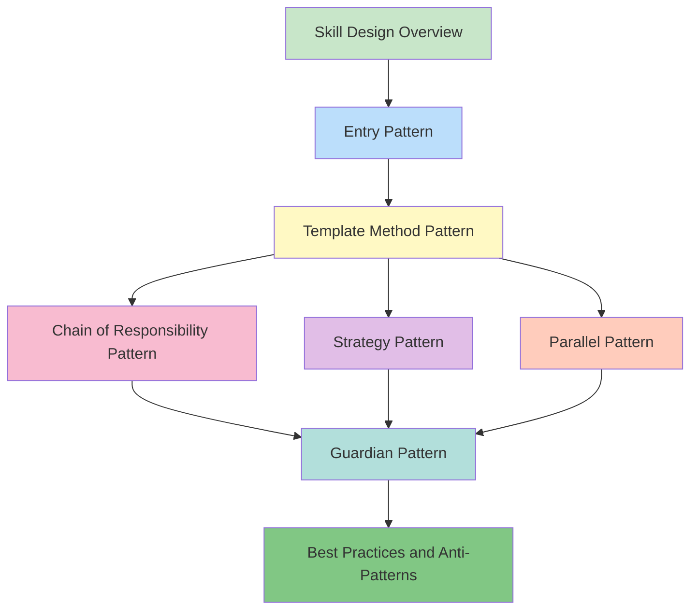

# 📚 Skill Design Patterns: From Theory to Practice

> **Master the core design principles of AI skills and build scalable, collaborative skill ecosystems**

## Course Introduction

This course deeply analyzes the design principles, architectural patterns, and best practices of modern AI skills. Through dissecting real implementations of Superpowers and Gstack, you'll learn how to design high-quality, reusable skill systems.

### Target Audience

- **Experienced Developers** - Want to deeply understand AI tool design principles
- **Skill Developers** - Want to build their own skill ecosystems
- **Architects** - Need to design scalable AI toolchains

### Learning Path

```
Chapter 1: Skill Design Overview
  ↓
Chapter 2: Entry Pattern - Unified Dispatch Center
  ↓
Chapter 3: Template Method Pattern - Workflow Orchestration
  ↓
Chapter 4: Chain of Responsibility Pattern - Quality Assurance
  ↓
Chapter 5: Strategy Pattern - Flexible Decision-Making
  ↓
Chapter 6: Parallel Pattern - Efficiency Maximization
  ↓
Chapter 7: Guardian Pattern - Security Boundaries
  ↓
Chapter 8: Best Practices and Anti-Patterns
```

---

## 📖 Course Chapters

### Chapter 1: Skill Design Overview

**⏱️ Duration**: 45 minutes
**🎯 Difficulty**: Beginner
**📋 Overview**:
- What is a skill ecosystem
- Five-layer architecture design (Entry, Process, Tool, Completion, Guardian)
- Separation of concerns and orchestration principles
- Superpowers vs Gstack positioning comparison

**🔗 Quick Links**:
- [中文版](../skills-package-design-patterns.md)
- [English Version](./skills-package-design-patterns.md)

**✅ Learning Objectives**:
- Understand the value of skill ecosystems
- Master the five-layer architecture design philosophy
- Understand the positioning differences between Superpowers and Gstack

---

### Chapter 2: Entry Pattern - Unified Dispatch Center

**⏱️ Duration**: 60 minutes
**🎯 Difficulty**: Intermediate
**📋 Overview**:
- Why need a unified entry
- `using-superpowers` routing logic
- Three triggering mechanisms (Description-based, Explicit, Chain)
- How to design your own entry skill

**🔗 Quick Links**:
- [中文版](../chapter-02-entry-pattern.md)
- [English Version](./chapter-02-entry-pattern.md)

**✅ Learning Objectives**:
- Master the Entry Pattern design philosophy
- Understand the differences between three triggering mechanisms
- Be able to design your own entry skill

---

### Chapter 3: Template Method Pattern - The Art of Workflow Orchestration

**⏱️ Duration**: 75 minutes
**🎯 Difficulty**: Intermediate
**📋 Overview**:
- Fixed skeleton, variable details design philosophy
- `writing-plans` five-step skeleton design
- Skill invocation mechanism (browse, design-consultation, plan-*-review)
- Superpowers workflow chain vs Gstack tool invocation comparison

**🔗 Quick Links**:
- [中文版](../chapter-03-template-method-pattern.md)
- [English Version](./chapter-03-template-method-pattern.md)

**✅ Learning Objectives**:
- Master the application of Template Method Pattern
- Understand how to preserve flexibility within fixed workflows
- Be able to design your own template method skill

---

### Chapter 4: Chain of Responsibility Pattern - Quality Assurance Chain

**⏱️ Duration**: 70 minutes
**🎯 Difficulty**: Intermediate
**📋 Overview**:
- Layer-by-layer quality assurance mechanism
- verification → review → qa → design-review complete chain
- Each node's responsibility boundary design
- Superpowers validation chain vs Gstack quality chain comparison

**🔗 Quick Links**:
- [中文版](../chapter-04-chain-of-responsibility.md)
- [English Version](./chapter-04-chain-of-responsibility.md)

**✅ Learning Objectives**:
- Master the application of Chain of Responsibility Pattern
- Understand quality assurance chain design principles
- Be able to design your own responsibility chain skill

---

### Chapter 5: Strategy Pattern - Flexible Decision-Making Mechanism

**⏱️ Duration**: 65 minutes
**🎯 Difficulty**: Intermediate
**📋 Overview**:
- Select different strategies based on scenarios
- `finishing-branch` three merge strategies
- Strategy decision mechanism (branch type, dependencies, urgency)
- Superpowers branch strategy vs traditional Git workflow comparison

**🔗 Quick Links**:
- [中文版](../chapter-05-strategy-pattern.md)
- [English Version](./chapter-05-strategy-pattern.md)

**✅ Learning Objectives**:
- Master the application of Strategy Pattern
- Understand how to design flexible decision mechanisms
- Be able to design your own strategy pattern skill

---

### Chapter 6: Parallel Pattern - Efficiency Maximization

**⏱️ Duration**: 60 minutes
**🎯 Difficulty**: Advanced
**📋 Overview**:
- Execute independent tasks in parallel
- `dispatching-parallel-agents` implementation mechanism
- Task decomposition, agent scheduling, result aggregation
- Parallel vs sequential execution trade-offs

**🔗 Quick Links**:
- [中文版](../chapter-06-parallel-pattern.md)
- [English Version](./chapter-06-parallel-pattern.md)

**✅ Learning Objectives**:
- Master the application of Parallel Pattern
- Understand how to identify parallelizable tasks
- Be able to design your own parallel pattern skill

---

### Chapter 7: Guardian Pattern - Security Boundary Design

**⏱️ Duration**: 55 minutes
**🎯 Difficulty**: Intermediate
**📋 Overview**:
- Defensive programming philosophy
- careful, freeze, guard three-tier protection
- Dangerous operation identification and interception
- Design your own security guardian skill

**🔗 Quick Links**:
- [中文版](../chapter-07-08-guardian-and-best-practices.md)
- [English Version](./chapter-07-08-guardian-and-best-practices.md)

**✅ Learning Objectives**:
- Master the Guardian Pattern design philosophy
- Understand the three-tier protection mechanism
- Be able to design your own guardian skill

---

### Chapter 8: Best Practices and Anti-Patterns - Lessons Learned

**⏱️ Duration**: 50 minutes
**🎯 Difficulty**: Intermediate
**📋 Overview**:
- 8 design principles for skills
- 10 common anti-patterns and how to avoid them
- How to design your own skill ecosystem
- Future trends in skill collaboration

**🔗 Quick Links**:
- [中文版](../chapter-08-best-practices.md)
- [English Version](./chapter-08-best-practices.md)

**✅ Learning Objectives**:
- Master core principles of skill design
- Identify and avoid common anti-patterns
- Be able to design complete skill ecosystems

---

## 🗺️ Recommended Learning Paths

### Path A: Quick Start (4 hours)

Suitable for: Limited time, want quick overview of core concepts

1. **Chapter 1**: Skill Design Overview (45 min)
2. **Chapter 2**: Entry Pattern (60 min)
3. **Chapter 8**: Best Practices and Anti-Patterns (50 min)

**Outcome**: Build overall concept, understand core patterns

---

### Path B: Deep Learning (8 hours)

Suitable for: Want systematic learning, deep understanding of each pattern

Study all 8 chapters in order

**Outcome**: Comprehensively master skill design, able to design your own skill systems

---

### Path C: Practice-Oriented (6 hours)

Suitable for: Have project needs, want to learn while doing

1. **Chapter 1**: Skill Design Overview (45 min)
2. **Chapter 3**: Template Method Pattern (75 min)
3. **Chapter 4**: Chain of Responsibility Pattern (70 min)
4. **Chapter 5**: Strategy Pattern (65 min)
5. **Chapter 6**: Parallel Pattern (60 min)
6. **Chapter 8**: Best Practices and Anti-Patterns (50 min)

**Outcome**: Master patterns most commonly used in practice

---

## 📊 Knowledge Graph



---

## 🎯 Design Pattern Quick Reference

| Pattern | Core Skill | Key Value | Use Cases |
|---------|-----------|-----------|-----------|
| Entry Pattern | using-superpowers | Unified dispatch, intelligent routing | Need to manage multiple skills |
| Template Method Pattern | writing-plans | Fixed skeleton, variable details | Standardize workflows, preserve flexibility |
| Chain of Responsibility Pattern | verification → review | Layer-by-layer checks, quality assurance | Tasks requiring multi-level validation |
| Strategy Pattern | finishing-branch | Flexible decisions, dynamic selection | Choose different approaches based on scenarios |
| Parallel Pattern | dispatching-parallel-agents | Efficiency maximization, task parallelization | Independent tasks can execute simultaneously |
| Guardian Pattern | careful, freeze, guard | Security boundaries, tiered protection | Need to prevent misoperations |

---

## 💡 Learning Tips

### For Beginners

1. **Start with Chapter 1**, build overall concept
2. **Learn while practicing**, hands-on with each pattern
3. **Complete exercises**, reinforce understanding
4. **Connect to real projects**, apply learned knowledge

### For Experienced Developers

1. **Can jump directly to patterns of interest**
2. **Focus on source code analysis sections**
3. **Compare implementations across different skill packages**
4. **Think about how to apply to your own projects**

### For Skill Developers

1. **Deep dive into implementation details of each pattern**
2. **Study Superpowers and Gstack source code**
3. **Design your own skill ecosystem**
4. **Continuously iterate and optimize**

---

## 🔗 Related Resources

### Official Documentation

- [Claude Skills Official Documentation](https://docs.anthropic.com/claude/docs/skills)
- [Superpowers GitHub](https://github.com/superpower/skills)
- [Gstack GitHub](https://github.com/garrytan/gstack)

### Recommended Books

- [Design Patterns: Elements of Reusable Object-Oriented Software](https://book.douban.com/subject/1052241/)
- [Clean Code: A Handbook of Agile Software Craftsmanship](https://book.douban.com/subject/4199741/)
- [The Pragmatic Programmer](https://book.douban.com/subject/1152111/)

### Community Resources

- [awesome-claude-skills](https://github.com/ComposioHQ/awesome-claude-skills)
- [Claude Code Discord](https://discord.gg/anthropic)

---

## 📝 Exercises and Assignments

### Basic Exercises

1. **Concept Understanding**: Explain each pattern's core value in your own words
2. **Pattern Recognition**: Analyze an existing skill package, identify design patterns
3. **Comparative Analysis**: Compare differences between similar patterns (e.g., Chain of Responsibility vs Pipeline)

### Advanced Exercises

1. **Design Practice**: Design a skill package for your workflow
2. **Code Implementation**: Implement a simple skill package prototype
3. **Performance Optimization**: Analyze a skill package's performance bottlenecks and propose optimization solutions

### Advanced Projects

1. **Skill Ecosystem**: Design a complete skill ecosystem architecture
2. **Cross-Platform Skills**: Design a skill package that works across multiple AI platforms
3. **Intelligent Orchestration System**: Design a system that can automatically select skills

---

## 📈 Learning Progress Tracker

Use this checklist to track your learning progress:

- [ ] Chapter 1: Skill Design Overview
  - [ ] Chinese Version
  - [ ] English Version
  - [ ] Exercises Completed

- [ ] Chapter 2: Entry Pattern
  - [ ] Chinese Version
  - [ ] English Version
  - [ ] Exercises Completed

- [ ] Chapter 3: Template Method Pattern
  - [ ] Chinese Version
  - [ ] English Version
  - [ ] Exercises Completed

- [ ] Chapter 4: Chain of Responsibility Pattern
  - [ ] Chinese Version
  - [ ] English Version
  - [ ] Exercises Completed

- [ ] Chapter 5: Strategy Pattern
  - [ ] Chinese Version
  - [ ] English Version
  - [ ] Exercises Completed

- [ ] Chapter 6: Parallel Pattern
  - [ ] Chinese Version
  - [ ] English Version
  - [ ] Exercises Completed

- [ ] Chapter 7: Guardian Pattern
  - [ ] Chinese Version
  - [ ] English Version
  - [ ] Exercises Completed

- [ ] Chapter 8: Best Practices and Anti-Patterns
  - [ ] Chinese Version
  - [ ] English Version
  - [ ] Exercises Completed

---

## 🎓 Completion Standards

Complete the following to be considered as having completed the course:

1. ✅ Complete all 8 chapters
2. ✅ Understand core concepts of each pattern
3. ✅ Complete 80%+ of exercises
4. ✅ Be able to identify design patterns in skill packages
5. ✅ Be able to design simple skill packages

---

## 🤝 Feedback and Contributions

### Issue Feedback

If you encounter issues during learning, you can:
- Ask questions in GitHub Issues
- Discuss in community forums
- Consult official documentation

### Content Contributions

If you find content errors or have improvement suggestions:
- Pull Requests are welcome
- Provide improvement suggestions
- Share your learning insights

---

## 📜 Change Log

- **2024-03-24**: Course launch, completed all 8 chapters in Chinese and English
- **Future Plans**:
  - Add video tutorials
  - Increase practical cases
  - Develop online practice platform

---

## 📄 License

This course content is licensed under [CC BY-NC-SA 4.0](https://creativecommons.org/licenses/by-nc-sa/4.0/).

---

**Start your learning journey now!** 🚀

Remember: Practice makes perfect, time is the only test of truth. Use AI, but don't blindly follow. Dialectical unity, neither deify nor demonize.