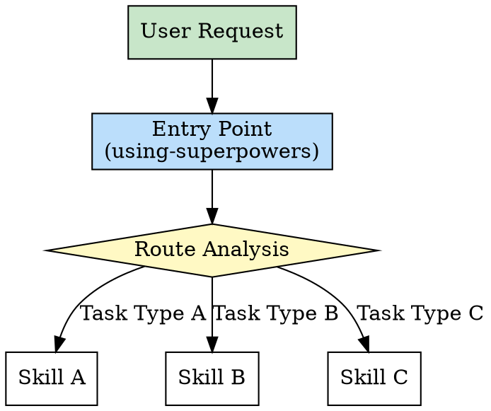
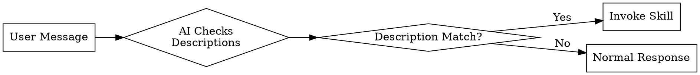
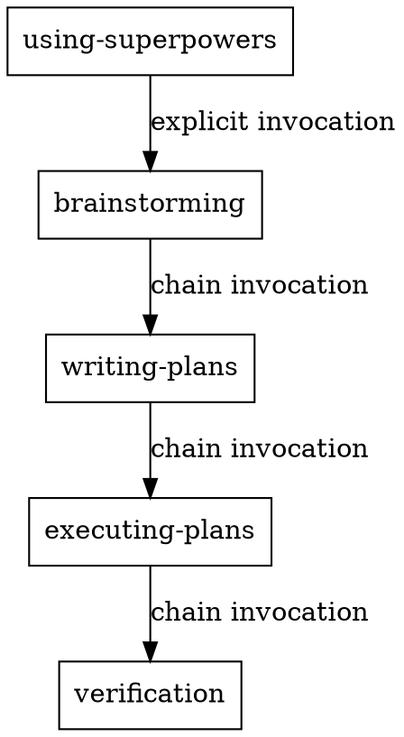

# Chapter 2: Entry Pattern - Unified Dispatch Center

> **Single entry point, intelligent routing, ensuring workflow coherence**

## Chapter Overview

The Entry Pattern is the "facade" of a skill ecosystem, determining how users interact with the entire system. A well-designed entry reduces cognitive burden, prevents skill conflicts, and provides a global perspective. This chapter deeply analyzes the design philosophy, implementation, and best practices of the Entry Pattern.

### What You'll Learn

- ✅ Why a unified entry is needed
- ✅ Three triggering mechanisms of the Entry Pattern
- ✅ Routing logic of `using-superpowers`
- ✅ How to design your own entry skill

---

## 2.1 Concept: Why Need a Unified Entry

### Problem Background: Chaos Without Entry

Imagine a skill system with 20 skills. Without a unified entry, users face:

```
❌ Problem Scenario 1: Choice Paralysis

User: "I want to develop a new feature"

AI: "Okay, I can use these skills:
     - brainstorming
     - writing-plans
     - executing-plans
     - tdd
     - verification
     ...
     Which one do you want?"

User: "...I don't know, I'm a beginner"
```

```
❌ Problem Scenario 2: Skill Conflicts

User: "Help me write a login feature"

Skill A: "I can help you plan"
Skill B: "I can write code directly"
Skill C: "I can do architecture design first"

Three skills respond simultaneously, causing chaos
```

```
❌ Problem Scenario 3: Broken Workflows

User uses brainstorming
But doesn't know what to do next

Result: Ideas exist, but no follow-up actions
Task abandoned halfway
```

### Solution: Unified Entry

**Entry Pattern** provides a unified dispatch center:



### Core Value of Entry

| Value Dimension | Without Entry | With Entry |
|----------------|--------------|------------|
| **User Experience** | Need to remember all skill names | Just describe requirements |
| **Decision Burden** | User chooses skills themselves | System auto-routes |
| **Workflow Coherence** | Easily broken | Auto-connects next steps |
| **Skill Conflicts** | Multiple skills respond simultaneously | Unified dispatch, avoid conflicts |
| **Maintainability** | New skills have large impact | Only update routing rules |

### Three Responsibilities of Entry

**1. Receive Requests**

```markdown
# Entry receives all user requests

User: "Help me develop a login feature"
User: "Test this webpage"
User: "Refactor this module"

Entry doesn't care about implementation, only understands intent
```

**2. Analyze Intent**

```markdown
# Intent Analysis

User: "Develop a login feature"
  → Analysis: This is a development task
  → Subtype: New feature development
  → Characteristic: Needs complete workflow from concept to implementation

User: "Test this webpage"
  → Analysis: This is a testing task
  → Subtype: Browser testing
  → Characteristic: Needs browser automation tools
```

**3. Route Decisions**

```markdown
# Select skill path based on intent

Development task → brainstorming → writing-plans → ...
Testing task → browse → qa → ...
Refactoring task → first-principles → writing-plans → ...
```

---

## 2.2 Implementation: using-superpowers Routing Logic

### Skill Overview

**Skill Name**: `using-superpowers`

**Description**: Use when starting any conversation - establishes how to find and use skills, requiring Skill tool invocation before ANY response including clarifying questions

**Positioning**: The gatekeeper of the super skills package

### YAML Frontmatter Analysis

```yaml
---
name: using-superpowers
description: Use when starting any conversation - establishes how to find and use skills, requiring Skill tool invocation before ANY response including clarifying questions
---

# Core content
```

**Key Information**:

1. **Trigger Condition**: `starting any conversation` - triggers at start of every conversation
2. **Core Responsibility**: `how to find and use skills` - teaches system how to discover and invoke skills
3. **Mandatory Requirement**: `before ANY response` - must invoke before responding, highest priority

### Routing Logic Deep Dive

#### Step 1: Check for Skill Matches

```markdown
# using-superpowers pseudocode

IF user request matches a skill's description:
    Invoke Skill tool with skill name
ELSE:
    Continue normal conversation
```

**Matching Rules**:

| User Request Keywords | Matched Skill | Reason |
|----------------------|--------------|--------|
| "develop", "implement", "create feature" | brainstorming | Creative task, needs exploration |
| "test", "verify" | verification | Validation task, check results |
| "refactor", "optimize" | first-principles | Need first-principles thinking |
| "deploy", "go live" | land-and-deploy | Deployment task |
| "write a..." | tdd | Development task, test-first |

#### Step 2: Determine Task Type

```markdown
# Task Type Classification

IF creative task:
  → brainstorming (superpowers)
  → plan-design-review (gstack)

IF development task:
  → writing-plans (superpowers)
  → plan-eng-review (gstack)
  → executing-plans (superpowers)
  → tdd (superpowers)
  → browse (gstack, when browser needed)

IF quality task:
  → verification (superpowers)
  → review (gstack)
  → qa (gstack)
  → design-review (gstack)

IF deployment task:
  → finishing-branch (superpowers)
  → land-and-deploy (gstack)
  → canary (gstack)
```

#### Step 3: Build Execution Chain

```markdown
# Build skill execution chain

Development task complete workflow:
  using-superpowers
    ↓
  brainstorming
    ↓ (auto-invoke)
  writing-plans
    ↓ (auto-invoke)
  executing-plans
    ↓ (auto-invoke)
  tdd
    ↓ (auto-invoke)
  verification
```

### Real Case Demonstrations

**Case 1: New Feature Development**

```
User: "Help me develop a user authentication system"

using-superpowers analysis:
  1. Keyword detection: "develop" → development task
  2. Subtype judgment: "user authentication system" → new feature
  3. Determine workflow: complete development workflow

Execution chain:
  → brainstorming (explore solutions)
    Thinking: JWT vs Session? OAuth?
  → writing-plans (make plan)
    Plan: database design → API development → frontend integration
  → executing-plans (execute)
    Implement: complete each subtask step by step
  → tdd (test-driven)
    Test: unit tests + integration tests
  → verification (verify)
    Confirm: does it meet original requirements
```

**Case 2: Bug Fix**

```
User: "Login page has a bug, button doesn't respond"

using-superpowers analysis:
  1. Keyword detection: "bug", "doesn't respond" → debugging
  2. Subtype judgment: frontend interaction issue
  3. Determine workflow: debugging workflow

Execution chain:
  → systematic-debugging (systematic debugging)
    Investigate: locate root cause
    Hypothesis: possible event listener issue
    Verify: check code
  → tdd (post-fix testing)
    Test: ensure fix doesn't break other features
  → verification (verify)
    Confirm: is bug truly fixed
```

**Case 3: Code Review**

```
User: "Help me review this code"

using-superpowers analysis:
  1. Keyword detection: "review" → quality task
  2. Subtype judgment: code review
  3. Determine workflow: quality assurance workflow

Execution chain:
  → requesting-code-review (request code review)
    Review: code quality, security, performance
  → (if improvements needed)
    → systematic-debugging (fix issues)
  → verification (verify)
    Confirm: does code meet quality standards
```

---

## 2.3 Source Code Analysis: Three Triggering Mechanisms

### Triggering Mechanism Overview

Skills have three triggering methods:

```
1. Description-based Triggering
   - Relies on description in YAML frontmatter
   - AI automatically judges when to invoke

2. Explicit Invocation
   - User or skill explicitly invokes via Skill tool
   - Specifies skill name clearly

3. Chain Invocation
   - Skill internally invokes other skills
   - Forms execution chains
```

### Mechanism Details

#### Mechanism 1: Description-based Triggering

**Principle**: Claude automatically judges whether to invoke based on skill description

```yaml
---
name: brainstorming
description: You MUST use this before any creative work - creating features, building components, adding functionality, or modifying behavior
TRIGGER when: creating features, building components, adding functionality
DO NOT TRIGGER when: reading files, simple queries, bug fixes
---

# brainstorming skill content
```

**Triggering Flow**:



**Advantages**:
- ✅ Users don't need to remember skill names
- ✅ High automation level
- ✅ Low barrier to entry

**Disadvantages**:
- ⚠️ Depends on description accuracy
- ⚠️ Possible misjudgment
- ⚠️ Long descriptions affect token consumption

**Best Practices**:

```yaml
# Good description

description: "Trigger when user asks to create new features or modify existing functionality"

# Bad description

description: "This is a very useful skill that can help you with many things..."  # Too vague
```

#### Mechanism 2: Explicit Invocation

**Principle**: Invoke clearly through Skill tool

```markdown
# User explicit invocation

User: "/brainstorming"
or
User: "Use brainstorming skill to help me design..."

# Skill explicit invocation

**Next Steps**:
- Call Skill tool with skill="brainstorming"
```

**Invocation Methods**:

**Method 1: Slash Command**

```
User: /brainstorming

Claude: Launching skill: brainstorming
[Execute brainstorming skill]
```

**Method 2: Natural Language**

```
User: Use brainstorming skill to help me design the user authentication system

Claude: [Invoke brainstorming skill]
```

**Method 3: Skill Chain Invocation**

```markdown
# Inside writing-plans skill

After completion:

**Next Steps**:
- Call /executing-plans to start implementation
```

**Advantages**:
- ✅ Precise control
- ✅ No ambiguity
- ✅ Suitable for advanced users

**Disadvantages**:
- ⚠️ Users need to know skill names
- ⚠️ Increases memory burden

#### Mechanism 3: Chain Invocation

**Principle**: Skills internally invoke other skills, forming execution chains

```markdown
# brainstorming skill internal logic

After creative exploration completes:

**Next Steps**:
1. Call /writing-plans to create implementation plan
2. Then proceed to /executing-plans
3. Finally use /verification to validate results
```

**Chain Invocation Flow**:



**Implementation Method**:

```markdown
# Chain invocation in skill file

---
name: brainstorming
---

# Brainstorming Ideas Into Designs

[Main skill content]

## After the Design

**Implementation:**

- Invoke the writing-plans skill to create a detailed implementation plan
- Do NOT invoke any other skill. writing-plans is the next step.
```

**Key Design Principles**:

1. **Clear Next Step**
   ```markdown
   ✅ Good: "Then invoke /writing-plans"
   ❌ Bad: "Then do something else"  # Vague
   ```

2. **Single Inheritance**
   ```markdown
   ✅ Good: "After this, call skill A"
   ❌ Bad: "After this, call skill A and skill B"  # Forking
   ```

3. **Avoid Cycles**
   ```markdown
   ❌ Bad:
   Skill A → Skill B → Skill A  # Infinite loop
   ```

### Comparison of Three Mechanisms

| Dimension | Description Trigger | Explicit Invocation | Chain Invocation |
|-----------|-------------------|-------------------|-----------------|
| **Triggered By** | AI auto-judgment | User/skill explicit | Previous skill |
| **User Awareness** | Invisible | Needs skill name | Auto-flow |
| **Precision** | Medium (depends on description) | High | High |
| **Flexibility** | High | Medium | Low (fixed chain) |
| **Use Cases** | Novice users, simple tasks | Advanced users, precise control | Standardized workflows |

### Combined Usage Strategy

**Strategy 1: Entry Uses Description Trigger**

```yaml
# using-superpowers
description: Use when starting any conversation
```

**Reason**: Entry needs auto-triggering to lower usage barrier

**Strategy 2: Middle Skills Use Chain Invocation**

```markdown
# After brainstorming completes
Next: writing-plans
```

**Reason**: Ensures workflow coherence, avoids manual selection

**Strategy 3: Tool Skills Use Explicit Invocation**

```markdown
# When browser is needed
Call /browse explicitly
```

**Reason**: Tool skills may be reused in different workflows, need flexible invocation

---

## 2.4 Comparison: Entry Designs Across Skill Packages

### Superpowers Entry Design

**Entry Skill**: `using-superpowers`

**Design Philosophy**: **Entry is Router**

```markdown
# using-superpowers core logic

1. Receive user request
2. Analyze task type
3. Select skill path
4. Invoke first skill
5. Subsequent skills auto chain-invoke
```

**Characteristics**:
- ✅ Single entry point
- ✅ Intelligent routing
- ✅ Workflow automation
- ⚠️ Entry skill relatively complex

### Gstack Entry Design

**Entry Skill**: No unified entry

**Design Philosophy**: **Invoke as Needed**

```markdown
# Gstack invocation method

User directly invokes specific skills:
- /browse - when browser is needed
- /qa - when quality check is needed
- /land-and-deploy - when deployment is needed
```

**Characteristics**:
- ✅ High flexibility
- ✅ Strong skill independence
- ⚠️ Users need to know skill names
- ⚠️ Lacks workflow orchestration

### Design Comparison Analysis

| Comparison Dimension | Superpowers | Gstack | Analysis |
|---------------------|------------|--------|----------|
| **Entry Count** | Single entry | Multiple independent skills | Superpowers more unified |
| **User Cognitive Burden** | Low | Medium | Superpowers beginner-friendly |
| **Workflow Coherence** | High | Low | Superpowers auto-orchestrates |
| **Flexibility** | Medium | High | Gstack more flexible |
| **Skill Reusability** | Low (fixed chains) | High (independent invocation) | Gstack easier to reuse |
| **Maintenance Cost** | High (complex entry) | Low (independent skills) | Gstack easier to maintain |

### Best Practice: Hybrid Mode

**Scenario**: Need both workflow orchestration and tool flexibility

**Solution**: Dual-layer entry

```
Layer 1: Process Entry (Superpowers)
  → using-superpowers
  → Auto-orchestrate workflows

Layer 2: Tool Entry (Gstack)
  → browse, qa, land-and-deploy
  → Can be invoked by process entry, also used independently
```

**Implementation Example**:

```markdown
# using-superpowers hybrid mode

IF development task:
  → brainstorming (superpowers, process skill)
  → writing-plans (superpowers, process skill)
  → executing-plans (superpowers, process skill)
  → browse (gstack, tool skill, explicit invocation)
  → qa (gstack, tool skill, explicit invocation)
  → verification (superpowers, process skill)
```

**Advantages**:
- ✅ Workflow automation (process skills)
- ✅ Tool flexibility (tool skills)
- ✅ Clear responsibilities
- ✅ Easy to maintain

---

## 2.5 Practice: Design Your Own Entry Skill

### Design Steps

#### Step 1: Define Responsibility Boundaries

```markdown
# What Entry Skill Should Do

✅ Receive all user requests
✅ Analyze task types and intent
✅ Select appropriate skill path
✅ Invoke first skill

# What Entry Skill Should NOT Do

❌ Implement specific business logic
❌ Directly manipulate files or databases
❌ Contain too many conditional branches
```

#### Step 2: Define Task Types

```markdown
# Define task types based on your project

Example: Content Creation Platform

Task Types:
1. Content Creation → brainstorming → writing → editing
2. Content Review → content-review → feedback
3. Content Publishing → publishing → promotion
4. Data Analysis → data-collection → analysis → report
```

#### Step 3: Write YAML Frontmatter

```yaml
---
name: content-platform-entry
description: |
  Use when starting any conversation about content creation, review, or publishing.

  TRIGGER when:
  - User asks to create content
  - User asks to review content
  - User asks to publish content
  - User asks to analyze data

  DO NOT TRIGGER when:
  - Simple questions about the platform
  - User is just browsing
---
```

#### Step 4: Implement Routing Logic

```markdown
# content-platform-entry skill content

## Welcome to Content Platform

I'm here to help you with content-related tasks.

## Task Routing

### Content Creation Tasks

IF user wants to create content:
  1. Invoke /brainstorming to generate ideas
  2. Then use /content-writing to draft
  3. Finally use /editing to polish

### Content Review Tasks

IF user wants to review content:
  1. Invoke /content-review to check quality
  2. If issues found, use /feedback-generator
  3. Track changes with /version-control

### Publishing Tasks

IF user wants to publish:
  1. Invoke /publishing to prepare content
  2. Use /promotion to distribute
  3. Track performance with /analytics

### Data Analysis Tasks

IF user wants to analyze data:
  1. Invoke /data-collection to gather metrics
  2. Use /analysis to process data
  3. Generate /report with insights
```

#### Step 5: Test and Optimize

```markdown
# Testing Checklist

□ Test if description triggering is accurate
  - User says "write an article" → triggers content creation workflow
  - User says "review this article" → triggers content review workflow

□ Test if routing is correct
  - Creation task → brainstorming → writing → editing
  - Review task → content-review → feedback

□ Test if chain invocation is smooth
  - brainstorming auto-invokes writing after completion
  - writing auto-invokes editing after completion

□ Test error handling
  - Unrecognized task type → prompt user
  - Skill invocation fails → fallback plan
```

### Common Pitfalls

#### Pitfall 1: Entry Too Complex

```markdown
❌ Wrong Example:

IF task type A:
  IF subtype A1:
    IF urgency high:
      invoke skill X
    ELSE:
      invoke skill Y
  ELIF subtype A2:
    ...

Problems:
- Logic too complex
- Hard to maintain
- Error-prone
```

```markdown
✅ Correct Example:

IF task type A:
  invoke skill A-handler
ELSE IF task type B:
  invoke skill B-handler

Each skill handles its own logic internally
```

#### Pitfall 2: Entry Contains Business Logic

```markdown
❌ Wrong Example:

IF content creation:
  1. Analyze user intent
  2. Generate content outline
  3. Write main text
  4. Add images

Problems:
- Entry takes on too many responsibilities
- Violates Single Responsibility Principle
```

```markdown
✅ Correct Example:

IF content creation:
  invoke /content-creation-pipeline

content-creation-pipeline skill handles:
  1. Analyze intent
  2. Generate outline
  3. Write main text
  4. Add images
```

#### Pitfall 3: Missing Error Handling

```markdown
❌ Wrong Example:

IF task type A:
  invoke skill A
ELSE:
  # No default handling

Problems:
- Unrecognized tasks get stuck
- Poor user experience
```

```markdown
✅ Correct Example:

IF task type A:
  invoke skill A
ELSE:
  Reply to user:
    "Sorry, I can't handle this type of task yet.
     I'm good at:
     - Content creation
     - Content review
     - Content publishing
     Please tell me what you want to do?"
```

---

## Chapter Summary

This chapter deeply analyzed the Entry Pattern:

1. **Why Need Entry** - Solves three problems: choice paralysis, skill conflicts, broken workflows
2. **Entry Core Responsibilities** - Receive requests, analyze intent, route decisions
3. **Three Triggering Mechanisms** - Description triggering, explicit invocation, chain invocation
4. **Superpowers vs Gstack** - Single entry vs multi-entry design differences
5. **Design Your Own Entry** - Five-step method and common pitfalls

The Entry Pattern is the "facade" of a skill ecosystem. A well-designed entry enables users to seamlessly use complex skill systems.

---

## Extended Reading

- [Superpowers: using-superpowers Source](https://github.com/superpower/skills/blob/main/using-superpowers.md)
- [Design Patterns: Facade Pattern](https://en.wikipedia.org/wiki/Facade_pattern)
- [Routing Algorithm Best Practices](https://martinfowler.com/articles/richardsonMaturityModel.html)

## Exercises

1. **Thinking Question**: In your project, do you need a unified entry? Why?
2. **Practice**: Design a simple entry skill, defining routing rules for 3 task types.
3. **Discussion**: What are the disadvantages of Superpowers' single entry design? How to improve?

---

**Next Chapter Preview**: Chapter 3 will explore the Template Method Pattern, analyzing how `writing-plans` implements workflow orchestration.