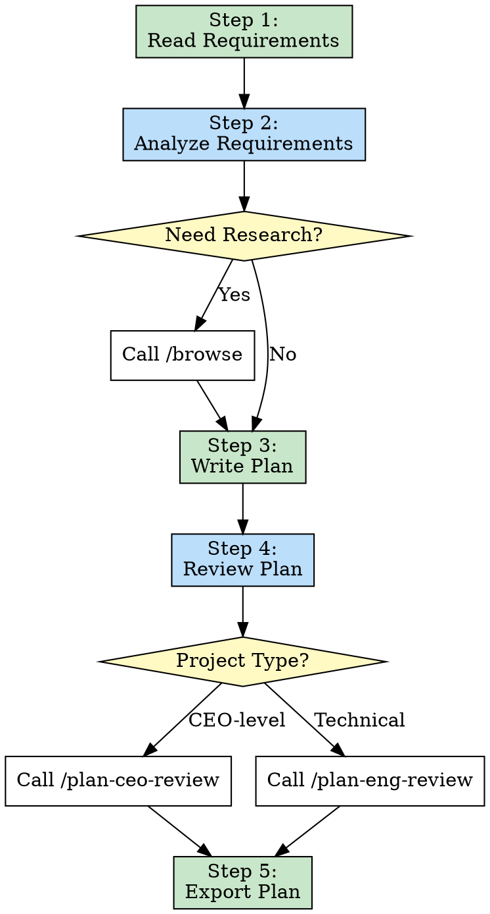
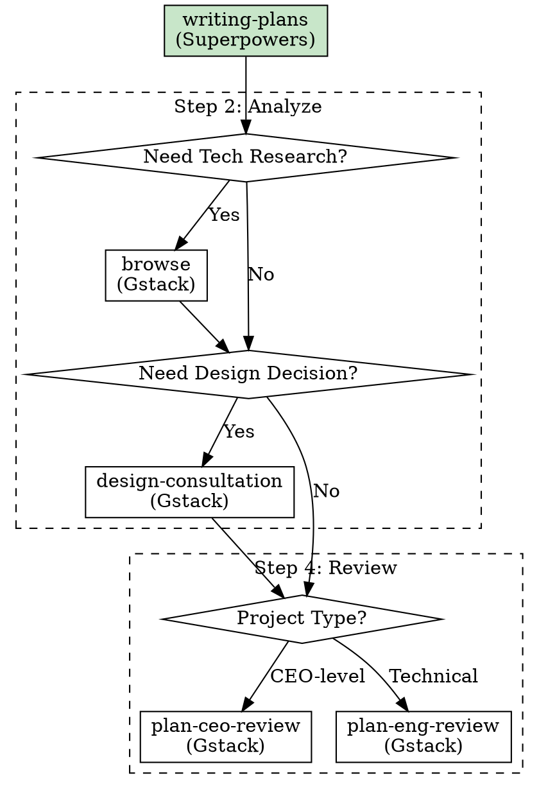

# Chapter 3: Template Method Pattern - The Art of Workflow Orchestration

> **Fixed skeleton, variable details, ensuring standardized workflows**

## Chapter Overview

The Template Method Pattern is the core pattern for skill workflow orchestration. It defines the skeleton of an algorithm in an operation, deferring some steps to subclasses. In skill systems, this pattern ensures workflow standardization while preserving flexibility. This chapter deeply analyzes the Template Method Pattern's application in skills.

### What You'll Learn

- ✅ Core concepts of the Template Method Pattern
- ✅ Skeleton design of `writing-plans`
- ✅ How to preserve flexibility within fixed workflows
- ✅ Multi-skill-package collaboration using Template Method

---

## 3.1 Concept: Fixed Skeleton, Variable Details

### Design Pattern Review

**Template Method Pattern** is a behavioral design pattern:

> **Define the skeleton of an algorithm in an operation, deferring some steps to subclasses**

**Classic Example**:

```java
// Traditional object-oriented implementation

abstract class DataProcessor {
    // Template method: define algorithm skeleton
    public final void process() {
        readData();      // Fixed step
        processData();   // Variable step (subclass implements)
        writeData();     // Fixed step
    }

    // Fixed step: concrete implementation
    private void readData() {
        System.out.println("Reading data...");
    }

    // Variable step: abstract method, subclass implements
    protected abstract void processData();

    // Fixed step: concrete implementation
    private void writeData() {
        System.out.println("Writing data...");
    }
}

// Subclass 1: Text processing
class TextProcessor extends DataProcessor {
    @Override
    protected void processData() {
        System.out.println("Processing text data...");
    }
}

// Subclass 2: Image processing
class ImageProcessor extends DataProcessor {
    @Override
    protected void processData() {
        System.out.println("Processing image data...");
    }
}
```

**Execution Flow**:

```
TextProcessor:
  readData() → processData() [text processing] → writeData()

ImageProcessor:
  readData() → processData() [image processing] → writeData()
```

### Application in Skills

**Template Method in Skills**:

```markdown
# writing-plans as a template method

Fixed skeleton:
  1. Read requirements
  2. Analyze requirements
  3. Write plan
  4. Review plan
  5. Export plan

Variable details:
  - How to analyze requirements? (optional browse skill for research)
  - How to review plan? (optional plan-ceo-review or plan-eng-review)
  - What format to output? (Markdown, JSON, etc.)
```

### Core Value

| Value Dimension | Without Template Method | With Template Method |
|----------------|------------------------|---------------------|
| **Workflow Consistency** | Manual planning each time | Standardized workflow |
| **Learning Cost** | High (must remember all steps) | Low (just invoke one skill) |
| **Quality Assurance** | Easy to miss steps | Ensures all steps execute |
| **Flexibility** | High (completely free) | Medium (fixed skeleton, variable details) |
| **Maintainability** | Low (scattered logic) | High (centralized logic) |

### Template Method vs Strategy Pattern

**Comparison**: Two easily confused patterns

| Comparison Dimension | Template Method Pattern | Strategy Pattern |
|---------------------|----------------------|-----------------|
| **Focus** | Algorithm skeleton | Algorithm implementation |
| **Variation Point** | Step implementation | Entire algorithm |
| **Inheritance Relationship** | Subclass inherits parent | Composition relationship |
| **Typical Application** | Fixed workflow, variable steps | Same task, different strategies |
| **Skill Example** | writing-plans | finishing-branch |

**Comparison in Skills**:

```markdown
# Template Method Pattern: writing-plans

Fixed workflow:
  1. Read requirements
  2. Analyze
  3. Write plan
  4. Review

Variable steps:
  - Step 2: Optional browse invocation
  - Step 4: Optional plan-ceo-review or plan-eng-review
```

```markdown
# Strategy Pattern: finishing-branch

Select different strategies based on situation:

IF feature is complete and independent:
  Strategy: Create new PR

ELIF small fix or depends on other PR:
  Strategy: Merge to existing branch

ELIF emergency fix:
  Strategy: Direct commit and deploy
```

---

## 3.2 Implementation: writing-plans Skeleton Design

### Skill Overview

**Skill Name**: `writing-plans`

**Description**: Use when you have a spec or requirements for a multi-step task, before touching code

**Positioning**: Standardized process for plan creation

### Complete Skeleton Analysis

```markdown
# writing-plans skill complete skeleton

---
name: writing-plans
description: Use when you have a spec or requirements for a multi-step task, before touching code
---

# Writing Plans

## Template Method Skeleton

### Step 1: Read Requirements (Fixed Step)

Read the spec or requirements document.

### Step 2: Analyze Requirements (Variable Step)

IF technical research needed:
  Call /browse (gstack)

IF design decisions needed:
  Call /design-consultation (gstack)

Analyze requirements and identify:
- Key components
- Technical constraints
- Dependencies

### Step 3: Write Plan (Fixed Step)

Create a detailed implementation plan:

1. Break down into tasks
2. Identify dependencies
3. Estimate effort
4. Define milestones

### Step 4: Review Plan (Variable Step)

IF CEO-level priority project:
  Call /plan-ceo-review (gstack)

ELIF technical project:
  Call /plan-eng-review (gstack)

### Step 5: Export Plan (Fixed Step)

Save the plan to:
- `task_plan.md` (implementation plan)
- `findings.md` (research findings)
- `progress.md` (tracking progress)
```

### Skeleton Visualization



### Fixed Steps vs Variable Steps

**Fixed Steps**:

```markdown
# These steps must execute for every plan

✅ Step 1: Read Requirements
   - Must understand requirements first

✅ Step 3: Write Plan
   - Must create the plan

✅ Step 5: Export Plan
   - Must output results
```

**Variable Steps**:

```markdown
# These steps are selectively executed based on situation

🔄 Step 2: Analyze Requirements
   - Simple requirements: Direct analysis
   - Complex requirements: Call browse for technical research
   - Design issues: Call design-consultation

🔄 Step 4: Review Plan
   - CEO-level project: plan-ceo-review
   - Technical project: plan-eng-review
   - Small project: Auto-review
```

### Hook Method Design

**Hook Methods**: "Hooks" in the template method allowing subclasses (or skill callers) to customize behavior

```markdown
# Hook methods in writing-plans

## Hook 1: beforeAnalyze

When: Before analyzing requirements

Usage:
  IF extra preparation needed:
    Call custom skill

Examples:
  - Call /setup-environment to prepare environment
  - Call /install-dependencies to install dependencies

## Hook 2: afterPlanWritten

When: After plan is written

Usage:
  IF extra validation needed:
    Call custom skill

Examples:
  - Call /security-check for security review
  - Call /cost-estimation for cost estimation

## Hook 3: afterReview

When: After review is complete

Usage:
  IF extra processing needed:
    Call custom skill

Examples:
  - Call /stakeholder-approval to get stakeholder approval
  - Call /resource-allocation to allocate resources
```

**Value of Hook Methods**:

```
Extensibility: Can extend functionality without modifying skeleton

Example:

Basic workflow:
  Read → Analyze → Write → Review → Export

Extended workflow (with Hooks):
  Read → beforeAnalyze → Analyze → Write → afterPlanWritten → Review → afterReview → Export

Characteristics:
  - Skeleton unchanged
  - Functionality enhanced
  - Flexibly controllable
```

---

## 3.3 Source Code Analysis: Invoking Other Skills to Form Complete Workflows

### Skill Invocation Strategy

**writing-plans** needs to invoke multiple skills to complete plan creation:

```
Internal Skills (Superpowers):
  - None (writing-plans is standalone)

External Skills (Gstack):
  - browse (technical research)
  - design-consultation (design consultation)
  - plan-ceo-review (CEO review)
  - plan-eng-review (engineer review)
```

### Invocation Timing and Methods

#### Scenario 1: Technical Research (Invoke browse)

**Trigger Condition**: Requirements involve unfamiliar tech stack

```markdown
# writing-plans internal logic

## Step 2: Analyze Requirements

IF requirements involve new technology or unfamiliar tech stack:

  **Action**: Call /browse skill

  Example:
    "Requirement: Implement user query feature using GraphQL"

    writing-plans判断:
      - GraphQL is new technology
      - Need technical research

    Invocation method:
      - Skill tool with skill="browse"
      - Args: "research GraphQL best practices"

  **Result**:
    - Understand GraphQL best practices
    - Determine technical approach
    - Identify potential risks
```

**Implementation Code**:

```markdown
# writing-plans skill file excerpt

### Step 2: Analyze Requirements

Analyze the requirements to identify:

1. Key technical challenges
2. Dependencies and integrations
3. Potential risks

**IF you encounter unfamiliar technology or need technical research:**

- Use the Skill tool to invoke `browse` from gstack
- Research best practices and patterns
- Document findings in `findings.md`

Example invocation:
```
Call /browse to research GraphQL best practices for user queries
```
```

#### Scenario 2: Design Consultation (Invoke design-consultation)

**Trigger Condition**: Requirements involve complex design decisions

```markdown
# writing-plans internal logic

## Step 2: Analyze Requirements

IF requirements involve complex UX or product design:

  **Action**: Call /design-consultation skill

  Example:
    "Requirement: Redesign user registration flow"

    writing-plans判断:
      - This is a UX design problem
      - Need design expert opinion

    Invocation method:
      - Skill tool with skill="design-consultation"
      - Args: "redesign user registration flow"

  **Result**:
    - Get design solution recommendations
    - UX optimization suggestions
    - Competitive analysis
```

**Implementation Code**:

```markdown
# writing-plans skill file excerpt

### Step 2: Analyze Requirements

**IF the project involves significant UX or product design decisions:**

- Invoke `design-consultation` skill from gstack
- Get expert design recommendations
- Consider user experience implications

Example:
```
Call /design-consultation for user registration flow redesign
```
```

#### Scenario 3: Plan Review (Invoke plan-*-review)

**Trigger Condition**: Plan needs expert review

```markdown
# writing-plans internal logic

## Step 4: Review Plan

IF is CEO-priority high-importance project:

  **Action**: Call /plan-ceo-review skill

  Example:
    "Project: New product core feature development"

    writing-plans判断:
      - This is CEO-level project
      - Need high-level perspective review

    Invocation method:
      - Skill tool with skill="plan-ceo-review"

  **Result**:
    - Business value assessment
    - Strategic alignment check
    - Resource prioritization suggestions

ELIF is technology-intensive project:

  **Action**: Call /plan-eng-review skill

  Example:
    "Project: Microservices architecture refactoring"

    writing-plans判断:
      - This is technical project
      - Need engineer perspective review

    Invocation method:
      - Skill tool with skill="plan-eng-review"

  **Result**:
    - Technical feasibility assessment
    - Architecture reasonability check
    - Performance and security suggestions
```

**Implementation Code**:

```markdown
# writing-plans skill file excerpt

### Step 4: Review Plan

**Review the plan based on project importance:**

**IF this is a CEO-level priority project:**

- Invoke `plan-ceo-review` from gstack
- Focus on business value and strategic alignment
- Get resource allocation recommendations

**ELSE IF this is a technical project:**

- Invoke `plan-eng-review` from gstack
- Focus on technical feasibility and architecture
- Get implementation recommendations

**ELSE:**

- Self-review the plan
- Check for completeness and clarity
```

### Invocation Flow Diagram



### Invocation Protocol

**Explicit Invocation Protocol**: Clearly specify skill name and parameters

```markdown
# Invocation format

Use the Skill tool with:
  - skill: "skill-name"
  - args: "optional arguments"

# Examples

**Call browse skill:**
Use the Skill tool with skill="browse" to research GraphQL best practices.

**Call plan-eng-review skill:**
Use the Skill tool with skill="plan-eng-review" for technical review.
```

**Return Value Handling**:

```markdown
# Processing after skill invocation

## After Calling browse

Result: Technical research findings

Processing:
  1. Extract key information
  2. Update findings.md
  3. Adjust technical approach

## After Calling plan-eng-review

Result: Review feedback

Processing:
  1. Read review comments
  2. Update plan
  3. Record modification reasons
```

---

## 3.4 Comparison: Superpowers Workflow Chain vs Gstack Tool Invocation

### Superpowers Template Method Implementation

**Characteristics**: **Workflow-Driven**

```markdown
# brainstorming → writing-plans chain

After brainstorming completes:
  Automatically invoke writing-plans

After writing-plans completes:
  Automatically invoke executing-plans

After executing-plans completes:
  Automatically invoke tdd
```

**Design Philosophy**:
- ✅ Workflow coherence
- ✅ High automation
- ⚠️ Lower flexibility

**Example**:

```markdown
# Inside brainstorming skill

## After the Design

**Implementation:**

- Invoke the writing-plans skill to create a detailed implementation plan
- Do NOT invoke any other skill. writing-plans is the next step.
```

**Invocation Method**: **Chain Invocation**

```
After brainstorming completes, automatically invoke writing-plans
(User no need to intervene)
```

### Gstack Tool Invocation Implementation

**Characteristics**: **On-Demand Invocation**

```markdown
# writing-plans invoking gstack skills

IF need technical research:
  Explicitly invoke browse

IF need design decisions:
  Explicitly invoke design-consultation

IF need review:
  Explicitly invoke plan-*-review
```

**Design Philosophy**:
- ✅ High flexibility
- ✅ Strong tool independence
- ⚠️ Requires explicit invocation

**Example**:

```markdown
# Inside writing-plans skill

### Step 2: Analyze Requirements

**IF you encounter unfamiliar technology:**

- Invoke `browse` skill from gstack
- Research best practices

Invocation method: Explicit invocation
(Determined and invoked by writing-plans actively)
```

### Two Patterns Comparison

| Comparison Dimension | Superpowers Chain Invocation | Gstack Tool Invocation |
|---------------------|----------------------------|----------------------|
| **Invocation Timing** | Fixed (auto-invoke after completion) | Flexible (on-demand) |
| **Invocation Method** | Chain awakening | Explicit invocation |
| **User Awareness** | Invisible | Optional awareness |
| **Workflow Coherence** | High (fixed chain) | Medium (on-demand assembly) |
| **Tool Reusability** | Low (fixed in chain) | High (standalone tools) |
| **Use Cases** | Standardized workflows | Flexible tool combination |

### Best Practice: Hybrid Mode

**Strategy**: **Workflow Skeleton + Tool Slots**

```markdown
# writing-plans hybrid mode

## Fixed Skeleton (Superpowers style)

Step 1: Read Requirements
Step 2: Analyze Requirements
Step 3: Write Plan
Step 4: Review Plan
Step 5: Export Plan

## Tool Slots (Gstack style)

Reserve slots in Step 2 and Step 4:

Step 2 slots:
  - browse (technical research)
  - design-consultation (design consultation)

Step 4 slots:
  - plan-ceo-review (CEO review)
  - plan-eng-review (engineer review)

## Chain Invocation (Superpowers style)

After writing-plans completes:
  Automatically invoke executing-plans
```

**Advantages**:

```
✅ Workflow standardization (fixed skeleton)
✅ Tool flexibility (pluggable tools)
✅ Automated flow (chain invocation)
✅ Easy maintenance (separation of concerns)
```

**Implementation Example**:

```markdown
# writing-plans hybrid mode implementation

## Template Method Skeleton (Fixed)

### Step 1: Read Requirements (Fixed)
Read the spec or requirements.

### Step 2: Analyze Requirements (Variable, with tool slots)
Analyze requirements.

**Tool Slots:**
- IF need technical research → Call /browse (Gstack)
- IF need design consultation → Call /design-consultation (Gstack)

### Step 3: Write Plan (Fixed)
Write the implementation plan.

### Step 4: Review Plan (Variable, with tool slots)
Review the plan.

**Tool Slots:**
- IF CEO-level project → Call /plan-ceo-review (Gstack)
- IF technical project → Call /plan-eng-review (Gstack)

### Step 5: Export Plan (Fixed)
Export plan to files.

## After Completion (Chain Invocation)

**Next Steps:**
- Automatically invoke /executing-plans to start implementation
```

---

## 3.5 Practice: Design Your Own Template Method Skill

### Design Steps

#### Step 1: Define Algorithm Skeleton

```markdown
# Example: Design a content publishing pipeline skill

## Task: Publish a blog article

Fixed skeleton:

Step 1: Receive Content
  - Receive user-submitted blog article

Step 2: Content Check
  - Check if article meets publishing standards

Step 3: Content Optimization
  - Optimize article format and SEO

Step 4: Publish
  - Publish to platform

Step 5: Promote
  - Auto-promote to social media
```

#### Step 2: Identify Variable Steps

```markdown
# Identify which steps need flexibility

Fixed steps (must execute):
  ✅ Step 1: Receive Content
  ✅ Step 4: Publish
  ✅ Step 5: Promote

Variable steps (adjust based on situation):
  🔄 Step 2: Content Check
     - Simple article: Auto-check
     - Important article: Manual review

  🔄 Step 3: Content Optimization
     - SEO needs: Call SEO-optimizer
     - Format needs: Call format-fixer
     - No needs: Skip
```

#### Step 3: Design Hook Methods

```markdown
# Design hooks for variable steps

## Hook 1: beforeCheck

When: Before content check

Purpose:
  - Auto-flag sensitive words
  - Detect copyright issues

## Hook 2: afterCheck

When: After content check

Purpose:
  - If check fails, invoke editing skill to fix
  - If check passes, proceed to optimization step

## Hook 3: beforePublish

When: Before publishing

Purpose:
  - Final confirmation
  - Set publish time
```

#### Step 4: Write Skill File

```markdown
---
name: content-publishing-pipeline
description: |
  Use when publishing blog content to platform.

  TRIGGER when:
  - User submits blog article for publishing
  - User asks to publish content

  DO NOT TRIGGER when:
  - User is just drafting content
  - User is editing content
---

# Content Publishing Pipeline

## Step 1: Receive Content (Fixed)

Receive the blog article from user.

## Step 2: Content Check (Variable)

Check if the content meets publishing standards.

**IF simple article:**
- Auto-check for:
  - Grammar errors
  - Formatting issues
  - Link validity

**IF important article:**
- Invoke /manual-review for human review

**Hook: afterCheck**
- IF check fails → Invoke /content-editor to fix issues
- IF check passes → Proceed to Step 3

## Step 3: Content Optimization (Variable)

Optimize content for better reach.

**IF SEO needed:**
- Invoke /seo-optimizer
- Add meta tags, keywords

**IF format issues:**
- Invoke /format-fixer
- Fix formatting problems

**ELSE:**
- Skip optimization

## Step 4: Publish (Fixed)

Publish the content to platform.

Steps:
1. Upload to CMS
2. Set URL and categories
3. Go live

## Step 5: Promote (Fixed)

Promote to social media.

Steps:
1. Generate social media posts
2. Share to Twitter, LinkedIn
3. Track engagement

## After Completion

**Next Steps:**
- Automatically invoke /analytics-tracker to monitor performance
```

#### Step 5: Test and Optimize

```markdown
# Testing Checklist

□ Test if all fixed steps execute
  - Receive → Publish → Promote, do these three steps all execute?

□ Test variable step branches
  - Simple article → Auto-check
  - Important article → Manual review
  - Are branches correct?

□ Test hook methods
  - Is afterCheck invoked after checking?
  - Does check failure trigger editing skill?

□ Test chain invocation
  - Is analytics tracker auto-invoked after publishing completes?

□ Test error handling
  - Is there a fallback plan for publishing failure?
  - Can check failure recover?
```

### Common Pitfalls

#### Pitfall 1: Skeleton Too Complex

```markdown
❌ Wrong Example:

Step 1: Receive Content
  Step 1.1: Validate Format
    Step 1.1.1: Check Title
    Step 1.1.2: Check Body
  Step 1.2: Validate Metadata
    Step 1.2.1: Check Tags
    Step 1.2.2: Check Categories

Problem:
- Skeleton too granular, loses template method meaning
- Should encapsulate sub-steps in separate skills
```

```markdown
✅ Correct Example:

Step 1: Receive and Validate Content
  (Call content-validator skill to handle all validation logic)

Advantage:
- Clear skeleton
- Single responsibility
```

#### Pitfall 2: Too Many Variable Steps

```markdown
❌ Wrong Example:

Step 1: Receive Content (Variable)
Step 2: Content Check (Variable)
Step 3: Content Optimization (Variable)
Step 4: Publish (Variable)
Step 5: Promote (Variable)

Problem:
- All steps are variable, loses skeleton meaning
- Template method becomes strategy pattern
```

```markdown
✅ Correct Example:

Step 1: Receive Content (Fixed)
Step 2: Content Check (Variable)
Step 3: Content Optimization (Variable)
Step 4: Publish (Fixed)
Step 5: Promote (Fixed)

Advantage:
- Preserve core workflow stability
- Provide flexibility at key points
```

#### Pitfall 3: Missing Error Handling

```markdown
❌ Wrong Example:

Step 1: Receive Content
Step 2: Content Check
  IF check fails:
    [No handling]

Problem:
- Workflow breaks after check fails
- User doesn't know what happened
```

```markdown
✅ Correct Example:

Step 1: Receive Content
Step 2: Content Check
  IF check fails:
    - Record failure reason
    - Call /content-editor to fix
    - Re-check (loop max 3 times)
  IF still fails:
    - Notify user, provide failure details
    - Suggest manual intervention

Advantage:
- Complete error handling
- Auto-recovery mechanism
- User-friendly feedback
```

---

## Chapter Summary

This chapter deeply analyzed the Template Method Pattern:

1. **Pattern Concept** - Fixed skeleton, variable details
2. **writing-plans Implementation** - Five-step skeleton design and variable steps
3. **Skill Invocation Mechanism** - How to invoke other skills within template methods
4. **Superpowers vs Gstack** - Workflow-driven vs on-demand invocation differences
5. **Design Your Own Template Method** - Five-step method and common pitfalls

The Template Method Pattern is the core of workflow orchestration, ensuring standardized workflows while preserving flexibility.

---

## Extended Reading

- [Design Patterns: Template Method Pattern](https://en.wikipedia.org/wiki/Template_method_pattern)
- [Superpowers: writing-plans Source](https://github.com/superpower/skills/blob/main/writing-plans.md)
- [Martin Fowler: Workflow Patterns](https://www.workflowpatterns.com/)

## Exercises

1. **Thinking Question**: What's the difference between Template Method Pattern and Strategy Pattern? When to choose which?
2. **Practice**: Design a data processing pipeline skill, defining fixed skeleton and variable steps.
3. **Discussion**: What aspects of writing-plans skeleton design could be improved?

---

**Next Chapter Preview**: Chapter 4 will explore the Chain of Responsibility Pattern, analyzing quality assurance chain design and implementation.