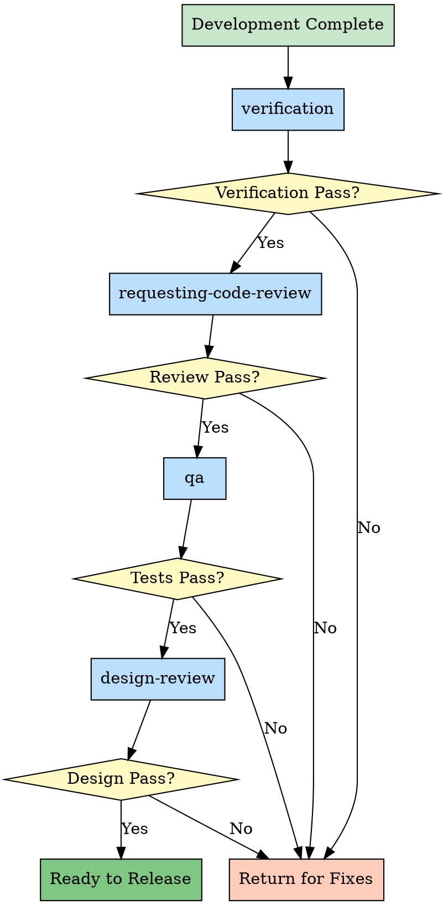
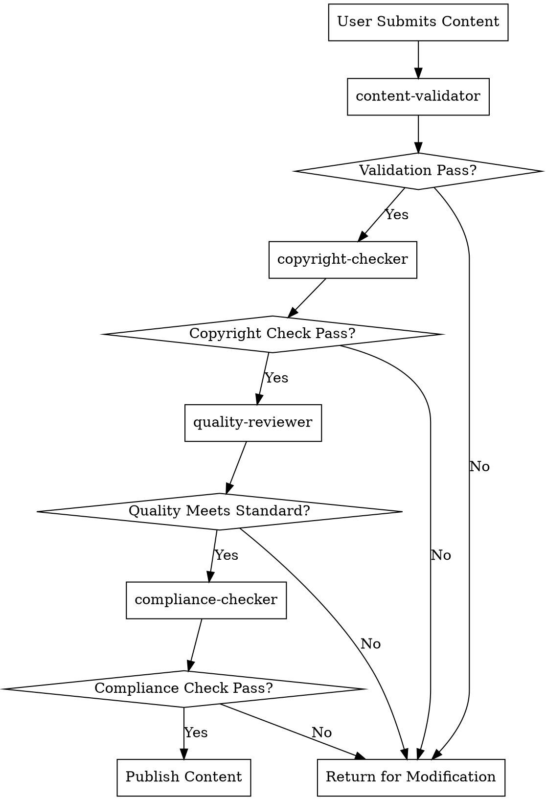

# Chapter 4: Chain of Responsibility Pattern - Quality Assurance Chain

> **Layer-by-layer verification, step-by-step validation, ensuring reliable results**

## Chapter Overview

The Chain of Responsibility Pattern is the core pattern for skill quality assurance. It chains request-handling objects and passes requests along the chain until an object handles it. In skill systems, this pattern builds a complete quality assurance system, ensuring every step undergoes rigorous validation. This chapter deeply analyzes the Chain of Responsibility Pattern's application in quality assurance.

### What You'll Learn

- ✅ Core concepts of the Chain of Responsibility Pattern
- ✅ Skill package quality assurance chain design
- ✅ Collaboration mechanism of verification → review → qa
- ✅ How to design your own responsibility chain

---

## 4.1 Concept: Layer-by-Layer Verification, Step-by-Step Validation

### Design Pattern Review

**Chain of Responsibility Pattern** is a behavioral design pattern:

> **Pass requests along a chain of handlers until one handles it**

**Classic Example**:

```java
// Traditional object-oriented implementation

abstract class Handler {
    private Handler next;

    public Handler setNext(Handler next) {
        this.next = next;
        return next;
    }

    public abstract boolean handle(Request request);

    protected boolean passToNext(Request request) {
        if (next != null) {
            return next.handle(request);
        }
        return true; // End of chain, default pass
    }
}

// Concrete handler 1: Format check
class FormatHandler extends Handler {
    @Override
    public boolean handle(Request request) {
        if (!isValidFormat(request)) {
            return false; // Format error, stop propagation
        }
        return passToNext(request); // Format correct, pass to next
    }
}

// Concrete handler 2: Security check
class SecurityHandler extends Handler {
    @Override
    public boolean handle(Request request) {
        if (hasSecurityRisk(request)) {
            return false; // Security risk, stop propagation
        }
        return passToNext(request); // Secure, pass to next
    }
}

// Concrete handler 3: Performance check
class PerformanceHandler extends Handler {
    @Override
    public boolean handle(Request request) {
        if (isPerformanceIssue(request)) {
            return false; // Performance issue, stop propagation
        }
        return passToNext(request); // Good performance, pass to next
    }
}

// Usage
Handler chain = new FormatHandler()
    .setNext(new SecurityHandler())
    .setNext(new PerformanceHandler());

boolean isValid = chain.handle(request);
```

**Execution Flow**:

```
Request → FormatHandler → SecurityHandler → PerformanceHandler
             ↓                  ↓                   ↓
          Check format       Check security      Check performance
             ↓                  ↓                   ↓
         Pass/Fail          Pass/Fail           Pass/Fail
```

### Application in Skills

**Chain of Responsibility in Skills**:

```markdown
# Quality Assurance Responsibility Chain

Request: Is code/feature ready for release?

Handler 1: verification
  → Verify if tests pass
  → Verify if requirements are met
  → Pass? Pass to next

Handler 2: requesting-code-review
  → Code quality review
  → Security review
  → Pass? Pass to next

Handler 3: qa
  → Automated testing
  → Edge case testing
  → Pass? Pass to next

Handler 4: design-review
  → UI/UX review
  → User experience check
  → Pass? Ready for release

Any failure → Return for fixes
```

### Core Value

| Value Dimension | Without Responsibility Chain | With Responsibility Chain |
|----------------|------------------------------|--------------------------|
| **Quality Assurance** | Relies on manual memory, easy to miss | Standardized process, ensures every step validated |
| **Separation of Concerns** | One check does everything | Each step has single responsibility |
| **Extensibility** | Adding checks requires code changes | Just add handlers |
| **Error Localization** | Hard to identify problem step | Clearly know which step failed |
| **Configurability** | Fixed check process | Can dynamically adjust chain composition |

### Chain of Responsibility vs Pipeline Pattern

**Comparison**: Two easily confused patterns

| Comparison Dimension | Chain of Responsibility Pattern | Pipeline Pattern |
|---------------------|--------------------------------|------------------|
| **Propagation Method** | Chain propagation, any node can terminate | Pipeline flow, all nodes execute |
| **Return Value** | Boolean (success/failure) | Data transformation result |
| **Typical Application** | Validation, approval | Data processing, transformation |
| **Termination Condition** | Any node failure terminates | All nodes execute |
| **Skill Example** | verification → review | Browser automation pipeline |

**Comparison in Skills**:

```markdown
# Chain of Responsibility Pattern: Quality Assurance Chain

verification → review → qa → design-review

Characteristics:
- Any step failure terminates entire chain
- Returns failure reason
- Re-run chain after fixes
```

```markdown
# Pipeline Pattern: Browser Testing Pipeline

navigate → interact → verify → screenshot

Characteristics:
- All steps execute
- Each step transforms data
- Final output is test result
```

---

## 4.2 Implementation: verification → review → qa → design-review

### Complete Quality Assurance Chain Analysis

```markdown
# Quality Assurance Chain Complete Workflow

┌─────────────────────────────────────────────────────────┐
│                 Quality Assurance Responsibility Chain   │
├─────────────────────────────────────────────────────────┤
│                                                           │
│  【Handler 1: verification】                             │
│   ├─ Check: Do tests pass?                              │
│   ├─ Check: Are original requirements met?              │
│   ├─ Check: Is documentation updated?                   │
│   └─ Result: Pass → Pass to review                      │
│            Fail → Return missing items list              │
│                                                           │
│  【Handler 2: requesting-code-review】                   │
│   ├─ Check: Code quality                                │
│   ├─ Check: Security vulnerabilities                     │
│   ├─ Check: Performance issues                           │
│   └─ Result: Pass → Pass to qa                          │
│            Fail → Return review comments                 │
│                                                           │
│  【Handler 3: qa】                                        │
│   ├─ Test: Automated testing                             │
│   ├─ Test: Edge case testing                            │
│   ├─ Test: Integration testing                           │
│   └─ Result: Pass → Pass to design-review               │
│            Fail → Return test failure report             │
│                                                           │
│  【Handler 4: design-review】                            │
│   ├─ Check: UI/UX design                                │
│   ├─ Check: User experience                             │
│   ├─ Check: Visual consistency                          │
│   └─ Result: Pass → Ready for release ✅                │
│            Fail → Return design improvement suggestions  │
│                                                           │
└─────────────────────────────────────────────────────────┘
```

### Chain Visualization



### Each Handler's Responsibility

#### Handler 1: verification

**Responsibility**: Verify if development is complete and meets original requirements

```markdown
# verification skill

---
name: verification-before-completion
description: Use when about to claim work is complete, fixed, or passing, before committing or creating PRs
---

## Core Checks

### Check 1: Tests Pass

**Action**: Run tests

**IF tests fail:**
- Return: List of failing tests
- Stop chain

**IF tests pass:**
- Continue to next check

### Check 2: Requirements Met

**Action**: Compare against original requirements

**IF requirements not met:**
- Return: List of missing requirements
- Stop chain

**IF requirements met:**
- Continue to next check

### Check 3: Documentation Updated

**Action**: Check if docs are updated

**IF docs outdated:**
- Return: List of outdated docs
- Stop chain

**IF docs updated:**
- Pass to next handler: requesting-code-review
```

#### Handler 2: requesting-code-review

**Responsibility**: Code quality and security review

```markdown
# requesting-code-review skill

---
name: requesting-code-review
description: Use when completing tasks, implementing major features, or before merging to verify work meets requirements
---

## Review Areas

### Area 1: Code Quality

Check:
- Code style and formatting
- Naming conventions
- Code complexity
- DRY violations

**IF issues found:**
- Return: Code quality issues list
- Stop chain

### Area 2: Security

Check:
- SQL injection vulnerabilities
- XSS vulnerabilities
- Authentication/authorization issues
- Sensitive data exposure

**IF issues found:**
- Return: Security vulnerabilities list
- Stop chain

### Area 3: Performance

Check:
- N+1 queries
- Memory leaks
- Inefficient algorithms
- Missing indexes

**IF issues found:**
- Return: Performance issues list
- Stop chain

**IF all pass:**
- Pass to next handler: qa
```

#### Handler 3: qa

**Responsibility**: Comprehensive testing

```markdown
# qa skill

---
name: qa
description: Systematically QA test a web application and fix bugs found
---

## Test Types

### Type 1: Automated Tests

Run:
- Unit tests
- Integration tests
- E2E tests

**IF tests fail:**
- Return: Test failure report
- Stop chain

### Type 2: Edge Case Tests

Test:
- Boundary conditions
- Invalid inputs
- Race conditions
- Error handling

**IF tests fail:**
- Return: Edge case failure report
- Stop chain

### Type 3: Cross-browser Tests

Test on:
- Chrome
- Firefox
- Safari
- Mobile browsers

**IF tests fail:**
- Return: Browser compatibility issues
- Stop chain

**IF all pass:**
- Pass to next handler: design-review
```

#### Handler 4: design-review

**Responsibility**: Design and user experience review

```markdown
# design-review skill

---
name: design-review
description: Designer's eye QA - finds visual inconsistency, spacing issues, hierarchy problems
---

## Design Checks

### Check 1: Visual Consistency

Check:
- Font sizes
- Colors
- Spacing
- Alignment

**IF inconsistencies found:**
- Return: Visual inconsistency report
- Stop chain

### Check 2: UX Issues

Check:
- Navigation flow
- Accessibility
- Responsive design
- Loading states

**IF issues found:**
- Return: UX issues list
- Stop chain

### Check 3: Interaction Quality

Check:
- Hover states
- Click feedback
- Animation smoothness
- Error messages

**IF issues found:**
- Return: Interaction issues list
- Stop chain

**IF all pass:**
- **Chain Complete** ✅
- Ready for deployment
```

### Collaboration Between Handlers

```markdown
# Data Passing Between Handlers

## verification → requesting-code-review

Pass data:
  - Original requirements document
  - Test report
  - Modified files list

Pass method:
  - Explicit Skill tool invocation
  - Or automatic chain awakening

## requesting-code-review → qa

Pass data:
  - Code review comments
  - Fixed issues list
  - Areas to watch

Pass method:
  - Explicit Skill tool invocation

## qa → design-review

Pass data:
  - Test report
  - Passed tests list
  - Edge case handling results

Pass method:
  - Explicit Skill tool invocation
```

---

## 4.3 Source Code Analysis: Each Node's Responsibility Boundary

### Node Responsibility Division Principles

**Principle 1: Single Responsibility**

```markdown
# Each node does one thing only

verification:
  Only verifies completion, doesn't fix

requesting-code-review:
  Only reviews, doesn't test

qa:
  Only tests, doesn't check design

design-review:
  Only checks design, doesn't test functionality

✅ Advantages:
- Clear responsibilities
- Easy to maintain
- Can test independently
```

**Principle 2: Clear Input/Output**

```markdown
# Each node's input and output

## verification

Input:
  - Goal file path
  - AI self-assessment of completion

Output:
  - Verification result (pass/fail)
  - Missing items list (if failed)

## requesting-code-review

Input:
  - Code file path
  - Review scope

Output:
  - Review comments
  - Issues list (if any)

## qa

Input:
  - App URL
  - Test scope

Output:
  - Test report
  - Failed test cases list (if any)

## design-review

Input:
  - Design mock URL
  - Implementation page URL

Output:
  - Design review comments
  - Inconsistency list (if any)
```

**Principle 3: Stateless Design**

```markdown
# Nodes should not maintain state

❌ Wrong Example:

verification records:
  - Previous failure count
  - Historical verification results
  - User behavior

Problems:
  - Complex state management
  - Hard to test
  - Concurrency issues

✅ Correct Example:

verification is independent each time:
  - Doesn't record history
  - Only focuses on current state
  - Pure functional processing

Advantages:
  - Easy to test
  - Can execute concurrently
  - Predictable results
```

### Boundary Condition Handling

#### Scenario 1: A Node Execution Fails

```markdown
# verification Failure Handling

verification execution:
  Discovers tests not passing

Handling:
  1. Immediately terminate responsibility chain
  2. Return failure reason:
     - Which tests failed
     - What error messages are
  3. Suggest fix approach
  4. Don't continue to next node

User action:
  1. Read failure reason
  2. Fix code
  3. Re-trigger responsibility chain
  4. Re-verify starting from verification
```

#### Scenario 2: A Node Cannot Execute

```markdown
# qa Cannot Execute (e.g., app not started)

qa skill needs to access app URL

But app not started, cannot access

Handling:
  1. Node returns error message:
     "App not started, cannot execute QA tests"
  2. Terminate responsibility chain
  3. Suggest user start app first

User action:
  1. Start app
  2. Re-trigger responsibility chain
  3. Can start from qa (if previous already passed)
```

#### Scenario 3: Skipping a Node

```markdown
# Some scenarios can skip nodes

Scenario: Pure backend API development

design-review mainly focuses on frontend UI/UX

Handling:
  IF is pure backend project:
    Skip design-review
    Mark as "ready to release" after qa completes

Implementation:
  ```markdown
  # Inside qa skill

  ### After Tests Pass

  IF is frontend project:
    Pass to next handler: design-review

  ELIF is backend project:
    Mark as ready for deployment ✅
  ```
```

### Error Recovery Mechanism

```markdown
# Responsibility Chain Error Recovery

## Strategy 1: Start from Beginning

Any node fails → Start from first node

Pros:
  - Simple
  - Ensures all checks pass

Cons:
  - Inefficient
  - Repeated work

## Strategy 2: Continue from Failed Node

Record passed nodes → Start from failed node

Pros:
  - Efficient
  - Reduces repetition

Cons:
  - Needs state management
  - Complex implementation

## Recommended Strategy

Simple projects → Strategy 1 (start from beginning)

Complex projects → Strategy 2 (continue from failed node)
  + Manual confirmation if need to re-validate passed nodes
```

---

## 4.4 Comparison: Superpowers Validation Chain vs Gstack Quality Chain

### Superpowers Responsibility Chain Implementation

**Characteristics**: **Process Control**

```markdown
# Superpowers Quality Assurance Chain

verification (Superpowers)
  ↓ Pass
requesting-code-review (Superpowers)
  ↓ Pass
finishing-branch (Superpowers)

Design philosophy:
  - Process-driven
  - Forced validation
  - Automatic flow
```

**Implementation**:

```markdown
# Inside verification skill

## After Verification

**IF verification passes:**

**Next Steps:**
- Invoke /requesting-code-review to get code review
- Then proceed to /finishing-branch for merge decision

**IF verification fails:**

- Return missing items list
- User must fix issues
- Re-invoke /verification after fixes
```

**Advantages**:
- ✅ Standardized process
- ✅ Automatic flow
- ✅ Consistent user experience

**Disadvantages**:
- ⚠️ Fixed chain, hard to customize
- ⚠️ Lacks flexibility

### Gstack Responsibility Chain Implementation

**Characteristics**: **Independent Tools**

```markdown
# Gstack Quality Assurance Chain

review (Gstack)
  ↓ Pass
qa (Gstack)
  ↓ Pass
benchmark (Gstack)
  ↓ Pass
canary (Gstack)

Design philosophy:
  - Independent tools
  - On-demand invocation
  - Flexible combination
```

**Implementation**:

```markdown
# No automatic chain invocation

User needs to explicitly invoke each tool:

Step 1: Call /review
Step 2: Call /qa
Step 3: Call /benchmark
Step 4: Call /canary

Or orchestrated by other skills:
  land-and-deploy will automatically call canary
```

**Advantages**:
- ✅ Highly flexible
- ✅ Independent tools
- ✅ Can combine arbitrarily

**Disadvantages**:
- ⚠️ Needs manual orchestration
- ⚠️ Process easily breaks

### Two Patterns Comparison

| Comparison Dimension | Superpowers Process Control | Gstack Independent Tools |
|---------------------|----------------------------|-------------------------|
| **Chain Invocation** | Automatic chain awakening | Manual explicit invocation |
| **Process Coherence** | High (fixed chain) | Low (needs orchestration) |
| **Flexibility** | Low (fixed chain) | High (arbitrary combination) |
| **Tool Independence** | Low (embedded in chain) | High (standalone tools) |
| **User Burden** | Low (automatic flow) | High (need to understand process) |
| **Use Cases** | Standardized process | Flexible tool combination |

### Best Practice: Hybrid Mode

**Strategy**: **Core Chain + Optional Tools**

```markdown
# Hybrid Quality Assurance Chain

## Core Chain (Superpowers, automatic flow)

verification → requesting-code-review → finishing-branch

Automatic chain invocation, ensures basic quality

## Optional Tools (Gstack, on-demand invocation)

Between verification and review:
  - Optional /qa (Gstack)
  - Optional /benchmark (Gstack)

After finishing-branch:
  - Automatic /land-and-deploy (Gstack)
  - Automatic /canary (Gstack)
```

**Implementation Example**:

```markdown
# verification skill hybrid mode

## After Verification

**Core Chain (Automatic):**
- Invoke /requesting-code-review (Superpowers)

**Optional Tools (Conditional):**

**IF project needs comprehensive testing:**
- Invoke /qa (Gstack)

**IF project needs performance benchmarking:**
- Invoke /benchmark (Gstack)

**After all checks pass:**
- Invoke /finishing-branch (Superpowers)
```

**Advantages**:

```
✅ Core process standardization (Superpowers)
✅ Tool flexibility (Gstack)
✅ Automatic flow (reduces user burden)
✅ Strong extensibility (optional tools)
```

---

## 4.5 Practice: Design Your Own Responsibility Chain

### Design Steps

#### Step 1: Define Handler Nodes

```markdown
# Example: Design content publishing review chain

Scenario: User publishes content to platform

Handler nodes:
1. content-validator
   - Check if content meets standards
   - Check sensitive words

2. copyright-checker
   - Check copyright issues
   - Check originality

3. quality-reviewer
   - Check content quality
   - Rating system

4. compliance-checker
   - Check compliance
   - Check legal regulations
```

#### Step 2: Define Each Node's Responsibility

```markdown
# Node 1: content-validator

Responsibility:
  - Check format standards
  - Filter sensitive words
  - Check word count limits

Input:
  - Content text
  - Content type

Output:
  - Validation result (pass/fail)
  - Violations list (if failed)

Failure handling:
  - Auto-mark sensitive words
  - Suggest modifications

---

# Node 2: copyright-checker

Responsibility:
  - Check for plagiarism
  - Check image copyright
  - Check citation standards

Input:
  - Content text
  - Image list

Output:
  - Copyright check result
  - Infringement list (if any)

Failure handling:
  - Mark infringing content
  - Provide original sources

---

# Node 3: quality-reviewer

Responsibility:
  - Content quality scoring
  - Readability check
  - Professionalism assessment

Input:
  - Content text

Output:
  - Quality score (0-100)
  - Improvement suggestions

Failure handling:
  - If score < 60:
    - Return improvement suggestions
    - Terminate chain

---

# Node 4: compliance-checker

Responsibility:
  - Legal compliance check
  - Industry standard check
  - Platform rule check

Input:
  - Content text
  - Content type

Output:
  - Compliance result
  - Violations list (if any)

Failure handling:
  - Mark violating content
  - Provide legal basis
```

#### Step 3: Design Chain Invocation

```markdown
# Content Publishing Review Chain Flow

---
name: content-publishing-chain
description: Use when user wants to publish content to platform
---

# Content Publishing Chain

## Step 1: Content Validation

Invoke /content-validator

**IF validation fails:**
- Return: Content validation failed
- Show: Violations list
- Stop chain

**IF validation passes:**
- Continue to Step 2

## Step 2: Copyright Check

Invoke /copyright-checker

**IF copyright check fails:**
- Return: Copyright issues found
- Show: Infringement list
- Stop chain

**IF copyright check passes:**
- Continue to Step 3

## Step 3: Quality Review

Invoke /quality-reviewer

**IF quality score < 60:**
- Return: Content quality insufficient
- Show: Improvement suggestions
- Stop chain

**IF quality score >= 60:**
- Continue to Step 4

## Step 4: Compliance Check

Invoke /compliance-checker

**IF compliance check fails:**
- Return: Compliance issues found
- Show: Violations list
- Stop chain

**IF compliance check passes:**
- **Chain Complete** ✅
- Publish content
```

#### Step 4: Visualize Chain



#### Step 5: Test and Optimize

```markdown
# Testing Checklist

□ Test each node's independent functionality
  - Can content-validator detect sensitive words?
  - Can copyright-checker discover plagiarism?
  - Is quality-reviewer scoring accurate?
  - Can compliance-checker find violating content?

□ Test chain invocation
  - Do nodes pass correctly between each other?
  - Does failure correctly terminate chain?

□ Test error handling
  - When a node fails, is there clear error information?
  - Does user know how to fix?

□ Test boundary conditions
  - How to handle empty content?
  - How to handle special characters?
  - How to handle extra-long content?

□ Test performance
  - How long does entire chain take to execute?
  - Can certain nodes be parallelized?
```

### Common Pitfalls

#### Pitfall 1: Node Responsibilities Overlap

```markdown
❌ Wrong Example:

content-validator checks:
  - Sensitive words
  - Copyright issues
  - Content quality

copyright-checker checks:
  - Copyright issues
  - Legal compliance

Problem:
  - Copyright check duplicated
  - Responsibilities unclear
  - Hard to maintain
```

```markdown
✅ Correct Example:

content-validator checks:
  - Sensitive words
  - Format standards

copyright-checker checks:
  - Copyright issues

quality-reviewer checks:
  - Content quality

compliance-checker checks:
  - Legal compliance

Advantage:
  - Single responsibility
  - No overlap
  - Easy to maintain
```

#### Pitfall 2: Missing Error Information

```markdown
❌ Wrong Example:

content-validator:
  IF check fails:
    Return: "Validation failed"

Problem:
  - User doesn't know why it failed
  - Cannot fix
```

```markdown
✅ Correct Example:

content-validator:
  IF check fails:
    Return:
      - Validation failure reason
      - Violating content location
      - Suggested modification approach
      - Related rule explanation

Advantage:
  - Clear error information
  - User can fix
  - Improves user experience
```

#### Pitfall 3: Cannot Skip Nodes

```markdown
❌ Wrong Example:

All nodes must execute, cannot skip

Problem:
  - Some scenarios don't need all checks
  - Inefficient
```

```markdown
✅ Correct Example:

Allow skipping certain nodes based on content type:

IF content type == "repost":
  Skip quality-reviewer
  Go directly to compliance-checker

IF content type == "original":
  Execute complete chain

Advantage:
  - Flexible
  - Improves efficiency
  - Adapts to different scenarios
```

---

## Chapter Summary

This chapter deeply analyzed the Chain of Responsibility Pattern:

1. **Pattern Concept** - Layer-by-layer verification, step-by-step validation
2. **Quality Assurance Chain Implementation** - verification → review → qa → design-review
3. **Node Responsibility Boundaries** - Single responsibility, clear input/output, stateless design
4. **Superpowers vs Gstack** - Process control vs independent tools
5. **Design Your Own Responsibility Chain** - Five-step method and common pitfalls

The Chain of Responsibility Pattern is the core of quality assurance, ensuring every step undergoes rigorous validation.

---

## Extended Reading

- [Design Patterns: Chain of Responsibility Pattern](https://en.wikipedia.org/wiki/Chain-of-responsibility_pattern)
- [Quality Assurance Best Practices](https://www.guru99.com/software-testing.html)
- [Continuous Integration and Quality Gates](https://martinfowler.com/articles/continuousIntegration.html)

## Exercises

1. **Thinking Question**: What's the difference between Chain of Responsibility Pattern and Pipeline Pattern? When to choose which?
2. **Practice**: Design a user registration review responsibility chain, defining at least 3 handler nodes.
3. **Discussion**: Is the order of verification → review → qa → design-review reasonable? Can it be adjusted?

---

**Next Chapter Preview**: Chapter 5 will explore the Strategy Pattern, analyzing flexible decision-making mechanism design and implementation.