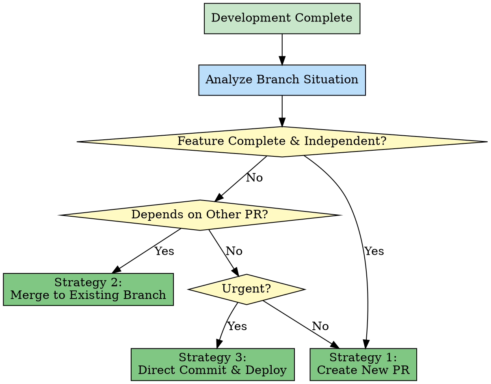

# Chapter 5: Strategy Pattern - Flexible Decision-Making Mechanism

> **Select different strategies based on scenarios, dynamically adjust behavior**

## Chapter Overview

The Strategy Pattern is the core pattern for skill decision-making mechanisms. It defines a family of algorithms, encapsulates each one, and makes them interchangeable. In skill systems, this pattern enables the system to select the most appropriate handling strategy based on different scenarios, providing great flexibility. This chapter deeply analyzes the Strategy Pattern's application in skill decision-making.

### What You'll Learn

- ✅ Core concepts of the Strategy Pattern
- ✅ finishing-branch merge strategy selection
- ✅ How to design flexible decision mechanisms
- ✅ Strategy Pattern and Template Method Pattern working together

---

## 5.1 Concept: Select Different Strategies Based on Scenarios

### Design Pattern Review

**Strategy Pattern** is a behavioral design pattern:

> **Define a family of algorithms, encapsulate each one, and make them interchangeable**

**Classic Example**:

```java
// Traditional object-oriented implementation

// Strategy interface
interface PaymentStrategy {
    void pay(int amount);
}

// Concrete strategy 1: Credit card payment
class CreditCardStrategy implements PaymentStrategy {
    @Override
    public void pay(int amount) {
        System.out.println("Pay with credit card: $" + amount);
    }
}

// Concrete strategy 2: PayPal payment
class PayPalStrategy implements PaymentStrategy {
    @Override
    public void pay(int amount) {
        System.out.println("Pay with PayPal: $" + amount);
    }
}

// Concrete strategy 3: WeChat Pay
class WeChatPayStrategy implements PaymentStrategy {
    @Override
    public void pay(int amount) {
        System.out.println("Pay with WeChat: ¥" + amount);
    }
}

// Context class
class PaymentContext {
    private PaymentStrategy strategy;

    public void setStrategy(PaymentStrategy strategy) {
        this.strategy = strategy;
    }

    public void executePayment(int amount) {
        strategy.pay(amount);
    }
}

// Usage
PaymentContext context = new PaymentContext();

// Scenario 1: International user uses credit card
context.setStrategy(new CreditCardStrategy());
context.executePayment(100);

// Scenario 2: European user uses PayPal
context.setStrategy(new PayPalStrategy());
context.executePayment(100);

// Scenario 3: Chinese user uses WeChat Pay
context.setStrategy(new WeChatPayStrategy());
context.executePayment(100);
```

**Execution Flow**:

```
User selects payment method → Set corresponding strategy → Execute strategy

Different users:
  International user → CreditCardStrategy
  European user → PayPalStrategy
  Chinese user → WeChatPayStrategy
```

### Application in Skills

**Strategy Pattern in Skills**:

```markdown
# finishing-branch merge strategy

Context: Development complete, how to handle code merge?

Strategy 1: Create New PR
  Use when:
    - Feature is complete and independent
    - Needs review
    - Not urgent

Strategy 2: Merge to Existing Branch
  Use when:
    - Small fix
    - Depends on other PRs
    - Related feature

Strategy 3: Direct Commit and Deploy
  Use when:
    - Emergency fix
    - Critical bug
    - Already reviewed
```

### Core Value

| Value Dimension | Without Strategy Pattern | With Strategy Pattern |
|----------------|-------------------------|----------------------|
| **Flexibility** | Fixed one approach | Multiple strategies to choose |
| **Extensibility** | Adding strategies requires code changes | Just add strategy class |
| **Conditional Branching** | Many if-else statements | Strategy encapsulation, clear separation |
| **Testability** | Hard to test different cases | Each strategy tested independently |
| **Maintainability** | Strategies coupled together | Strategies independent, easy to maintain |

### Strategy Pattern vs Template Method Pattern

**Comparison**: Two patterns often used together

| Comparison Dimension | Strategy Pattern | Template Method Pattern |
|---------------------|-----------------|----------------------|
| **Focus** | Entire algorithm interchangeability | Algorithm skeleton fixed nature |
| **Variation Point** | Entire strategy | Step implementation |
| **Inheritance Relationship** | Composition (interface) | Inheritance (parent class) |
| **Flexibility** | High (runtime switching) | Medium (compile-time determined) |
| **Typical Application** | Different strategies for different scenarios | Fixed workflow, variable steps |

**Working Together in Skills**:

```markdown
# Example of Working Together

## Template Method Defines Workflow Skeleton

writing-plans (Template Method):
  Step 1: Read Requirements (Fixed)
  Step 2: Analyze Requirements (Variable)
  Step 3: Write Plan (Fixed)
  Step 4: Review Plan (Variable)
  Step 5: Export Plan (Fixed)

## Strategy Pattern Handles Variable Steps

Step 2 analysis strategy:
  Strategy A: Simple analysis (no tool calls)
  Strategy B: Technical research (call browse)
  Strategy C: Design consultation (call design-consultation)

Step 4 review strategy:
  Strategy A: CEO review (plan-ceo-review)
  Strategy B: Engineer review (plan-eng-review)
  Strategy C: Auto review (self-review)
```

---

## 5.2 Implementation: finishing-branch Merge Strategy Selection

### Skill Overview

**Skill Name**: `finishing-a-development-branch`

**Description**: Use when implementation is complete, all tests pass, and you need to decide how to integrate the work

**Positioning**: Branch merge decision center

### Complete Strategy Analysis

```markdown
# finishing-branch skill complete strategy

---
name: finishing-a-development-branch
description: Use when implementation is complete, all tests pass, and you need to decide how to integrate the work
---

# Finishing a Development Branch

## Context Analysis

Analyze the branch situation:

1. Branch type (feature, bugfix, refactor)
2. Branch dependencies
3. Urgency level
4. Review status

## Strategy Selection

### Strategy 1: Create New PR

**When to use:**
- Feature is complete and independent
- No dependencies on other PRs
- Not urgent
- Needs review

**Steps:**
1. Push branch to remote
2. Create pull request
3. Request code review
4. Wait for approval
5. Merge to main

**Pros:**
- ✅ Proper review process
- ✅ Clean git history
- ✅ Easy to track

**Cons:**
- ⚠️ Takes time (review process)
- ⚠️ May need multiple iterations

---

### Strategy 2: Merge to Existing Branch

**When to use:**
- Small fix or enhancement
- Depends on another PR
- Related to existing work
- Can bypass new review

**Steps:**
1. Identify target branch
2. Merge into target branch
3. Run tests on target branch
4. Update target branch PR

**Pros:**
- ✅ Faster than new PR
- ✅ Keeps related work together

**Cons:**
- ⚠️ Harder to track individually
- ⚠️ May complicate existing PR

---

### Strategy 3: Direct Commit and Deploy

**When to use:**
- Emergency hotfix
- Critical bug fix
- Already reviewed
- Urgent deployment needed

**Steps:**
1. Commit directly to main
2. Push to remote
3. Trigger CI/CD
4. Deploy immediately
5. Create retrospective PR (optional)

**Pros:**
- ✅ Fastest deployment
- ✅ Immediate fix

**Cons:**
- ⚠️ Bypasses review
- ⚠️ Higher risk
- ⚠️ Should use sparingly
```

### Strategy Selection Flow



### Strategy Decision Logic

#### Decision Factor Analysis

```markdown
# Factors Influencing Strategy Selection

## Factor 1: Branch Type

Feature Branch:
  - Usually new functionality
  - Should create new PR

Bugfix Branch:
  - Small fix
  - Can merge into related PR

Refactor Branch:
  - Code refactoring
  - Should create new PR

Hotfix Branch:
  - Emergency fix
  - May need direct deployment

## Factor 2: Dependency Relationship

Independent:
  - Doesn't depend on other PRs
  - Can merge independently

Dependent:
  - Depends on unmerged PRs
  - Should merge into that PR

Depended on:
  - Other PRs depend on this branch
  - Should merge this branch first

## Factor 3: Urgency Level

Normal:
  - Can follow normal process

Urgent:
  - Needs quick release
  - Can skip some processes

Critical:
  - Production environment issue
  - Deploy immediately

## Factor 4: Review Status

Reviewed:
  - Already passed code review
  - Can merge faster

Not Reviewed:
  - Needs complete review process
  - Must create PR
```

#### Decision Matrix

```markdown
# Strategy Selection Decision Matrix

| Branch Type | Dependency | Urgency | Review Status | Recommended Strategy |
|------------|-----------|---------|--------------|---------------------|
| Feature | Independent | Normal | Not Reviewed | Strategy 1: New PR |
| Feature | Independent | Urgent | Reviewed | Strategy 1: New PR (expedited) |
| Bugfix | Dependent | Normal | Not Reviewed | Strategy 2: Merge to existing branch |
| Bugfix | Independent | Normal | Reviewed | Strategy 1: New PR |
| Bugfix | Independent | Urgent | Reviewed | Strategy 3: Direct deploy |
| Hotfix | Independent | Critical | Reviewed | Strategy 3: Direct deploy |
| Refactor | Independent | Normal | Not Reviewed | Strategy 1: New PR |
```

### Strategy Implementation Details

#### Strategy 1: Create New PR

```markdown
# Detailed steps to create new PR

## Step 1: Prepare Branch

```bash
# Ensure on correct branch
git checkout feature-branch

# Ensure code is latest
git pull origin feature-branch

# Run all tests
npm test
```

## Step 2: Push to Remote

```bash
# Push branch to remote repository
git push origin feature-branch
```

## Step 3: Create Pull Request

Use gh CLI to create PR:

```bash
gh pr create \
  --title "Add user authentication feature" \
  --body "## Summary
- Implemented JWT-based authentication
- Added login/logout endpoints
- Added password encryption

## Test plan
- [ ] Unit tests pass
- [ ] Integration tests pass
- [ ] Manual testing completed
" \
  --base main
```

## Step 4: Request Code Review

```bash
# Assign reviewers
gh pr edit --add-reviewer username1,username2
```

## Step 5: Wait for Review

- Monitor PR status
- Respond to review comments
- Modify code if necessary

## Step 6: Merge PR

After review approval:

```bash
# Merge PR
gh pr merge --squash
```
```

#### Strategy 2: Merge to Existing Branch

```markdown
# Detailed steps to merge to existing branch

## Step 1: Identify Target Branch

Determine which branch to merge into:

```bash
# View related PRs
gh pr list --state open

# Or view branch dependency relationships
git log --oneline --graph --all
```

## Step 2: Merge Branch

```bash
# Checkout target branch
git checkout target-branch

# Merge current branch
git merge --no-ff feature-branch

# Push update
git push origin target-branch
```

## Step 3: Run Tests

```bash
# Ensure tests pass
npm test

# If has CI, check CI status
gh pr checks
```

## Step 4: Update Target Branch PR

If target branch has PR:

```bash
# Update PR description
gh pr edit target-pr-number \
  --body "Updated: Merged feature-branch"
```
```

#### Strategy 3: Direct Commit and Deploy

```markdown
# Detailed steps to directly commit and deploy

⚠️ **Warning: Only for emergencies!**

## Step 1: Confirm Urgency

Confirm this is truly an emergency:
- Production environment failure
- Critical bug impact
- No other alternatives

## Step 2: Prepare Commit

```bash
# Checkout main branch
git checkout main

# Pull latest code
git pull origin main

# Apply fix
git cherry-pick commit-hash
# Or commit directly
git commit -m "hotfix: fix critical login bug"
```

## Step 3: Push and Trigger Deployment

```bash
# Push to main
git push origin main

# This automatically triggers CI/CD
```

## Step 4: Monitor Deployment

```bash
# Check CI/CD status
gh run list --branch main --limit 1

# View deployment logs
gh run view run-id
```

## Step 5: Create Retrospective PR (Optional but Recommended)

```bash
# Create branch to record this fix
git checkout -b hotfix/login-bug

# Create PR to record
gh pr create \
  --title "Hotfix: Fix critical login bug" \
  --body "Emergency fix for production issue"
```
```

---

## 5.3 Source Code Analysis: How to Determine Which Strategy to Use

### Strategy Selection Algorithm

```markdown
# finishing-branch strategy selection logic

## Pseudocode Implementation

```python
def select_strategy(branch_info):
    """
    Select most appropriate strategy based on branch information
    """

    # Check if critical emergency fix
    if branch_info.urgency == "critical":
        if branch_info.reviewed:
            return Strategy.DIRECT_DEPLOY
        else:
            # Even if urgent, needs quick review
            return Strategy.NEW_PR_EXPEDITED

    # Check if has dependencies
    if branch_info.has_dependencies():
        # Merge into dependent branch
        return Strategy.MERGE_TO_EXISTING

    # Check branch type
    if branch_info.type == "feature":
        # New features must go through PR process
        return Strategy.NEW_PR

    elif branch_info.type == "bugfix":
        if branch_info.size == "small" and branch_info.reviewed:
            # Small fix and reviewed, can quick merge
            return Strategy.NEW_PR_EXPEDITED
        else:
            return Strategy.NEW_PR

    elif branch_info.type == "hotfix":
        if branch_info.reviewed:
            return Strategy.DIRECT_DEPLOY
        else:
            # Even hotfix needs review
            return Strategy.NEW_PR_EXPEDITED

    elif branch_info.type == "refactor":
        # Refactoring needs complete review
        return Strategy.NEW_PR

    # Default: create new PR
    return Strategy.NEW_PR
```

## Strategy Enumeration

```python
class Strategy(Enum):
    NEW_PR = "create_new_pr"
    NEW_PR_EXPEDITED = "create_new_pr_expedited"
    MERGE_TO_EXISTING = "merge_to_existing_branch"
    DIRECT_DEPLOY = "direct_commit_and_deploy"
```
```

### Branch Information Collection

```markdown
# How to collect information needed for decisions

## Collect Branch Type

Method 1: Infer from branch name

```
feature/user-auth → Feature
bugfix/login-error → Bugfix
hotfix/critical-fix → Hotfix
refactor/api-structure → Refactor
```

Method 2: Infer from commit messages

```
feat: add user auth → Feature
fix: resolve login error → Bugfix
hotfix: critical security fix → Hotfix
refactor: reorganize API → Refactor
```

Method 3: Ask user

```
When unable to determine branch type:
  Ask user: "What type of change is this?
    A. New feature
    B. Bug fix
    C. Emergency fix
    D. Code refactoring"
```

## Check Dependencies

Method 1: Analyze PR description

```
PR description mentions:
  "Depends on #123"
  → Has dependencies

PR description mentions:
  "Related to #456"
  → May have dependencies
```

Method 2: Analyze code changes

```bash
# View modified files
git diff --name-only main...branch

# If modified files are also modified in other PRs
# May have dependencies
```

Method 3: Analyze branch history

```bash
# View branch history
git log --oneline --graph --all

# If branch was created from another branch
# May have dependencies
```

## Determine Urgency Level

Method 1: Infer from commit messages

```
"fix: critical production issue" → Critical
"hotfix: security vulnerability" → Critical
"feat: new feature" → Normal
```

Method 2: Ask user

```
Ask user: "How urgent is this change?
  A. Critical (production environment issue)
  B. Urgent (needs to go live ASAP)
  C. Normal (normal process)"
```

Method 3: Infer from timestamps

```
Committed outside work hours → May be urgent
Committed during work hours → May be normal
```

## Check Review Status

Method 1: Query GitHub API

```bash
# Check PR review status
gh pr view pr-number --json reviews

# If has approved status reviews
# → Reviewed
```

Method 2: Check commit tags

```
Commit message contains:
  "Reviewed-by: ..." → Reviewed
  "Co-Authored-By: ..." → Reviewed
```

Method 3: Ask user

```
Ask user: "Has this code been reviewed?
  A. Yes, reviewed and approved
  B. No, needs review"
```
```

### Strategy Execution Encapsulation

```markdown
# Execution encapsulation for each strategy

## Strategy 1: Create New PR

```markdown
# create_new_pr.md

## Input
- branch_name: Branch name
- pr_title: PR title
- pr_body: PR description
- reviewers: Reviewer list (optional)

## Steps
1. Push branch to remote
2. Create PR using gh CLI
3. Add reviewers if specified
4. Return PR URL

## Output
- pr_url: Created PR link

## Error Handling
- IF push fails → Return error with reason
- IF PR creation fails → Return error with reason
- IF reviewers not found → Continue without reviewers
```

## Strategy 2: Merge to Existing Branch

```markdown
# merge_to_existing_branch.md

## Input
- source_branch: Source branch
- target_branch: Target branch
- target_pr: Target PR number (optional)

## Steps
1. Checkout target branch
2. Merge source branch
3. Push to remote
4. Run tests
5. Update target PR if exists

## Output
- merge_commit: Merged commit hash

## Error Handling
- IF merge conflicts → Return conflict details
- IF tests fail → Rollback merge, return test failures
- IF push fails → Return error with reason
```

## Strategy 3: Direct Deploy

```markdown
# direct_deploy.md

## Input
- commit_message: Commit message
- deploy_command: Deploy command (optional)

## Steps
1. ⚠️ Confirm urgency with user
2. Checkout main branch
3. Cherry-pick commit or create new commit
4. Push to main
5. Monitor CI/CD status
6. Create retrospective PR

## Output
- deploy_status: Deployment status
- deployment_url: Deployed environment URL

## Error Handling
- IF CI fails → Alert immediately
- IF deploy fails → Rollback, alert immediately
- IF monitoring fails → Alert for manual check
```
```

---

## 5.4 Comparison: Superpowers Branch Strategy vs Traditional Git Workflows

### Superpowers Branch Strategy

**Characteristics**: **Intelligent Decision + Standardized Process**

```markdown
# Superpowers Branch Strategy

Features:
  - Automatically analyze branch situation
  - Intelligently select merge strategy
  - Standardized process guidance
  - Reduce human errors

Advantages:
  ✅ Reduce decision burden
  ✅ Ensure correct process
  ✅ Suitable for beginners
  ✅ Reduce errors

Disadvantages:
  ⚠️ Lower flexibility
  ⚠️ May not fully match team standards
```

### Traditional Git Workflow

**Characteristics**: **Manual Decision + Flexible Execution**

```markdown
# Traditional Git Workflow

Features:
  - Developers decide based on experience
  - Manually execute Git commands
  - Team-customized standards
  - Highly flexible

Advantages:
  ✅ Completely flexible
  ✅ Customizable
  ✅ Adapt to various team standards

Disadvantages:
  ⚠️ Depend on experience
  ⚠️ Easy to make mistakes
  ⚠️ High barrier for beginners
```

### Comparative Analysis

| Comparison Dimension | Superpowers Strategy Pattern | Traditional Git Workflow |
|---------------------|----------------------------|-------------------------|
| **Decision Method** | Automatic analysis | Manual judgment |
| **Process Guidance** | Detailed step-by-step guidance | Depends on experience and docs |
| **Error Rate** | Low (standardized) | Medium (depends on human factors) |
| **Flexibility** | Medium (preset strategies) | High (complete freedom) |
| **Learning Curve** | Low (skill guidance) | High (needs experience) |
| **Team Adaptability** | Medium (needs to match standards) | High (customizable) |

### Best Practice: Combined Use

**Strategy**: **Intelligent Suggestion + Manual Confirmation**

```markdown
# Combined Workflow

## Step 1: Skill Analysis

finishing-branch analyzes branch situation:
  - Branch type: Feature
  - Dependencies: Independent
  - Urgency: Normal
  - Review status: Not reviewed

## Step 2: Strategy Suggestion

Suggested strategy: Strategy 1 (Create new PR)

Reasoning:
  - Feature is complete and independent
  - No dependencies
  - Not urgent
  - Needs review

## Step 3: Manual Confirmation

Ask user: "I suggest creating a new PR, continue?
  A. Yes, create new PR
  B. No, I want to merge to existing branch
  C. No, this is emergency fix, need direct deployment"

## Step 4: Execution

Execute corresponding strategy based on user choice:
  - If A → Execute Strategy 1
  - If B → Re-analyze, execute Strategy 2
  - If C → Confirm urgency, execute Strategy 3
```

**Advantages**:

```
✅ Reduce decision burden (automatic analysis)
✅ Preserve manual control (final confirmation)
✅ Provide professional suggestions (best practices)
✅ Flexible and adjustable (can override suggestions)
✅ Reduce errors (standardized process)
```

---

## 5.5 Practice: Design Your Own Strategy Pattern Skill

### Design Steps

#### Step 1: Identify Strategy Variation Points

```markdown
# Example: Design code review strategy

Scenario: Choose different review methods based on code type

Strategy variation points:
  - Frontend code → UI/UX review
  - Backend code → Performance and security review
  - Database code → Database expert review
  - Test code → Test expert review
```

#### Step 2: Define Strategy Interface

```markdown
# Strategy Interface Definition

Each review strategy must implement:

## Required Methods

1. analyze(code_path) → AnalysisResult
   - Analyze code
   - Return analysis results

2. generate_review() → ReviewReport
   - Generate review report
   - Include issues and suggestions

3. suggest_fixes() → FixList
   - Provide fix suggestions
   - Optional auto-fix

## Common Interface

All strategies share the same interface:
  - Input: code_path, review_scope
  - Output: review_report
```

#### Step 3: Implement Concrete Strategies

```markdown
# Strategy A: Frontend Review

```markdown
---
name: frontend-code-review
description: Review frontend code with focus on UI/UX
---

## Focus Areas

1. UI/UX Quality
   - Component structure
   - Responsive design
   - Accessibility

2. Performance
   - Bundle size
   - Render performance
   - Lazy loading

3. Best Practices
   - React/Vue conventions
   - State management
   - Component reusability

## Review Process

1. Analyze component structure
2. Check responsive design
3. Test accessibility
4. Measure performance
5. Generate report
```

# Strategy B: Backend Review

```markdown
---
name: backend-code-review
description: Review backend code with focus on performance and security
---

## Focus Areas

1. Performance
   - Database queries
   - API response time
   - Caching strategy

2. Security
   - SQL injection
   - Authentication
   - Authorization
   - Data validation

3. Architecture
   - API design
   - Microservices patterns
   - Error handling

## Review Process

1. Analyze API endpoints
2. Check database queries
3. Test security vulnerabilities
4. Measure performance
5. Generate report
```

# Strategy C: Database Review

```markdown
---
name: database-code-review
description: Review database code with focus on performance and integrity
---

## Focus Areas

1. Performance
   - Query optimization
   - Index usage
   - Join efficiency

2. Data Integrity
   - Foreign keys
   - Constraints
   - Transactions

3. Security
   - User permissions
   - Data encryption
   - SQL injection

## Review Process

1. Analyze SQL queries
2. Check indexes
3. Test query performance
4. Verify constraints
5. Generate report
```
```

#### Step 4: Implement Strategy Selector

```markdown
# Strategy Selector

```markdown
---
name: code-review-selector
description: Select appropriate review strategy based on code type
---

# Code Review Selector

## Analyze Code Type

Determine the type of code to review:

1. Check file extensions
   - .jsx, .tsx, .vue → Frontend
   - .js, .ts, .py, .go → Backend
   - .sql → Database

2. Check directory structure
   - /frontend/ → Frontend
   - /backend/ or /api/ → Backend
   - /migrations/ or /sql/ → Database

3. Ask user if ambiguous

## Select Strategy

Based on code type:

**IF frontend code:**
- Invoke /frontend-code-review

**ELIF backend code:**
- Invoke /backend-code-review

**ELIF database code:**
- Invoke /database-code-review

**ELSE:**
- Default to /backend-code-review

## Execute Strategy

Call selected strategy:

```
Use Skill tool with:
  skill: selected_strategy_name
  args: code_path
```
```
```

#### Step 5: Test and Optimize

```markdown
# Testing Checklist

□ Test strategy identification
  - Is frontend code identified as frontend?
  - Is backend code identified as backend?
  - Is database code identified as database?

□ Test strategy execution
  - Does each strategy execute correctly?
  - Does it generate correct reports?

□ Test strategy switching
  - Can it switch strategies based on different code types?
  - Is switching smooth?

□ Test boundary conditions
  - How to handle mixed code?
  - How to handle unidentifiable types?

□ Test performance
  - Is strategy selection fast?
  - Is review efficient?
```

### Common Pitfalls

#### Pitfall 1: Strategies Too Similar

```markdown
❌ Wrong Example:

frontend-review and backend-review are completely identical
  - Both check code style
  - Both check performance
  - Both check security

Problem:
  - No differentiation
  - Loses meaning of Strategy Pattern
```

```markdown
✅ Correct Example:

frontend-review:
  Focus on:
    - UI/UX
    - Component structure
    - Responsive design

backend-review:
  Focus on:
    - API design
    - Database performance
    - Security

Advantage:
  - Each strategy has unique value
  - True polymorphism
```

#### Pitfall 2: Strategy Selection Too Complex

```markdown
❌ Wrong Example:

Strategy selection logic:
  IF code lines > 100:
    IF contains database:
      IF performance critical:
        Strategy A
      ELSE:
        Strategy B
    ELSE:
      IF has frontend:
        Strategy C
      ELSE:
        Strategy D
  ELSE:
    ...

Problem:
  - Overly complex
  - Hard to understand
  - Error-prone
```

```markdown
✅ Correct Example:

Strategy selection logic:
  IF frontend code:
    Strategy A (frontend-review)
  ELIF backend code:
    Strategy B (backend-review)
  ELIF database code:
    Strategy C (database-review)
  ELSE:
    Default strategy

Advantage:
  - Simple and clear
  - Easy to understand
  - Easy to maintain
```

#### Pitfall 3: Missing Default Strategy

```markdown
❌ Wrong Example:

IF frontend:
  Strategy A
ELIF backend:
  Strategy B

No ELSE branch

Problem:
  - What about unidentifiable types?
  - System will crash or error
```

```markdown
✅ Correct Example:

IF frontend:
  Strategy A
ELIF backend:
  Strategy B
ELSE:
  Default strategy (e.g., backend-review)

Advantage:
  - Strong robustness
  - Always has a strategy available
  - Graceful degradation
```

---

## Chapter Summary

This chapter deeply analyzed the Strategy Pattern:

1. **Pattern Concept** - Select different strategies based on scenarios
2. **finishing-branch Implementation** - Intelligent selection of three merge strategies
3. **Strategy Decision Mechanism** - How to analyze branch situation and select strategy
4. **Superpowers vs Traditional Git Workflow** - Intelligent decision vs manual judgment
5. **Design Your Own Strategy Pattern** - Five-step method and common pitfalls

The Strategy Pattern provides flexible decision-making mechanisms for skills, enabling the system to select the most appropriate handling approach based on different scenarios.

---

## Extended Reading

- [Design Patterns: Strategy Pattern](https://en.wikipedia.org/wiki/Strategy_pattern)
- [Git Flow Workflow](https://nvie.com/posts/a-successful-git-branching-model/)
- [GitHub Flow Workflow](https://docs.github.com/en/get-started/quickstart/github-flow)

## Exercises

1. **Thinking Question**: What's the difference between Strategy Pattern and Template Method Pattern? How to use them together?
2. **Practice**: Design a deployment strategy skill, defining at least 3 deployment strategies.
3. **Discussion**: Are the three strategies of finishing-branch sufficient? Do we need to add other strategies?

---

**Next Chapter Preview**: Chapter 6 will explore the Parallel Pattern, analyzing efficiency maximization design and implementation.