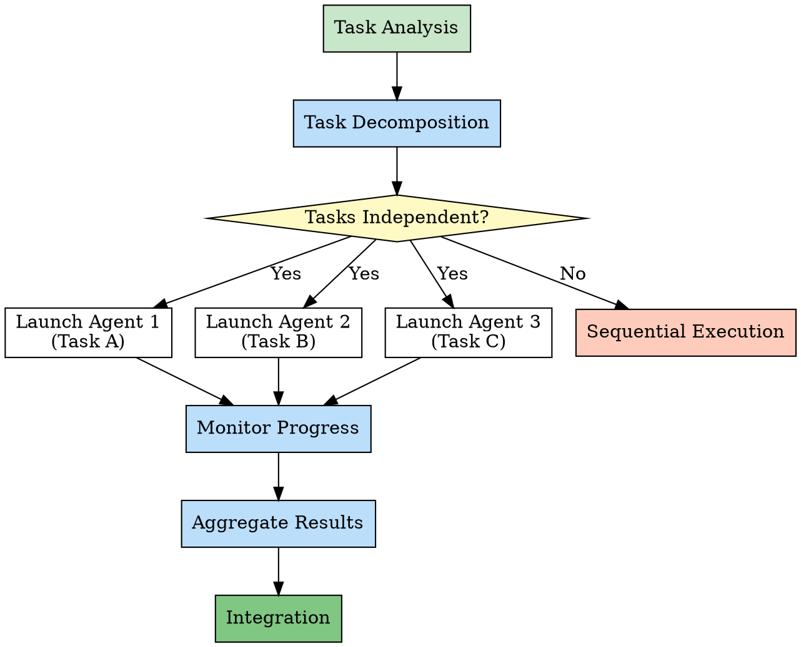

# Chapter 6: Parallel Pattern - Efficiency Maximization

> **Execute independent tasks in parallel, maximize efficiency**

## Chapter Overview

The Parallel Pattern is the core pattern for improving skill efficiency. It allows the system to execute multiple independent tasks simultaneously, dramatically reducing overall execution time. In skill systems, this pattern achieves a qualitative leap in efficiency through intelligent task decomposition and parallel execution. This chapter deeply analyzes the Parallel Pattern's application in skills.

### What You'll Learn

- ✅ Core concepts of the Parallel Pattern
- ✅ Implementation mechanism of dispatching-parallel-agents
- ✅ How to identify parallelizable tasks
- ✅ Risks and controls of parallel execution

---

## 6.1 Concept: Execute Independent Tasks in Parallel

### Design Philosophy

**Parallel Pattern** core philosophy:

> **Execute multiple independent tasks simultaneously rather than sequentially**

**Comparison**:

```
Sequential Execution:

Task A (3s) → Task B (2s) → Task C (4s)
Total time: 3 + 2 + 4 = 9s

Parallel Execution:

Task A (3s) ┐
Task B (2s) ├→ Execute simultaneously
Task C (4s) ┘
Total time: max(3, 2, 4) = 4s

Efficiency improvement: 9s → 4s (55.6% time saved)
```

### Application in Skills

**Parallel Pattern in Skills**:

```markdown
# dispatching-parallel-agents skill

Scenario: Need to develop frontend, backend, and database simultaneously

Traditional approach:
  Develop frontend (2 hours)
    ↓
  Develop backend (3 hours)
    ↓
  Develop database (1 hour)
  Total time: 6 hours

Parallel approach:
  Agent 1: Develop frontend (2 hours) ┐
  Agent 2: Develop backend (3 hours) ├→ Execute simultaneously
  Agent 3: Develop database (1 hour) ┘
  Total time: 3 hours

Efficiency improvement: 50%
```

### Core Value

| Value Dimension | Sequential Execution | Parallel Execution |
|----------------|---------------------|-------------------|
| **Execution Time** | Cumulative | Take maximum |
| **Resource Utilization** | Single-threaded | Multi-threaded/multi-process |
| **Throughput** | Low | High |
| **Response Time** | Slow | Fast |
| **Complexity** | Low | High |

### Applicable Conditions

**Necessary Conditions for Parallel Execution**:

```markdown
# Conditions for Parallelization

✅ Condition 1: Task Independence
  - No dependencies between tasks
  - One task doesn't need another task's results

✅ Condition 2: Sufficient Resources
  - Enough computing resources
  - Enough memory, CPU

✅ Condition 3: Mergeable Results
  - Results from each task can be aggregated
  - Clear merging method

❌ Cannot Parallelize

❌ Case 1: Task Dependencies
  Task A → Task B (B depends on A's results)
  Must execute sequentially

❌ Case 2: Resource Sharing Conflicts
  Multiple tasks writing to same file simultaneously
  Will cause data corruption

❌ Case 3: Results Cannot Merge
  Task results contradict each other
  Cannot reach unified conclusion
```

---

## 6.2 Implementation: dispatching-parallel-agents

### Skill Overview

**Skill Name**: `dispatching-parallel-agents`

**Description**: Use when facing 2+ independent tasks that can be worked on without shared state or sequential dependencies

**Positioning**: Parallel task scheduler

### Complete Implementation Analysis

```markdown
# dispatching-parallel-agents skill implementation

---
name: dispatching-parallel-agents
description: Use when facing 2+ independent tasks that can be worked on without shared state or sequential dependencies
---

# Dispatching Parallel Agents

## Step 1: Analyze Tasks

Analyze the tasks to determine:

1. Number of tasks
2. Task dependencies
3. Resource requirements
4. Expected duration

**IF tasks have dependencies:**
- Refuse to parallelize
- Suggest sequential execution

**IF tasks are independent:**
- Proceed to parallelization

## Step 2: Decompose Tasks

Break down the work into independent units:

Example:
  Original: "Build a user management system"

  Decomposed:
    - Task 1: Design database schema
    - Task 2: Create API endpoints
    - Task 3: Build frontend UI

## Step 3: Launch Agents

Launch separate agents for each task:

**Agent 1: Database Agent**
```
Task: Design database schema
Skills: mysql-query, design-consultation
```

**Agent 2: Backend Agent**
```
Task: Create API endpoints
Skills: writing-plans, tdd, executing-plans
```

**Agent 3: Frontend Agent**
```
Task: Build frontend UI
Skills: writing-plans, executing-plans, design-review
```

## Step 4: Monitor Progress

Monitor each agent's progress:

- Track completion status
- Handle errors if they occur
- Collect results

## Step 5: Aggregate Results

Collect results from all agents:

1. Database schema from Agent 1
2. API code from Agent 2
3. Frontend code from Agent 3

## Step 6: Integrate

Integrate all results:

- Merge code into unified project
- Run integration tests
- Verify all components work together
```

### Parallel Execution Flow



### Agent Scheduling Mechanism

#### Sub-agent Creation

```markdown
# Creating Sub-agents

## Using Agent Tool

```markdown
# Inside dispatching-parallel-agents

Launch Agent 1:
  Use Agent tool with:
    subagent_type: "general-purpose"
    description: "Design database schema"
    prompt: |
      Design the database schema for user management system.

      Requirements:
      - User table with authentication fields
      - Role and permission tables
      - Audit log table

      Deliverables:
      - SQL schema file
      - Migration scripts
```

## Agent Work Isolation

Each Agent works in isolated environment:

- Independent file system access
- Independent tool access permissions
- Independent state management

Advantages:
  ✅ Avoid conflicts
  ✅ Parallel execution
  ✅ Error isolation
```

#### Progress Monitoring

```markdown
# Monitoring Agent Progress

## Using TaskOutput Tool

```markdown
Monitor Agent 1:

task_id = "agent-1-task-id"

result = TaskOutput(task_id, block=false)

IF result.status == "completed":
  Collect results

ELIF result.status == "in_progress":
  Continue waiting

ELIF result.status == "failed":
  Handle error
```

## Timeout Handling

```markdown
Set timeout:

result = TaskOutput(
  task_id,
  block=true,
  timeout=3600000  # 1 hour
)

IF timeout:
  - Cancel that Agent
  - Use other Agents' results
  - Or manual intervention
```
```

### Result Aggregation Strategy

```markdown
# Result Aggregation Strategies

## Strategy 1: Simple Aggregation

Directly collect all results:

```python
results = []

for agent_id in agent_ids:
    result = TaskOutput(agent_id, block=true)
    results.append(result)

# Merge all results
final_result = merge(results)
```

## Strategy 2: Validated Aggregation

Validate each result's validity:

```python
valid_results = []

for agent_id in agent_ids:
    result = TaskOutput(agent_id, block=true)

    if validate(result):
        valid_results.append(result)
    else:
        log_error(f"Agent {agent_id} produced invalid result")

if len(valid_results) < expected_count:
    handle_incomplete_results()
```

## Strategy 3: Priority Aggregation

Handle results by priority:

```python
high_priority_results = []
low_priority_results = []

for agent_id in agent_ids:
    result = TaskOutput(agent_id, block=true)

    if result.priority == "high":
        high_priority_results.append(result)
    else:
        low_priority_results.append(result)

# Prefer high priority results
final_result = merge(high_priority_results + low_priority_results)
```
```

---

## 6.3 Source Code Analysis: Sub-agent Scheduling and Result Aggregation

### Task Decomposition Algorithm

```python
# Task decomposition pseudocode

def decompose_tasks(original_task):
    """
    Decompose large task into parallelizable small tasks
    """

    # Analyze task structure
    components = analyze_components(original_task)

    # Identify dependencies
    dependencies = identify_dependencies(components)

    # Build dependency graph
    graph = build_dependency_graph(components, dependencies)

    # Identify parallelizable task groups
    parallel_groups = identify_parallel_groups(graph)

    return parallel_groups

def analyze_components(task):
    """
    Analyze what components the task contains
    """

    components = []

    # Check if involves database
    if involves_database(task):
        components.append({
            'type': 'database',
            'description': 'Database design and implementation'
        })

    # Check if involves backend API
    if involves_backend(task):
        components.append({
            'type': 'backend',
            'description': 'Backend API development'
        })

    # Check if involves frontend UI
    if involves_frontend(task):
        components.append({
            'type': 'frontend',
            'description': 'Frontend UI development'
        })

    return components

def identify_dependencies(components):
    """
    Identify dependencies between components
    """

    dependencies = []

    for i, component_a in enumerate(components):
        for j, component_b in enumerate(components):
            if i != j:
                if has_dependency(component_a, component_b):
                    dependencies.append({
                        'from': component_a,
                        'to': component_b,
                        'type': 'dependency'
                    })

    return dependencies

def identify_parallel_groups(graph):
    """
    Identify task groups that can execute in parallel
    """

    # Use topological sort
    sorted_nodes = topological_sort(graph)

    # Group: same level can be parallel
    groups = []
    current_group = []

    for node in sorted_nodes:
        if no_dependencies_to_current_group(node, current_group):
            current_group.append(node)
        else:
            if current_group:
                groups.append(current_group)
            current_group = [node]

    if current_group:
        groups.append(current_group)

    return groups
```

### Agent Scheduling Implementation

```python
# Agent scheduling pseudocode

class ParallelAgentScheduler:
    def __init__(self):
        self.agents = []
        self.results = {}

    def dispatch(self, tasks):
        """
        Schedule multiple agents in parallel
        """

        # Launch all agents
        for task in tasks:
            agent_id = self.launch_agent(task)
            self.agents.append(agent_id)

        # Wait for all agents to complete
        self.wait_for_completion()

        # Collect results
        self.collect_results()

        # Aggregate results
        final_result = self.aggregate_results()

        return final_result

    def launch_agent(self, task):
        """
        Launch single agent
        """

        agent_id = Agent(
            subagent_type="general-purpose",
            description=task['description'],
            prompt=self.build_prompt(task),
            run_in_background=True
        )

        return agent_id

    def build_prompt(self, task):
        """
        Build agent prompt
        """

        prompt = f"""
Task: {task['description']}

Context:
{task['context']}

Requirements:
{task['requirements']}

Deliverables:
{task['deliverables']}

Please complete this task independently.
Do not wait for or depend on other agents.
        """

        return prompt

    def wait_for_completion(self):
        """
        Wait for all agents to complete
        """

        for agent_id in self.agents:
            result = TaskOutput(
                task_id=agent_id,
                block=True,
                timeout=3600000  # 1 hour
            )

            self.results[agent_id] = result

    def collect_results(self):
        """
        Collect all agent results
        """

        # Already collected in wait_for_completion
        pass

    def aggregate_results(self):
        """
        Aggregate all results
        """

        aggregated = {
            'database': None,
            'backend': None,
            'frontend': None,
            'errors': []
        }

        for agent_id, result in self.results.items():
            if result['status'] == 'completed':
                task_type = result['task_type']
                aggregated[task_type] = result['output']
            else:
                aggregated['errors'].append({
                    'agent_id': agent_id,
                    'error': result['error']
                })

        return aggregated
```

### Result Integration Mechanism

```markdown
# Result Integration

## Integration Steps

### Step 1: Validate Each Result

```python
def validate_results(results):
    """
    Validate each agent's result
    """

    validation_report = {
        'valid': [],
        'invalid': []
    }

    for task_type, result in results.items():
        if task_type == 'errors':
            continue

        # Check result completeness
        if is_complete(result):
            # Check result quality
            if is_high_quality(result):
                validation_report['valid'].append({
                    'type': task_type,
                    'result': result
                })
            else:
                validation_report['invalid'].append({
                    'type': task_type,
                    'reason': 'Low quality'
                })
        else:
            validation_report['invalid'].append({
                'type': task_type,
                'reason': 'Incomplete'
            })

    return validation_report
```

### Step 2: Merge Code

```bash
# Merge each agent's code

# Database code
cp agent-1-output/schema.sql project/database/

# Backend code
cp -r agent-2-output/api/* project/backend/

# Frontend code
cp -r agent-3-output/components/* project/frontend/
```

### Step 3: Run Integration Tests

```bash
# Install dependencies
npm install

# Run tests
npm test

# Check API
npm run test:api

# Check frontend
npm run test:e2e
```

### Step 4: Fix Conflicts

If there are conflicts:

```markdown
# Handle Conflicts

## Code Conflicts

IF frontend and backend API interfaces inconsistent:
  1. Identify differences
  2. Negotiate unified interface
  3. Adjust code

## Database Conflicts

IF database design inconsistent with code:
  1. Check database schema
  2. Check queries in code
  3. Adjust schema or code
```
```

---

## 6.4 Comparison: Parallel vs Sequential Execution Trade-offs

### Performance Comparison

| Comparison Dimension | Sequential Execution | Parallel Execution | Difference |
|---------------------|---------------------|-------------------|------------|
| **Total Time** | Cumulative | Take maximum | Parallel faster |
| **Resource Consumption** | Low (single-thread) | High (multi-thread) | Parallel uses more |
| **Implementation Complexity** | Low | High | Parallel more complex |
| **Error Handling** | Simple | Complex | Parallel needs to handle multiple error sources |
| **Debugging Difficulty** | Low | High | Parallel harder to debug |

### Applicable Scenario Comparison

```markdown
# When to Choose Sequential Execution

✅ Scenarios:
  - Tasks have dependencies
  - Limited resources
  - Few tasks (1-2)
  - Not time-critical
  - Need detailed logging and debugging

Advantages:
  - Simple and reliable
  - Easy to debug
  - Low resource consumption

---

# When to Choose Parallel Execution

✅ Scenarios:
  - Tasks are independent
  - Sufficient resources
  - Many tasks (3+)
  - Time-critical
  - Can accept complex error handling

Advantages:
  - High efficiency
  - Short time
  - High resource utilization
```

### Hybrid Strategy

**Strategy**: **Parallelize when possible, sequential when necessary**

```markdown
# Hybrid Execution Strategy

## Analyze Task Dependencies

```
Task A → Task B → Task C (dependencies)
Task D (independent)
Task E (independent)
```

## Execution Plan

Phase 1 (Parallel):
  - Task D
  - Task E

Phase 2 (Sequential):
  - Task A → Task B → Task C

## Total Time

Parallel phase: max(D, E)
Sequential phase: A + B + C
Total time: max(D, E) + A + B + C
```

**Implementation**:

```markdown
# Hybrid Execution Implementation

```python
def hybrid_execution(tasks):

    # Analyze dependencies
    graph = analyze_dependencies(tasks)

    # Group
    phases = group_into_phases(graph)

    results = {}

    for phase in phases:
        if can_parallelize(phase):
            # Parallel execution
            phase_results = execute_parallel(phase)
        else:
            # Sequential execution
            phase_results = execute_sequential(phase)

        results.update(phase_results)

    return results
```
```

---

## 6.5 Practice: Design Your Own Parallel Pattern Skill

### Design Steps

#### Step 1: Identify Parallel Opportunities

```markdown
# Example: Multi-language Document Translation

Scenario: Translate an article into multiple languages

Tasks:
  - Translate to English
  - Translate to Japanese
  - Translate to Korean
  - Translate to French

Analysis:
  - Each language translation is independent ✅
  - Sufficient resources (multiple translation agents) ✅
  - Results can merge (one document per language) ✅

Conclusion: Can parallelize
```

#### Step 2: Design Agent Tasks

```markdown
# Agent Task Design

## Agent 1: English Translation

```markdown
Task: Translate article to English

Input:
  - Source article (Chinese)

Requirements:
  - Accurate translation
  - Native English expression
  - Maintain original style

Deliverables:
  - English version of article
  - Translation notes (if any)
```

## Agent 2: Japanese Translation

```markdown
Task: Translate article to Japanese

Input:
  - Source article (Chinese)

Requirements:
  - Accurate translation
  - Native Japanese expression
  - Maintain original style

Deliverables:
  - Japanese version of article
  - Translation notes (if any)
```

## Agent 3: Korean Translation

```markdown
Task: Translate article to Korean

Input:
  - Source article (Chinese)

Requirements:
  - Accurate translation
  - Native Korean expression
  - Maintain original style

Deliverables:
  - Korean version of article
  - Translation notes (if any)
```

## Agent 4: French Translation

```markdown
Task: Translate article to French

Input:
  - Source article (Chinese)

Requirements:
  - Accurate translation
  - Native French expression
  - Maintain original style

Deliverables:
  - French version of article
  - Translation notes (if any)
```
```

#### Step 3: Implement Scheduler

```markdown
# Translation Parallel Scheduler

```markdown
---
name: parallel-translation
description: Translate article to multiple languages in parallel
---

# Parallel Translation

## Analyze Source

Read the source article:
  - Language: Chinese
  - Length: 5000 words
  - Topic: Technology

## Determine Languages

Ask user which languages to translate to:
  A. English
  B. Japanese
  C. Korean
  D. French
  E. All of the above

## Launch Translation Agents

For each selected language:

**Agent for English:**
```
Use Agent tool with:
  subagent_type: "general-purpose"
  description: "Translate to English"
  prompt: |
    Translate the following article to English.

    Source article:
    {article_content}

    Requirements:
    - Accurate translation
    - Native English expression

    Save result to: en/article.md
```

**Agent for Japanese:**
```
Use Agent tool with:
  subagent_type: "general-purpose"
  description: "Translate to Japanese"
  prompt: |
    Translate the following article to Japanese.

    Source article:
    {article_content}

    Requirements:
    - Accurate translation
    - Native Japanese expression

    Save result to: ja/article.md
```

(Similar for Korean and French)

## Monitor Progress

Track each agent:
  - English: ✓ Completed
  - Japanese: ⏳ In progress
  - Korean: ⏳ In progress
  - French: ✓ Completed

## Collect Results

When all agents complete:
  1. Collect: en/article.md
  2. Collect: ja/article.md
  3. Collect: ko/article.md
  4. Collect: fr/article.md

## Generate Report

Report:
  - English: ✓ Completed (2 minutes)
  - Japanese: ✓ Completed (3 minutes)
  - Korean: ✓ Completed (3 minutes)
  - French: ✓ Completed (2 minutes)

  Total time: 3 minutes (parallel)
  vs. 10 minutes (sequential)

  Time saved: 70%
```
```

#### Step 4: Error Handling

```markdown
# Parallel Translation Error Handling

## Scenario: A Language Translation Fails

Example: Japanese translation agent fails

Handling:
  1. Detect failure
  2. Record failure reason
  3. Continue other translations
  4. Retry or manual translation

Implementation:
```python
results = {}
errors = []

for language in languages:
    try:
        agent_id = launch_translation_agent(language)
        result = TaskOutput(agent_id, block=true, timeout=300000)
        results[language] = result
    except Exception as e:
        errors.append({
            'language': language,
            'error': str(e)
        })

# Handle failed languages
for error in errors:
    log_error(f"Translation to {error['language']} failed: {error['error']}")

    # Retry
    retry_result = retry_translation(error['language'])

    if retry_result:
        results[error['language']] = retry_result
    else:
        # Record as failed
        results[error['language']] = None
```
```

#### Step 5: Test and Optimize

```markdown
# Testing Checklist

□ Test parallel execution
  - Do all agents start simultaneously?
  - Is it truly parallel execution?
  - Is time shorter than sequential execution?

□ Test result correctness
  - Is translation accurate?
  - Is language expression native?
  - Is format correct?

□ Test error handling
  - Does single agent failure affect other agents?
  - Is failure handled correctly?

□ Test resource consumption
  - Is memory usage reasonable?
  - Is CPU utilization normal?
  - Any resource leaks?

□ Test boundary conditions
  - How to handle empty article?
  - How to handle extra-long article?
  - How to handle unsupported language?
```

### Common Pitfalls

#### Pitfall 1: Over-parallelization

```markdown
❌ Wrong Example:

Execute 100 small tasks in parallel

Problem:
  - Large agent startup overhead
  - Excessive resource consumption
  - High scheduling complexity
  - Actual efficiency decreases
```

```markdown
✅ Correct Example:

Merge small tasks, control parallel count

Merge 100 small tasks into 10 groups:
  - Group 1: Task 1-10
  - Group 2: Task 11-20
  - ...

Launch 10 agents to execute in parallel

Advantage:
  - Reduce scheduling overhead
  - Reasonable resource utilization
  - Higher efficiency
```

#### Pitfall 2: Ignoring Dependencies

```markdown
❌ Wrong Example:

Execute in parallel:
  - Task A: Design database schema
  - Task B: Write API (depends on database schema)

Problem:
  - Task B needs Task A's result
  - Parallel execution causes Task B to fail
```

```markdown
✅ Correct Example:

Identify dependencies:
  Task A → Task B

Execution plan:
  Phase 1: Execute Task A
  Phase 2: Execute Task B (wait for A to complete)

Advantage:
  - Guarantee dependencies
  - Avoid errors
```

#### Pitfall 3: Resource Competition

```markdown
❌ Wrong Example:

Two agents writing to same file simultaneously:
  - Agent 1: Write to config.json
  - Agent 2: Also write to config.json

Problem:
  - File content gets corrupted
  - Data corruption
```

```markdown
✅ Correct Example:

Assign different files:
  - Agent 1: Write to database-config.json
  - Agent 2: Write to api-config.json

Or:
  - Use locking mechanism
  - Or sequential writes

Advantage:
  - Avoid competition
  - Data safety
```

---

## Chapter Summary

This chapter deeply analyzed the Parallel Pattern:

1. **Pattern Concept** - Execute independent tasks in parallel, maximize efficiency
2. **dispatching-parallel-agents Implementation** - Task decomposition, agent scheduling, result aggregation
3. **Sub-agent Mechanism** - Create, monitor, collect results
4. **Parallel vs Sequential** - Performance, complexity, applicable scenarios comparison
5. **Design Your Own Parallel Pattern** - Five-step method and common pitfalls

The Parallel Pattern is key to improving skill efficiency, but needs careful handling of dependencies and resource competition.

---

## Extended Reading

- [Parallel Computing Concepts](https://en.wikipedia.org/wiki/Parallel_computing)
- [Agent-based Systems](https://en.wikipedia.org/wiki/Intelligent_agent)
- [Concurrent Programming Patterns](https://en.wikipedia.org/wiki/Concurrent_computing)

## Exercises

1. **Thinking Question**: In what situations can parallel pattern reduce efficiency?
2. **Practice**: Design a parallel testing skill that tests multiple browsers simultaneously.
3. **Discussion**: How to balance parallelism and resource consumption?

---

**Next Chapter Preview**: Chapter 7 will explore the Guardian Pattern, analyzing security boundary design.