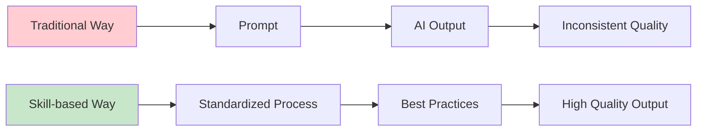
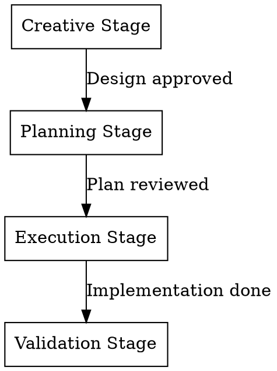

# 🎓 Skill Design Patterns: From Theory to Practice

> **Master the core design principles of AI skills and build scalable, collaborative skill ecosystems**

## Course Introduction

This course deeply analyzes the design principles, architectural patterns, and best practices of modern AI skills. Through dissecting real implementations of Superpowers and Gstack, two major skill packages, you'll learn how to design high-quality, reusable skill systems.

### What You'll Learn

- ✅ Core design principles of skill ecosystems
- ✅ Application of 8 classic design patterns in skills
- ✅ Complete implementation path from concept to source code
- ✅ How to design your own skill ecosystem

### Target Audience

- Experienced developers wanting to understand AI tool design principles
- Skill developers building their own skill ecosystems
- Architects designing scalable AI toolchains

### Prerequisites

- Basic programming experience (any language)
- Some experience using AI tools
- Understanding of basic software design patterns (bonus)

---

## Chapter 1: Skill Design Overview

### 1.1 What is a Skill Ecosystem?

#### Concept Definition

**Skills** are reusable capability modules designed for AI assistants (like Claude, GPT). Each skill encapsulates a set of related functionalities, workflows, and best practices, enabling AI to better accomplish specific tasks.

A **Skill Ecosystem** is an architectural system where multiple skills work collaboratively, including:

1. **Skill Definition** - The specific functionality of each skill
2. **Collaboration Mechanism** - How skills work together
3. **Dispatch System** - How to select and invoke the right skill
4. **Quality Assurance** - Ensuring reliable skill execution

#### Why Do We Need Skill Ecosystems?

**Problem Background**:

Before skills, AI assistants faced these challenges:

- ❌ **Repetitive Work** - Similar tasks require repeated explanation
- ❌ **Inconsistent Quality** - Output quality depends heavily on prompt quality
- ❌ **Missing Workflows** - Lack of standardized working processes
- ❌ **Difficult to Reuse** - Best practices aren't effectively shared

**Value of Skills**:



**Real Case Comparison**:

| Dimension | Traditional Prompts | Skill-based Approach |
|-----------|-------------------|---------------------|
| Learning Cost | Detailed explanation each time | Learn once, benefit forever |
| Execution Consistency | Highly dependent on prompt quality | Standardized process ensures consistency |
| Maintainability | Scattered everywhere | Centralized management, easy updates |
| Reusability | Hard to reuse | Modular design, high reuse |
| Team Collaboration | Hard to share best practices | Unified standards, knowledge accumulation |

#### Core Elements of a Skill

A complete skill contains:

1. **YAML Frontmatter** - Metadata and trigger conditions
   ```yaml
   ---
   name: skill-name
   description: "Skill description"
   TRIGGER when: [trigger scenarios]
   ---
   ```

2. **Core Instructions** - Skill content in Markdown format
   - Task description
   - Execution steps
   - Quality standards
   - Considerations

3. **Tool Dependencies** - Required external tools
   - File operations
   - Network requests
   - Database access

4. **Collaboration Interface** - How it works with other skills
   - Pre-dependencies
   - Post-actions
   - Mutual exclusion rules

---

### 1.2 Skill Collaboration Architecture Overview

#### Five-Layer Architecture Design

Modern skill ecosystems use a layered architecture with clear responsibilities at each layer:

```
┌─────────────────────────────────────────────────────────────┐
│                 Skill Collaboration Architecture             │
├─────────────────────────────────────────────────────────────┤
│                                                               │
│  【Entry Layer】                                              │
│   └─ using-superpowers → Determines which process skill      │
│                                                               │
│  【Process Layer】                                            │
│   ├─ Creative: brainstorming → first-principles              │
│   ├─ Planning: writing-plans → mvp-first                     │
│   ├─ Execution: executing-plans → tdd + systematic-debugging │
│   └─ Validation: verification → requesting-code-review       │
│                                                               │
│  【Tool Layer】                                               │
│   ├─ Browser: browse (replaces Chrome MCP)                  │
│   ├─ Database: mysql-query                                   │
│   └─ Git: using-git-worktrees                                │
│                                                               │
│  【Completion Layer】                                         │
│   ├─ finishing-a-development-branch → PR/merge decisions     │
│   ├─ land-and-deploy → deployment monitoring                 │
│   └─ document-release → documentation updates                │
│                                                               │
│  【Guardian Layer】                                           │
│   ├─ careful → dangerous operation warnings                  │
│   ├─ freeze → directory restrictions                         │
│   └─ guard → complete safety mode                            │
│                                                               │
└─────────────────────────────────────────────────────────────┘
```

#### Detailed Responsibilities of Each Layer

**1. Entry Layer**

**Responsibility**: Unified dispatch center, decides which skill to invoke

**Design Philosophy**:
- Single entry point, avoid chaos
- Intelligent routing, automatically determine task type
- Provide global perspective, ensure coherent workflow

**Core Skill**:
- `using-superpowers` - The gatekeeper of super skills

**Why Need Entry Layer?**
- ✅ Unified management, avoid skill conflicts
- ✅ Reduce cognitive burden, users don't need to remember all skills
- ✅ Easy to monitor and debug the entire process

**Example**:
```
User Request: "Help me develop a new feature"

using-superpowers analyzes:
  → Creative task
  → Invoke brainstorming
  → After brainstorming completes
  → Automatically invoke writing-plans
```

**2. Process Layer**

**Responsibility**: Define standard workflows for task execution

**Design Philosophy**:
- Handle complex tasks in stages
- Each stage focuses on one thing
- Clear handoff standards between stages

**Four Categories**:

| Category | Core Skills | Purpose |
|----------|------------|---------|
| Creative | brainstorming, first-principles | Explore solutions, break mental models |
| Planning | writing-plans, mvp-first | Make plans, ensure feasibility |
| Execution | executing-plans, tdd, systematic-debugging | Implementation, ensure quality |
| Validation | verification, requesting-code-review | Confirm results, continuous improvement |

**Process Orchestration Example**:



**3. Tool Layer**

**Responsibility**: Provide specific technical tools and operational capabilities

**Design Philosophy**:
- Focus on single responsibility
- Highly reusable
- Decoupled from business logic

**Core Skill Categories**:

| Tool Category | Representative Skills | Use Cases |
|--------------|---------------------|-----------|
| Browser Automation | browse, playwright | Web testing, data scraping |
| Database Operations | mysql-query | Data queries, analysis |
| Version Control | using-git-worktrees | Parallel development, branch management |
| File Operations | planning-with-files | Document management, task tracking |

**Importance of Tool Layer**:
- ✅ Avoid reinventing the wheel
- ✅ Standardize tool usage
- ✅ Easy maintenance and upgrades

**Example: browse skill application**:

```markdown
# When web testing is needed
User: "Test if login works properly"

using-superpowers → browse
browse executes:
  1. Open browser
  2. Navigate to login page
  3. Fill in username and password
  4. Click login button
  5. Verify if login successful
  6. Generate test report
```

**4. Completion Layer**

**Responsibility**: Complete final integration, deployment, and documentation

**Design Philosophy**:
- Ensure complete workflow closure
- Knowledge preservation and inheritance
- Automated deployment and monitoring

**Core Skills**:

```
finishing-a-development-branch
  ├─ Decision: Create new PR?
  ├─ Decision: Merge to which branch?
  └─ Action: Create PR or merge directly

land-and-deploy
  ├─ Merge code
  ├─ Trigger CI/CD
  ├─ Monitor deployment status
  └─ Verify production environment

document-release
  ├─ Update README
  ├─ Update CHANGELOG
  └─ Sync documentation website
```

**Why Need Completion Layer?**
- ✅ Prevent missing important steps
- ✅ Ensure knowledge preservation
- ✅ Automate deployment process

**Real Case**:

```bash
# Automated workflow after development completes
finishing-a-development-branch
  ↓ Create PR
requesting-code-review
  ↓ Code review passes
land-and-deploy
  ↓ Merge and deploy
canary
  ↓ Production monitoring
document-release
  ↓ Update docs
✅ Complete closure
```

**5. Guardian Layer**

**Responsibility**: Protect system security, prevent dangerous operations

**Design Philosophy**:
- Defensive programming
- Tiered protection
- Clear warnings

**Three-Tier Protection System**:

| Level | Skill | Protection Scope | Example |
|-------|-------|-----------------|---------|
| Lightweight | careful | Warn dangerous operations | `rm -rf`, `DROP TABLE` |
| Medium | freeze | Restrict edit directories | Only edit `/src/components/` |
| Heavy | guard | Complete protection mode | careful + freeze combination |

**How Guardian Layer Works**:

```
User operation: rm -rf /

careful detects dangerous operation
  ↓
Popup warning:
  "⚠️ This is a dangerous operation!
   About to delete all files in root directory.
   Are you sure you want to continue?"

User confirms: No
  ↓
Operation blocked ✅
```

**Value of Guardian Layer**:
- ✅ Prevent accidental operations
- ✅ Protect important data
- ✅ Provide undo opportunities

#### Collaboration Rules Between Layers

**Rule 1: Unidirectional Dependency**

```
Entry Layer → Process Layer → Tool Layer
                              ↓
                        Guardian Layer (optional, can trigger anytime)
                              ↓
                          Completion Layer
```

**Rule 2: Separation of Responsibilities**

- Entry layer only routes, doesn't implement logic
- Process layer orchestrates workflows, calls tool layer to execute
- Tool layer focuses on single function, doesn't care about business
- Guardian layer exists independently, can be called by any layer
- Completion layer ensures closure, doesn't participate in early development

**Rule 3: Mandatory vs Optional**

| Type | Skills | Description |
|------|--------|-------------|
| Mandatory | brainstorming, tdd, verification | Must execute, ensure quality |
| Optional | careful, freeze, design-review | Enable as needed |

---

### 1.3 Design Philosophy: Separation of Concerns and Orchestration

#### Core Design Principles

Modern skill ecosystems follow two core design principles:

1. **Separation of Concerns**
2. **Orchestration**

#### Separation of Concerns Principle

**Definition**: Each skill does one thing, and does it well

**Why Important?**
- ✅ Easy to understand and maintain
- ✅ Reduce coupling
- ✅ Improve testability
- ✅ Facilitate reuse

**Anti-Pattern Example**:

```markdown
# Bad Design: One skill does everything

name: all-in-one-development
description: "Complete the entire development process"

This skill wants to:
1. Requirements analysis
2. Architecture design
3. Write code
4. Run tests
5. Deploy to production
6. Update documentation

Problems:
- ❌ Too many responsibilities, hard to maintain
- ❌ Cannot use individual steps separately
- ❌ Quality hard to control
- ❌ Conflicts with other skills
```

**Good Pattern Example**:

```markdown
# Good Design: Separation of Concerns

brainstorming        → Only explores solutions
writing-plans        → Only makes plans
executing-plans      → Only executes plans
tdd                  → Only does test-driven development
verification         → Only verifies results

Advantages:
- ✅ Each skill is clear and focused
- ✅ Can be used independently or combined
- ✅ Easy to maintain and test
- ✅ Highly reusable
```

**Implementation Methods for Separation of Concerns**:

1. **Identify Single Responsibility**
   - Ask yourself: What does this skill do?
   - If the answer contains "and", "also", it has too many responsibilities

2. **Define Clear Boundaries**
   - What is the input
   - What is the output
   - What it doesn't do

3. **Establish Interface Specifications**
   - How to invoke this skill
   - How this skill invokes other skills
   - How data flows

**Example: verification skill responsibility definition**:

```yaml
---
name: verification-before-completion
description: "Verify if goals are met before claiming work is complete"
---

Responsibilities:
  - Verify code passes tests
  - Verify original requirements are met
  - Verify documentation is updated

NOT Responsible for:
  - Fixing code (that's systematic-debugging's job)
  - Writing tests (that's tdd's job)
  - Code review (that's requesting-code-review's job)

Inputs:
  - Goal file path
  - AI self-assessment of completion

Outputs:
  - Verification result (pass/fail)
  - List of missing items

Callers:
  - finishing-a-development-branch

Called by:
  - None (terminal skill)
```

#### Orchestration Principle

**Definition**: Multiple skills work together to form complete workflows

**Why Need Orchestration?**
- ✅ Automate complex processes
- ✅ Reduce manual intervention
- ✅ Ensure process consistency
- ✅ Improve efficiency

**Three Orchestration Patterns**:

**Pattern 1: Sequential Orchestration**

```
Task A → Task B → Task C → Task D

Use Cases:
- Strict dependencies exist
- Later tasks depend on earlier tasks' outputs

Example:
brainstorming → writing-plans → executing-plans → verification
```

**Pattern 2: Parallel Orchestration**

```
       ┌─→ Task A ─┐
Start ─┤           ├──→ Aggregate Results
       └─→ Task B ─┘

Use Cases:
- Tasks are independent of each other
- Can execute simultaneously

Example:
dispatching-parallel-agents
  ├─→ Agent 1: Develop frontend
  ├─→ Agent 2: Develop backend
  └─→ Agent 3: Write tests
      ↓
    Aggregate results
```

**Pattern 3: Conditional Orchestration**

```
Task A
  ↓
Condition?
  ├─ Yes → Task B
  └─ No → Task C

Use Cases:
- Need to decide next step based on intermediate results
- Dynamically adjust workflow

Example:
executing-plans
  ↓
Tests pass?
  ├─ Yes → verification
  └─ No → systematic-debugging → back to tdd
```

**Orchestration Implementation Methods**:

1. **Chain Invocation**

```markdown
# Inside brainstorming skill

After task completion:

**Next Steps**:
- Call /writing-plans to create implementation plan
- Then proceed to /executing-plans
```

2. **Explicit Orchestration**

```markdown
# writing-plans skill

Execution steps:
1. Read requirements
2. IF technical research needed:
     Call /browse (gstack)
3. IF design decisions needed:
     Call /design-consultation (gstack)
4. Write plan
5. IF CEO-level project:
     Call /plan-ceo-review (gstack)
   ELIF technical project:
     Call /plan-eng-review (gstack)
```

3. **Smart Routing**

```markdown
# using-superpowers skill

IF creative task:
  → brainstorming (superpowers)
  → plan-design-review (gstack)

IF development task:
  → writing-plans (superpowers)
  → plan-eng-review (gstack)
  → executing-plans (superpowers)
  → tdd (superpowers)
  → browse (gstack, when browser needed)

IF quality task:
  → verification (superpowers)
  → review (gstack)
  → qa (gstack)
  → design-review (gstack)
```

#### Balancing Separation of Concerns and Orchestration

**Problem of Over-separation**:
- Skills become too fragmented
- Orchestration complexity explodes
- Understanding cost increases

**Problem of Over-orchestration**:
- Individual skills become too large
- Hard to maintain and test
- Lose flexibility

**Balance Principles**:

```
Skill Granularity = f(Complexity, Reusability, Independence)

High Reuse + High Independence = Fine-grained skills
Low Reuse + High Coupling = Coarse-grained skills

Examples:
- verification: High reuse, high independence → Fine-grained, single responsibility
- land-and-deploy: Low reuse, high coupling → Coarse-grained, contains multiple steps
```

---

### 1.4 Superpowers vs Gstack Positioning Comparison

#### Overview of Two Major Skill Packages

| Dimension | Superpowers | Gstack |
|-----------|------------|--------|
| **Positioning** | Software Engineering Methodology | Web Development Toolchain |
| **Core Value** | Process standardization, quality assurance | Provide practical tools, automate operations |
| **Skill Types** | Process control, quality assurance | Browser automation, quality checks, deployment monitoring |
| **Maintainer** | Community-driven | Garry Tan |
| **GitHub** | superpower/skills | garrytan/gstack |

#### Responsibility Division Comparison

```
┌──────────────────┬──────────────────────────────┬─────────────────────────┐
│ Layer            │ Superpowers                  │ Gstack                  │
├──────────────────┼──────────────────────────────┼─────────────────────────┤
│ Entry            │ using-superpowers            │ -                       │
├──────────────────┼──────────────────────────────┼─────────────────────────┤
│ Process          │ brainstorming, writing-plans │ plan-*-review           │
├──────────────────┼──────────────────────────────┼─────────────────────────┤
│ Execution        │ tdd, systematic-debugging    │ browse, qa              │
├──────────────────┼──────────────────────────────┼─────────────────────────┤
│ Validation       │ verification                 │ review, benchmark       │
├──────────────────┼──────────────────────────────┼─────────────────────────┤
│ Deployment       │ -                            │ land-and-deploy, canary │
├──────────────────┼──────────────────────────────┼─────────────────────────┤
│ Completion       │ finishing-branch             │ document-release        │
└──────────────────┴──────────────────────────────┴─────────────────────────┘
```

#### Design Philosophy Differences

**Superpowers: Methodology-Driven**

Core Concept: **Define HOW (how to do things)**

```markdown
# Superpowers Design Philosophy

1. Standardized Processes
   - Creative → Planning → Execution → Validation
   - Each stage has clear inputs and outputs

2. Quality Assurance
   - TDD enforces test-first
   - Verification enforces result validation
   - Code Review enforces review

3. Best Practices
   - Integrates industry best practices
   - Reduces decision burden
   - Ensures minimum quality standards
```

**Gstack: Toolchain-Driven**

Core Concept: **Provide WHAT (what tools to use)**

```markdown
# Gstack Design Philosophy

1. Practical Tools
   - browse: Browser automation
   - qa: Quality checks
   - land-and-deploy: Deployment tools

2. Tech Stack Integration
   - Supports Vercel, Netlify, Fly.io
   - Integrates GitHub Actions
   - Monitoring and alerting

3. Automated Operations
   - Reduce repetitive work
   - Improve efficiency
   - Lower error rates
```

#### Skill Overlap and Complementarity

**Overlap Areas**:

| Function | Superpowers | Gstack | Selection Suggestion |
|----------|------------|--------|---------------------|
| Quality Check | verification | qa | Superpowers: Process verification<br>Gstack: Specific testing |
| Code Review | requesting-code-review | review | Superpowers: Process management<br>Gstack: Specific tools |
| Plan Review | - | plan-*-review | Gstack more specialized |

**Complementarity Areas**:

```
Superpowers Missing → Gstack Fills:
- Browser automation (browse)
- Deployment tools (land-and-deploy)
- Production monitoring (canary)
- Performance benchmarking (benchmark)

Gstack Missing → Superpowers Fills:
- Creative exploration (brainstorming)
- Process orchestration (using-superpowers)
- Branch decisions (finishing-branch)
- Parallel execution (dispatching-parallel-agents)
```

#### Collaboration Patterns

**Pattern 1: Superpowers-Led**

```
Scenario: New feature development

using-superpowers (Superpowers)
  ↓
brainstorming (Superpowers)
  ↓
writing-plans (Superpowers)
  ↓ Need design review
plan-design-review (Gstack)
  ↓
executing-plans (Superpowers)
  ↓ Need browser testing
browse (Gstack)
  ↓
verification (Superpowers)
  ↓
requesting-code-review (Superpowers)
  ↓ Need specific testing tools
qa (Gstack)
```

**Pattern 2: Gstack-Led**

```
Scenario: Deployment monitoring

land-and-deploy (Gstack)
  ↓
canary (Gstack)
  ↓ Issue found
systematic-debugging (Superpowers)
  ↓ Fix complete
verification (Superpowers)
  ↓
document-release (Gstack)
```

**Pattern 3: Parallel Collaboration**

```
Scenario: Multiple independent features in parallel

dispatching-parallel-agents (Superpowers)
  ├─→ Agent 1: writing-plans + executing (Superpowers)
  ├─→ Agent 2: tdd + browse (Superpowers + Gstack)
  └─→ Agent 3: qa + design-review (Gstack)
```

#### Selection Strategy

**When to Choose Superpowers?**

- ✅ Need standardized development process
- ✅ Team collaboration, need quality assurance
- ✅ Complex projects, need methodology guidance
- ✅ New feature development, from concept to implementation

**When to Choose Gstack?**

- ✅ Need specific development tools
- ✅ Deployment and monitoring needs
- ✅ Browser automation testing
- ✅ Performance benchmarking

**When to Combine?**

- ✅ Large-scale project development
- ✅ Need complete development-to-deployment workflow
- ✅ Need both process guidance and tool support

#### Real Case: Complete Development to Deployment Workflow

```
【Requirement】Develop a user login feature

1. Creative Exploration (Superpowers)
   using-superpowers → brainstorming
   Explore options: JWT vs Session, OAuth integration, etc.

2. Solution Review (Gstack)
   plan-design-review
   Design experts review solution feasibility

3. Detailed Planning (Superpowers)
   writing-plans
   Create implementation plan, break down tasks

4. Code Implementation (Superpowers + Gstack)
   executing-plans → tdd
   When API testing needed → browse (Gstack)

5. Quality Validation (Superpowers + Gstack)
   verification → requesting-code-review
   Specific testing → qa (Gstack)
   Performance testing → benchmark (Gstack)

6. Deployment (Gstack)
   land-and-deploy → canary

7. Documentation Update (Gstack)
   document-release
```

#### Comparison Summary

| Comparison Dimension | Superpowers | Gstack | Best Practice |
|---------------------|------------|--------|---------------|
| **Core Value** | Process standardization | Tool practicality | Use combined |
| **Skill Count** | ~15 core skills | ~20 tool skills | Choose as needed |
| **Learning Curve** | Medium (understand methodology) | Low (plug and play) | Tools first, then process |
| **Use Cases** | Complex project development | Specific technical tasks | Use together |
| **Team Size** | Medium to large teams | Any size | Choose based on team |
| **Maintenance Cost** | Medium (process updates) | Low (tool upgrades) | Regular maintenance |

---

## Chapter Summary

This chapter established a global view of skill ecosystems:

1. **Definition and Value of Skills** - Evolution from traditional prompts to standardized skills
2. **Five-Layer Architecture Design** - Collaboration mechanism of Entry, Process, Tool, Completion, and Guardian layers
3. **Core Design Principles** - Balance between separation of concerns and orchestration
4. **Two Major Skill Package Comparison** - Superpowers methodology vs Gstack toolchain

In the next chapter, we'll dive into the first design pattern: **Entry Pattern**, exploring how to design a unified dispatch center.

---

## Extended Reading

- [Superpowers GitHub](https://github.com/superpower/skills)
- [Gstack GitHub](https://github.com/garrytan/gstack)
- [Claude Skills Official Documentation](https://docs.anthropic.com/claude/docs/skills)
- [Design Patterns: Elements of Reusable Object-Oriented Software](https://book.douban.com/subject/1052241/)

## Exercises

1. **Thinking Question**: In your current project, which tasks are suitable for encapsulating into skills?
2. **Practice**: Try designing a simple skill, defining its responsibilities and boundaries.
3. **Discussion**: Between Superpowers and Gstack's design philosophies, which do you prefer? Why?

---

**Next Chapter Preview**: Chapter 2 will deeply explore the Entry Pattern, analyzing how `using-superpowers` implements intelligent routing.