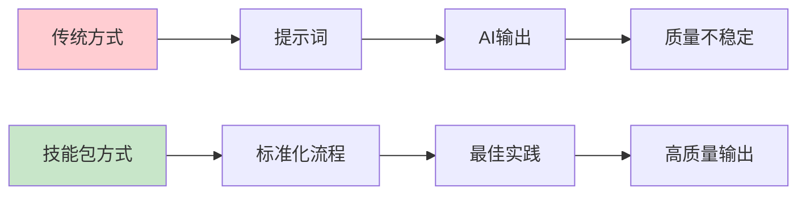
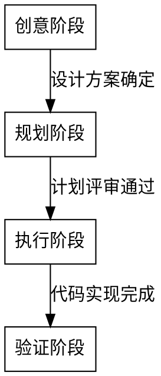

# 🎓 技能包设计模式：从理论到实践

> **掌握AI技能包的核心设计理念，构建可扩展、可协作的技能生态系统**

## 课程简介

本课程深入剖析现代AI技能包的设计理念、架构模式和最佳实践。通过解析 Superpowers 和 Gstack 两大技能包的实际实现，你将学会如何设计高质量、可复用的技能系统。

### 你将学到

- ✅ 技能包生态系统的核心设计理念
- ✅ 8种经典设计模式在技能包中的应用
- ✅ 从概念到源码的完整实现路径
- ✅ 如何设计自己的技能包生态系统

### 适合人群

- 有经验的开发者，希望深入理解AI工具的设计原理
- 技能包开发者，想要构建自己的技能生态系统
- 架构师，需要设计可扩展的AI工具链

### 前置知识

- 基本的编程经验（任何语言）
- 对AI工具有一定的使用经验
- 了解基本的软件设计模式（加分项）

---

## 第1章：技能包设计全景图

### 1.1 什么是技能包生态系统

#### 概念定义

**技能包（Skills）** 是为 AI 助手（如 Claude、GPT）设计的可复用能力模块。每个技能包封装了一组相关的功能、流程和最佳实践，使 AI 能够更好地完成特定任务。

**技能包生态系统** 则是多个技能包协同工作的架构体系，包含：

1. **技能定义** - 每个技能包的具体功能
2. **协作机制** - 技能包之间如何配合
3. **调度系统** - 如何选择和调用正确的技能
4. **质量保障** - 确保技能执行的可靠性

#### 为什么需要技能包生态系统？

**问题背景**：

在没有技能包之前，AI 助手面临以下挑战：

- ❌ **重复劳动** - 相似任务需要重复说明需求
- ❌ **质量不稳定** - 输出质量依赖于提示词的质量
- ❌ **流程缺失** - 缺乏标准化的工作流程
- ❌ **难以复用** - 最佳实践无法有效传播

**技能包的价值**：



**实际案例对比**：

| 维度 | 传统提示词方式 | 技能包方式 |
|------|---------------|-----------|
| 学习成本 | 每次都要详细说明 | 学习一次，终身受益 |
| 执行一致性 | 高度依赖提示词质量 | 标准化流程保证一致性 |
| 可维护性 | 分散在各处 | 集中管理，易于更新 |
| 复用性 | 难以复用 | 模块化设计，高度复用 |
| 团队协作 | 难以共享最佳实践 | 统一标准，知识沉淀 |

#### 技能包的核心要素

一个完整的技能包包含：

1. **YAML Frontmatter** - 元数据和触发条件
   ```yaml
   ---
   name: skill-name
   description: "技能描述"
   TRIGGER when: [触发场景]
   ---
   ```

2. **核心指令** - Markdown 格式的技能内容
   - 任务描述
   - 执行步骤
   - 质量标准
   - 注意事项

3. **工具依赖** - 需要的外部工具
   - 文件操作
   - 网络请求
   - 数据库访问

4. **协作接口** - 与其他技能包的协作方式
   - 前置依赖
   - 后置动作
   - 互斥规则

---

### 1.2 技能包协作架构总览

#### 五层架构设计

现代技能包生态系统采用分层架构，每层职责明确：

```
┌─────────────────────────────────────────────────────────────┐
│                    技能包协作架构                              │
├─────────────────────────────────────────────────────────────┤
│                                                               │
│  【入口层 Entry Skills】                                      │
│   └─ using-superpowers → 判断调用哪个流程技能                 │
│                                                               │
│  【流程层 Process Skills】                                    │
│   ├─ 创意类：brainstorming → first-principles                │
│   ├─ 规划类：writing-plans → mvp-first                       │
│   ├─ 执行类：executing-plans → tdd + systematic-debugging    │
│   └─ 验证类：verification → requesting-code-review           │
│                                                               │
│  【工具层 Tool Skills】                                       │
│   ├─ 浏览器：browse (替代 Chrome MCP)                        │
│   ├─ 数据库：mysql-query                                     │
│   └─ Git：using-git-worktrees                                │
│                                                               │
│  【收尾层 Completion Skills】                                 │
│   ├─ finishing-a-development-branch → PR/合并决策            │
│   ├─ land-and-deploy → 部署监控                              │
│   └─ document-release → 文档更新                             │
│                                                               │
│  【守护层 Guardian Skills】                                   │
│   ├─ careful → 危险操作警告                                  │
│   ├─ freeze → 目录限制                                       │
│   └─ guard → 完整安全模式                                    │
│                                                               │
└─────────────────────────────────────────────────────────────┘
```

#### 各层职责详解

**1. 入口层（Entry Layer）**

**职责**：统一调度中心，决定调用哪个技能

**设计理念**：
- 单一入口点，避免混乱
- 智能路由，自动判断任务类型
- 提供全局视角，确保流程连贯

**核心技能**：
- `using-superpowers` - 超级技能的入口守门人

**为什么需要入口层？**
- ✅ 统一管理，避免技能冲突
- ✅ 降低认知负担，用户无需记忆所有技能
- ✅ 便于监控和调试整个流程

**案例**：
```
用户请求: "帮我开发一个新功能"

using-superpowers 分析：
  → 是创意任务
  → 调用 brainstorming
  → brainstorming 完成后
  → 自动调用 writing-plans
```

**2. 流程层（Process Layer）**

**职责**：定义任务执行的标准流程

**设计理念**：
- 分阶段处理复杂任务
- 每个阶段专注一件事
- 阶段间有清晰的交接标准

**四大类别**：

| 类别 | 核心技能 | 目的 |
|------|---------|------|
| 创意类 | brainstorming, first-principles | 探索方案，突破思维定式 |
| 规划类 | writing-plans, mvp-first | 制定计划，确保可行性 |
| 执行类 | executing-plans, tdd, systematic-debugging | 落地实施，保证质量 |
| 验证类 | verification, requesting-code-review | 确认结果，持续改进 |

**流程编排示例**：



**3. 工具层（Tool Layer）**

**职责**：提供具体的技术工具和操作能力

**设计理念**：
- 专注单一职责
- 高度可复用
- 与业务逻辑解耦

**核心技能分类**：

| 工具类别 | 代表技能 | 使用场景 |
|---------|---------|---------|
| 浏览器自动化 | browse, playwright | 网页测试、数据抓取 |
| 数据库操作 | mysql-query | 数据查询、分析 |
| 版本控制 | using-git-worktrees | 并行开发、分支管理 |
| 文件操作 | planning-with-files | 文档管理、任务追踪 |

**工具层的重要性**：
- ✅ 避免重复造轮子
- ✅ 统一工具使用方式
- ✅ 便于维护和升级

**案例：browse 技能的应用**：

```markdown
# 当需要测试网页时
User: "测试一下登录功能是否正常"

using-superpowers → browse
browse 执行：
  1. 打开浏览器
  2. 导航到登录页面
  3. 填写用户名和密码
  4. 点击登录按钮
  5. 验证是否登录成功
  6. 生成测试报告
```

**4. 收尾层（Completion Layer）**

**职责**：完成最后的集成、部署和文档工作

**设计理念**：
- 确保工作完整闭环
- 知识沉淀和传承
- 自动化部署和监控

**核心技能**：

```
finishing-a-development-branch
  ├─ 判断：是否创建新 PR？
  ├─ 判断：合并到哪个分支？
  └─ 动作：创建 PR 或直接合并

land-and-deploy
  ├─ 合并代码
  ├─ 触发 CI/CD
  ├─ 监控部署状态
  └─ 验证生产环境

document-release
  ├─ 更新 README
  ├─ 更新 CHANGELOG
  └─ 同步文档网站
```

**为什么需要收尾层？**
- ✅ 防止遗漏重要步骤
- ✅ 确保知识沉淀
- ✅ 自动化部署流程

**实际案例**：

```bash
# 开发完成后的自动化流程
finishing-a-development-branch
  ↓ 创建 PR
requesting-code-review
  ↓ 代码审查通过
land-and-deploy
  ↓ 合并并部署
canary
  ↓ 生产环境监控
document-release
  ↓ 更新文档
✅ 完整闭环
```

**5. 守护层（Guardian Layer）**

**职责**：保护系统安全，防止危险操作

**设计理念**：
- 防御性编程
- 分级保护
- 明确警告

**三级防护体系**：

| 等级 | 技能 | 保护范围 | 示例 |
|------|------|---------|------|
| 轻量级 | careful | 警告危险操作 | `rm -rf`, `DROP TABLE` |
| 中量级 | freeze | 限制编辑目录 | 只允许编辑 `/src/components/` |
| 重量级 | guard | 完整保护模式 | careful + freeze 组合 |

**守护层的工作原理**：

```
用户操作: rm -rf /

careful 检测到危险操作
  ↓
弹出警告：
  "⚠️ 这是一个危险操作！
   即将删除根目录所有文件。
   确定要继续吗？"

用户确认: 否
  ↓
操作被阻止 ✅
```

**守护层的价值**：
- ✅ 防止误操作
- ✅ 保护重要数据
- ✅ 提供撤销机会

#### 层级间的协作规则

**规则1：单向依赖**

```
入口层 → 流程层 → 工具层
                 ↓
            守护层（可选，任何时候都可触发）
                 ↓
               收尾层
```

**规则2：职责分离**

- 入口层只负责路由，不实现具体逻辑
- 流程层编排流程，调用工具层执行
- 工具层专注单一功能，不关心业务
- 守护层独立存在，可被任何层调用
- 收尾层确保闭环，不参与前期开发

**规则3：强制与可选**

| 类型 | 技能 | 说明 |
|------|------|------|
| 强制 | brainstorming, tdd, verification | 必须执行，保证质量 |
| 可选 | careful, freeze, design-review | 根据需要启用 |

---

### 1.3 设计理念：职责分离与协作编排

#### 核心设计理念

现代技能包生态系统遵循两大核心设计理念：

1. **职责分离（Separation of Concerns）**
2. **协作编排（Orchestration）**

#### 职责分离原则

**定义**：每个技能只做一件事，做好一件事

**为什么重要？**
- ✅ 易于理解和维护
- ✅ 降低耦合度
- ✅ 提高可测试性
- ✅ 便于复用

**反面案例**：

```markdown
# 糟糕的设计：一个技能包做所有事情

name: all-in-one-development
description: "完成整个开发流程"

这个技能包要：
1. 需求分析
2. 架构设计
3. 编写代码
4. 运行测试
5. 部署上线
6. 更新文档

问题：
- ❌ 职责过多，难以维护
- ❌ 无法单独使用某个环节
- ❌ 质量难以控制
- ❌ 与其他技能冲突
```

**正面案例**：

```markdown
# 好的设计：职责分离

brainstorming        → 只负责探索方案
writing-plans        → 只负责制定计划
executing-plans      → 只负责执行计划
tdd                  → 只负责测试驱动开发
verification         → 只负责验证结果

优势：
- ✅ 每个技能清晰明确
- ✅ 可独立使用或组合
- ✅ 易于维护和测试
- ✅ 高度可复用
```

**职责分离的实施方法**：

1. **识别单一职责**
   - 问自己：这个技能要做什么？
   - 如果答案包含"和"、"以及"，说明职责过多

2. **定义清晰的边界**
   - 明确输入是什么
   - 明确输出是什么
   - 明确不做什么

3. **建立接口规范**
   - 如何调用这个技能
   - 这个技能如何调用其他技能
   - 数据如何传递

**案例：verification 技能的职责定义**：

```yaml
---
name: verification-before-completion
description: "在声称工作完成前验证目标是否达成"
---

职责：
  - 验证代码是否通过测试
  - 验证是否满足原始需求
  - 验证文档是否更新

不负责：
  - 修复代码（这是 systematic-debugging 的职责）
  - 编写测试（这是 tdd 的职责）
  - 代码审查（这是 requesting-code-review 的职责）

输入：
  - 目标文件路径
  - AI 自评完成情况

输出：
  - 验证结果（通过/失败）
  - 缺失项列表

调用者：
  - finishing-a-development-branch

被调用：
  - 无（末端技能）
```

#### 协作编排原则

**定义**：多个技能协同工作，形成完整的工作流

**为什么需要编排？**
- ✅ 自动化复杂流程
- ✅ 减少人工干预
- ✅ 确保流程一致性
- ✅ 提高效率

**编排的三种模式**：

**模式1：串行编排（Sequential Orchestration）**

```
任务 A → 任务 B → 任务 C → 任务 D

适用场景：
- 有严格的依赖关系
- 后一个任务依赖前一个任务的输出

示例：
brainstorming → writing-plans → executing-plans → verification
```

**模式2：并行编排（Parallel Orchestration）**

```
       ┌─→ 任务 A ─┐
开始 ──┤           ├──→ 汇总结果
       └─→ 任务 B ─┘

适用场景：
- 任务之间相互独立
- 可以同时执行

示例：
dispatching-parallel-agents
  ├─→ Agent 1: 开发前端
  ├─→ Agent 2: 开发后端
  └─→ Agent 3: 编写测试
      ↓
    结果汇总
```

**模式3：条件编排（Conditional Orchestration）**

```
任务 A
  ↓
判断条件？
  ├─ 是 → 任务 B
  └─ 否 → 任务 C

适用场景：
- 需要根据中间结果决定下一步
- 动态调整流程

示例：
executing-plans
  ↓
测试通过？
  ├─ 是 → verification
  └─ 否 → systematic-debugging → 返回 tdd
```

**编排的实现方式**：

1. **链式调用（Chain Invocation）**

```markdown
# brainstorming 技能内部

完成任务后：

**Next Steps**:
- Call /writing-plans to create implementation plan
- Then proceed to /executing-plans
```

2. **显式编排（Explicit Orchestration）**

```markdown
# writing-plans 技能

执行步骤：
1. Read requirements
2. IF 需要技术调研:
     Call /browse (gstack)
3. IF 需要设计决策:
     Call /design-consultation (gstack)
4. Write plan
5. IF 是 CEO 关注的项目:
     Call /plan-ceo-review (gstack)
   ELIF 是技术项目:
     Call /plan-eng-review (gstack)
```

3. **智能路由（Smart Routing）**

```markdown
# using-superpowers 技能

IF 创意任务:
  → brainstorming (superpowers)
  → plan-design-review (gstack)

IF 开发任务:
  → writing-plans (superpowers)
  → plan-eng-review (gstack)
  → executing-plans (superpowers)
  → tdd (superpowers)
  → browse (gstack, 需要浏览器时)

IF 质量任务:
  → verification (superpowers)
  → review (gstack)
  → qa (gstack)
  → design-review (gstack)
```

#### 职责分离与协作编排的平衡

**过度分离的问题**：
- 技能过于碎片化
- 编排复杂度爆炸
- 理解成本增加

**过度编排的问题**：
- 单个技能过于庞大
- 难以维护和测试
- 失去灵活性

**平衡原则**：

```
技能粒度 = f(复杂度, 复用性, 独立性)

高复用 + 高独立 = 细粒度技能
低复用 + 高耦合 = 粗粒度技能

示例：
- verification: 高复用，高独立 → 细粒度，单一职责
- land-and-deploy: 低复用，高耦合 → 粗粒度，包含多个步骤
```

---

### 1.4 Superpowers vs Gstack 定位对比

#### 两大技能包概览

| 维度 | Superpowers | Gstack |
|------|------------|--------|
| **定位** | 软件工程方法论 | Web 开发工具链 |
| **核心价值** | 流程规范化、质量保障 | 提供实用工具、自动化操作 |
| **技能类型** | 流程控制、质量保障 | 浏览器自动化、质量检查、部署监控 |
| **维护者** | 社区驱动 | Garry Tan |
| **GitHub** | superpower/skills | garrytan/gstack |

#### 职责分工对比

```
┌──────────────────┬──────────────────────────────┬─────────────────────────┐
│ 层级             │ Superpowers                  │ Gstack                  │
├──────────────────┼──────────────────────────────┼─────────────────────────┤
│ 入口             │ using-superpowers            │ -                       │
├──────────────────┼──────────────────────────────┼─────────────────────────┤
│ 流程             │ brainstorming, writing-plans │ plan-*-review           │
├──────────────────┼──────────────────────────────┼─────────────────────────┤
│ 执行             │ tdd, systematic-debugging    │ browse, qa              │
├──────────────────┼──────────────────────────────┼─────────────────────────┤
│ 验证             │ verification                 │ review, benchmark       │
├──────────────────┼──────────────────────────────┼─────────────────────────┤
│ 部署             │ -                            │ land-and-deploy, canary │
├──────────────────┼──────────────────────────────┼─────────────────────────┤
│ 收尾             │ finishing-branch             │ document-release        │
└──────────────────┴──────────────────────────────┴─────────────────────────┘
```

#### 设计理念差异

**Superpowers：方法论驱动**

核心理念：**定义 HOW（如何做事）**

```markdown
# Superpowers 的设计哲学

1. 标准化流程
   - 创意 → 规划 → 执行 → 验证
   - 每个阶段都有明确的输入输出

2. 质量保障
   - TDD 强制测试先行
   - Verification 强制结果验证
   - Code Review 强制审查

3. 最佳实践
   - 集成了业界最佳实践
   - 减少决策负担
   - 保证最低质量标准
```

**Gstack：工具链驱动**

核心理念：**提供 WHAT（用什么工具）**

```markdown
# Gstack 的设计哲学

1. 实用工具
   - browse: 浏览器自动化
   - qa: 质量检查
   - land-and-deploy: 部署工具

2. 技术栈集成
   - 支持 Vercel、Netlify、Fly.io
   - 集成 GitHub Actions
   - 监控和报警

3. 自动化操作
   - 减少重复劳动
   - 提高效率
   - 降低错误率
```

#### 技能重叠与互补

**重叠区域**：

| 功能 | Superpowers | Gstack | 选择建议 |
|------|------------|--------|---------|
| 质量检查 | verification | qa | Superpowers: 流程验证<br>Gstack: 具体测试 |
| 代码审查 | requesting-code-review | review | Superpowers: 流程管理<br>Gstack: 具体工具 |
| 规划审查 | - | plan-*-review | Gstack 更专业 |

**互补区域**：

```
Superpowers 缺失 → Gstack 补充：
- 浏览器自动化 (browse)
- 部署工具 (land-and-deploy)
- 生产监控 (canary)
- 性能基准测试 (benchmark)

Gstack 缺失 → Superpowers 补充：
- 创意探索 (brainstorming)
- 流程编排 (using-superpowers)
- 分支决策 (finishing-branch)
- 并行执行 (dispatching-parallel-agents)
```

#### 协作模式

**模式1：Superpowers 主导**

```
场景：新功能开发

using-superpowers (Superpowers)
  ↓
brainstorming (Superpowers)
  ↓
writing-plans (Superpowers)
  ↓ 需要设计审查
plan-design-review (Gstack)
  ↓
executing-plans (Superpowers)
  ↓ 需要浏览器测试
browse (Gstack)
  ↓
verification (Superpowers)
  ↓
requesting-code-review (Superpowers)
  ↓ 需要具体测试工具
qa (Gstack)
```

**模式2：Gstack 主导**

```
场景：部署监控

land-and-deploy (Gstack)
  ↓
canary (Gstack)
  ↓ 发现问题
systematic-debugging (Superpowers)
  ↓ 修复完成
verification (Superpowers)
  ↓
document-release (Gstack)
```

**模式3：并行协作**

```
场景：多个独立功能并行开发

dispatching-parallel-agents (Superpowers)
  ├─→ Agent 1: writing-plans + executing (Superpowers)
  ├─→ Agent 2: tdd + browse (Superpowers + Gstack)
  └─→ Agent 3: qa + design-review (Gstack)
```

#### 选择策略

**何时选择 Superpowers？**

- ✅ 需要标准化开发流程
- ✅ 团队协作，需要质量保障
- ✅ 复杂项目，需要方法论指导
- ✅ 新功能开发，从创意到实现

**何时选择 Gstack？**

- ✅ 需要具体的开发工具
- ✅ 部署和监控需求
- ✅ 浏览器自动化测试
- ✅ 性能基准测试

**何时组合使用？**

- ✅ 大型项目开发
- ✅ 需要完整的开发到部署流程
- ✅ 既需要流程指导，又需要工具支撑

#### 实际案例：完整的开发到部署流程

```
【需求】开发一个用户登录功能

1. 创意探索 (Superpowers)
   using-superpowers → brainstorming
   探索方案：JWT vs Session, OAuth 集成等

2. 方案审查 (Gstack)
   plan-design-review
   设计专家审查方案可行性

3. 详细规划 (Superpowers)
   writing-plans
   制定实施计划，分解任务

4. 代码实现 (Superpowers + Gstack)
   executing-plans → tdd
   需要 API 测试时 → browse (Gstack)

5. 质量验证 (Superpowers + Gstack)
   verification → requesting-code-review
   具体测试 → qa (Gstack)
   性能测试 → benchmark (Gstack)

6. 部署上线 (Gstack)
   land-and-deploy → canary

7. 文档更新 (Gstack)
   document-release
```

#### 对比总结

| 对比维度 | Superpowers | Gstack | 最佳实践 |
|---------|------------|--------|---------|
| **核心价值** | 流程规范化 | 工具实用化 | 组合使用 |
| **技能数量** | ~15个核心技能 | ~20个工具技能 | 按需选择 |
| **学习曲线** | 中等（理解方法论） | 低（即插即用） | 先工具后流程 |
| **适用场景** | 复杂项目开发 | 具体技术任务 | 配合使用 |
| **团队规模** | 中大型团队 | 任何规模 | 根据团队选择 |
| **维护成本** | 中等（流程更新） | 低（工具升级） | 定期维护 |

---

## 本章小结

本章我们建立了技能包生态系统的全局视野：

1. **技能包的定义与价值** - 从传统提示词到标准化技能包的演进
2. **五层架构设计** - 入口、流程、工具、收尾、守护层的协作机制
3. **核心设计理念** - 职责分离与协作编排的平衡
4. **两大技能包对比** - Superpowers 的方法论 vs Gstack 的工具链

下一章，我们将深入第一个设计模式：**入口模式**，探索如何设计统一调度中心。

---

## 延伸阅读

- [Superpowers GitHub](https://github.com/superpower/skills)
- [Gstack GitHub](https://github.com/garrytan/gstack)
- [Claude Skills 官方文档](https://docs.anthropic.com/claude/docs/skills)
- [软件设计模式：可复用面向对象软件的基础](https://book.douban.com/subject/1052241/)

## 练习题

1. **思考题**：在你当前的项目中，哪些任务适合封装成技能包？
2. **实践题**：尝试设计一个简单的技能包，定义它的职责和边界。
3. **讨论题**：Superpowers 和 Gstack 的设计理念，你更倾向于哪种？为什么？

---

**下一章预告**：第2章将深入探讨入口模式，解析 `using-superpowers` 如何实现智能路由。