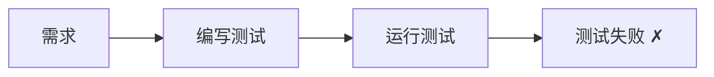
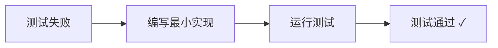
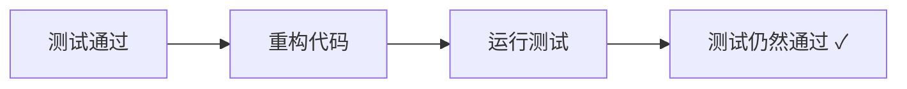
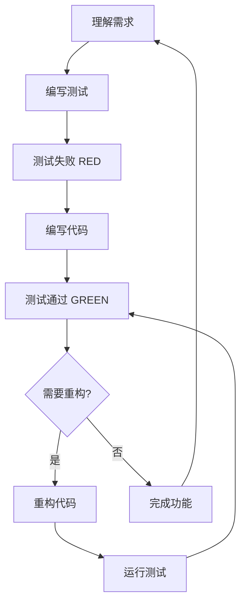

# TDD 工作流 - 测试驱动开发

> **来源**: Everything Claude Code - `skills/tdd-workflow/`
> **外部链接**: [ECC 原始位置](https://github.com/affaan-m/everything-claude-code/tree/main/skills/tdd-workflow/)

## 🎯 什么是 TDD?

测试驱动开发（Test-Driven Development，TDD）是一种软件开发方法，要求在编写功能代码之前先编写测试。TDD 的核心是 **RED-GREEN-REFACTOR** 循环。

## 📚 TDD 核心流程

### 1. RED - 编写失败的测试



**要点**：
- 理解需求，定义接口
- 编写测试用例，覆盖预期行为
- 运行测试，确认失败（因为功能还未实现）

**示例**（TypeScript）：

```typescript
// user.test.ts
import { createUser } from './user';

describe('createUser', () => {
  it('should create a user with valid email', () => {
    const user = createUser('test@example.com', 'Test User');
    expect(user).toBeDefined();
    expect(user.email).toBe('test@example.com');
    expect(user.name).toBe('Test User');
  });

  it('should throw error for invalid email', () => {
    expect(() => createUser('invalid-email', 'Test')).toThrow('Invalid email');
  });
});
```

### 2. GREEN - 编写最小代码使测试通过



**要点**：
- 编写最少的代码，使测试通过
- 不要过度设计，先让测试通过
- 可以使用简单的实现（硬编码、简单逻辑）

**示例**：

```typescript
// user.ts
export function createUser(email: string, name: string) {
  // 简单验证
  if (!email.includes('@')) {
    throw new Error('Invalid email');
  }

  return {
    email,
    name,
    id: Date.now().toString()
  };
}
```

### 3. REFACTOR - 重构代码



**要点**：
- 优化代码结构
- 消除重复代码
- 提高可读性和可维护性
- 重构时确保测试仍然通过

**重构后示例**：

```typescript
// user.ts
interface User {
  id: string;
  email: string;
  name: string;
  createdAt: Date;
}

function validateEmail(email: string): boolean {
  const emailRegex = /^[^\s@]+@[^\s@]+\.[^\s@]+$/;
  return emailRegex.test(email);
}

export function createUser(email: string, name: string): User {
  if (!validateEmail(email)) {
    throw new Error('Invalid email format');
  }

  if (!name || name.trim().length === 0) {
    throw new Error('Name is required');
  }

  return {
    id: crypto.randomUUID(),
    email: email.toLowerCase(),
    name: name.trim(),
    createdAt: new Date()
  };
}
```

## 🔄 TDD 完整循环



## 📊 TDD 的好处

### 1. **提高代码质量**
- 提前发现 Bug
- 确保代码可测试
- 减少回归问题

### 2. **更好的设计**
- 促使你思考接口设计
- 降低耦合度
- 提高模块化程度

### 3. **文档化**
- 测试即文档
- 展示预期行为
- 帮助新成员理解代码

### 4. **重构信心**
- 有测试覆盖，重构更安全
- 快速发现问题
- 保持代码健康

## 🎓 TDD 最佳实践

### 1. **测试覆盖率要求**

ECC 推荐：
- **最低覆盖率**: 80%
- **核心业务逻辑**: 90%+
- **关键路径**: 100%

```bash
# 运行覆盖率检查
npm test -- --coverage

# 查看覆盖率报告
open coverage/lcov-report/index.html
```

### 2. **测试命名规范**

```typescript
// 好的命名
describe('UserService', () => {
  describe('createUser', () => {
    it('should create user with valid data', () => {});
    it('should throw error for duplicate email', () => {});
    it('should sanitize email to lowercase', () => {});
  });
});

// 不好的命名
describe('test1', () => {
  it('works', () => {});
});
```

### 3. **测试隔离**

每个测试应该独立，不依赖其他测试：

```typescript
// 好的做法
beforeEach(() => {
  // 初始化测试数据
  database.clear();
});

afterEach(() => {
  // 清理测试数据
  database.clear();
});
```

### 4. **测试金字塔**

```
        /\
       /  \  E2E Tests (少量)
      /----\
     /      \ Integration Tests (适量)
    /--------\
   /          \ Unit Tests (大量)
  /____________\
```

## 🚀 快速开始 TDD

### 步骤 1: 创建测试文件

```bash
# 创建测试文件
touch src/user.test.ts
```

### 步骤 2: 编写第一个测试

```typescript
import { add } from './math';

describe('add function', () => {
  it('should add two numbers correctly', () => {
    expect(add(2, 3)).toBe(5);
  });
});
```

### 步骤 3: 运行测试（应该失败）

```bash
npm test

# 输出: FAIL - Cannot find module './math'
```

### 步骤 4: 实现功能

```typescript
// math.ts
export function add(a: number, b: number): number {
  return a + b;
}
```

### 步骤 5: 运行测试（应该通过）

```bash
npm test

# 输出: PASS - add function should add two numbers correctly
```

### 步骤 6: 重构（如需要）

```typescript
// math.ts - 添加类型检查和错误处理
export function add(a: number, b: number): number {
  if (typeof a !== 'number' || typeof b !== 'number') {
    throw new TypeError('Arguments must be numbers');
  }
  return a + b;
}
```

### 步骤 7: 添加更多测试

```typescript
describe('add function', () => {
  it('should add two positive numbers', () => {
    expect(add(2, 3)).toBe(5);
  });

  it('should add negative numbers', () => {
    expect(add(-2, -3)).toBe(-5);
  });

  it('should throw error for non-numbers', () => {
    expect(() => add('2' as any, 3)).toThrow(TypeError);
  });
});
```

## 📖 进阶学习

### 相关技能包

- [验证循环](../verification-loop/) - 持续验证机制
- [编码标准](../coding-standards/) - 通用编码规范
- [端到端测试](../e2e-testing/) - Playwright E2E 测试

### ECC 完整 TDD 资源

想要深入学习 TDD，请访问 ECC 完整资源：

- **ECC TDD Workflow**: [查看完整技能包](https://github.com/affaan-m/everything-claude-code/tree/main/skills/tdd-workflow/)
- **ECC TDD 命令**: 使用 `/tdd` 命令自动执行 TDD 流程

## 🔗 外部资源

- [Everything Claude Code](https://github.com/affaan-m/everything-claude-code) - 完整的 Claude Code 性能优化系统
- [ECC 精选资源](../../resources/external/everything-claude-code/) - Anything-AI 的 ECC 精选内容

---

**下一步**: [编码标准](../coding-standards/) | [返回技能包目录](../)