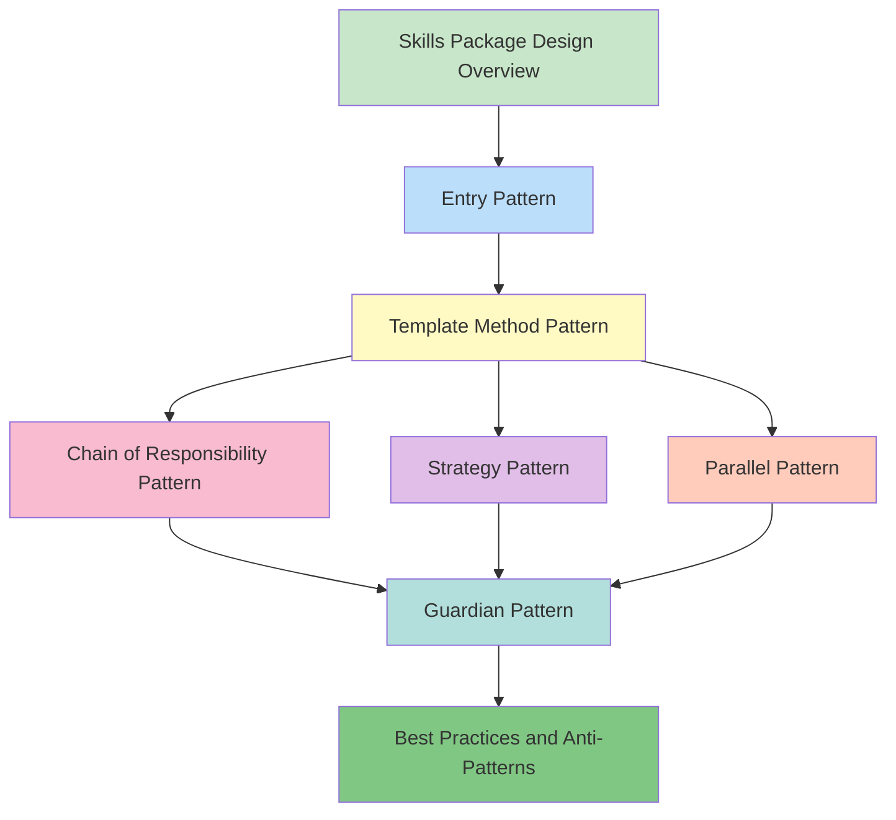

# 📚 Skills Package Design Patterns: From Theory to Practice

> **Master the core design principles of AI skills packages and build scalable, collaborative skill ecosystems**

## Course Introduction

This course provides an in-depth analysis of design principles, architectural patterns, and best practices for modern AI skills packages. By examining real implementations from the Superpowers and Gstack skill packages, you'll learn how to design high-quality, reusable skill systems.

### Target Audience

- **Experienced Developers** - Those who want to deeply understand AI tool design principles
- **Skill Package Developers** - Those who want to build their own skill ecosystems
- **Architects** - Those who need to design scalable AI toolchains

### Learning Path

```
Chapter 1: Skills Package Design Overview
  ↓
Chapter 2: Entry Pattern - Unified Dispatch Center
  ↓
Chapter 3: Template Method Pattern - Process Orchestration
  ↓
Chapter 4: Chain of Responsibility Pattern - Quality Assurance
  ↓
Chapter 5: Strategy Pattern - Flexible Decision Making
  ↓
Chapter 6: Parallel Pattern - Efficiency Maximization
  ↓
Chapter 7: Guardian Pattern - Security Boundaries
  ↓
Chapter 8: Best Practices and Anti-Patterns
```

---

## 📖 Course Chapters

### Chapter 1: Skills Package Design Overview

**⏱️ Estimated Time**: 45 minutes
**🎯 Difficulty**: Beginner
**📋 Content Overview**:
- What is a skills package ecosystem
- Five-layer architecture design (Entry, Process, Tools, Wrap-up, Guardian)
- Principle of responsibility separation and collaborative orchestration
- Superpowers vs Gstack positioning comparison

**🔗 Quick Links**:
- [中文版](/5-skills/course/skills-package-design-patterns.md)
- [English Version](./skills-package-design-patterns.md)

**✅ Learning Objectives**:
- Understand the value of skills package ecosystems
- Master the design principles of the five-layer architecture
- Learn the positioning differences between Superpowers and Gstack

---

### Chapter 2: Entry Pattern - Unified Dispatch Center

**⏱️ Estimated Time**: 60 minutes
**🎯 Difficulty**: Intermediate
**📋 Content Overview**:
- Why we need a unified entry point
- Routing logic of `using-superpowers`
- Three trigger mechanisms (description-triggered, explicit invocation, chain-awakening)
- How to design your own entry skill

**🔗 Quick Links**:
- [中文版](/5-skills/course/chapter-02-entry-pattern.md)
- [English Version](./chapter-02-entry-pattern.md)

**✅ Learning Objectives**:
- Master the design principles of the entry pattern
- Understand the differences between three trigger mechanisms
- Be able to design your own entry skill

---

### Chapter 3: Template Method Pattern - The Art of Process Orchestration

**⏱️ Estimated Time**: 75 minutes
**🎯 Difficulty**: Intermediate
**📋 Content Overview**:
- Design philosophy of fixed skeleton, variable details
- Five-step skeleton design of `writing-plans`
- Skill invocation mechanism (browse, design-consultation, plan-*-review)
- Comparison of Superpowers process chain vs Gstack tool invocation

**🔗 Quick Links**:
- [中文版](/5-skills/course/chapter-03-template-method-pattern.md)
- [English Version](./chapter-03-template-method-pattern.md)

**✅ Learning Objectives**:
- Master the application of the template method pattern
- Understand how to preserve flexibility within fixed processes
- Be able to design your own template method skill

---

### Chapter 4: Chain of Responsibility Pattern - Quality Assurance Chain

**⏱️ Estimated Time**: 70 minutes
**🎯 Difficulty**: Intermediate
**📋 Content Overview**:
- Layer-by-layer quality assurance mechanism
- Complete chain of verification → review → qa → design-review
- Responsibility boundary design of each node
- Comparison of Superpowers verification chain vs Gstack quality chain

**🔗 Quick Links**:
- [中文版](/5-skills/course/chapter-04-chain-of-responsibility.md)
- [English Version](./chapter-04-chain-of-responsibility.md)

**✅ Learning Objectives**:
- Master the application of the chain of responsibility pattern
- Understand the design principles of quality assurance chains
- Be able to design your own chain of responsibility skill

---

### Chapter 5: Strategy Pattern - Flexible Decision Mechanism

**⏱️ Estimated Time**: 65 minutes
**🎯 Difficulty**: Intermediate
**📋 Content Overview**:
- Selecting different strategies based on scenarios
- Three merge strategies of `finishing-branch`
- Strategy judgment mechanism (branch type, dependencies, urgency)
- Comparison of Superpowers branch strategy vs traditional Git workflows

**🔗 Quick Links**:
- [中文版](/5-skills/course/chapter-05-strategy-pattern.md)
- [English Version](./chapter-05-strategy-pattern.md)

**✅ Learning Objectives**:
- Master the application of the strategy pattern
- Understand how to design flexible decision mechanisms
- Be able to design your own strategy pattern skill

---

### Chapter 6: Parallel Pattern - Efficiency Maximization

**⏱️ Estimated Time**: 60 minutes
**🎯 Difficulty**: Advanced
**📋 Content Overview**:
- Parallel execution of independent tasks
- Implementation mechanism of `dispatching-parallel-agents`
- Task decomposition, agent scheduling, result aggregation
- Trade-offs between parallel vs sequential execution

**🔗 Quick Links**:
- [中文版](/5-skills/course/chapter-06-parallel-pattern.md)
- [English Version](./chapter-06-parallel-pattern.md)

**✅ Learning Objectives**:
- Master the application of the parallel pattern
- Understand how to identify parallelizable tasks
- Be able to design your own parallel pattern skill

---

### Chapter 7: Guardian Pattern - Security Boundary Design

**⏱️ Estimated Time**: 55 minutes
**🎯 Difficulty**: Intermediate
**📋 Content Overview**:
- Defensive programming philosophy
- Three-level protection: careful, freeze, guard
- Dangerous operation identification and interception
- Designing your own security guardian skill

**🔗 Quick Links**:
- [中文版](/5-skills/course/chapter-07-08-guardian-and-best-practices.md)
- [English Version](./chapter-07-08-guardian-and-best-practices.md)

**✅ Learning Objectives**:
- Master the design philosophy of the guardian pattern
- Understand the three-level protection mechanism
- Be able to design your own guardian skill

---

### Chapter 8: Best Practices and Anti-Patterns - Experience Summary

**⏱️ Estimated Time**: 50 minutes
**🎯 Difficulty**: Intermediate
**📋 Content Overview**:
- 8 core principles of skill design
- 10 common anti-patterns and how to avoid them
- How to design your own skills package ecosystem
- Future trends in skills package collaboration

**🔗 Quick Links**:
- [中文版](/5-skills/course/chapter-08-best-practices.md)
- [English Version](./chapter-08-best-practices.md)

**✅ Learning Objectives**:
- Master the core principles of skill design
- Identify and avoid common anti-patterns
- Be able to design a complete skills package ecosystem

---

## 🗺️ Recommended Learning Paths

### Path A: Quick Start (4 hours)

Suitable for: Limited time, want to quickly understand core concepts

1. **Chapter 1**: Skills Package Design Overview (45 minutes)
2. **Chapter 2**: Entry Pattern (60 minutes)
3. **Chapter 8**: Best Practices and Anti-Patterns (50 minutes)

**Outcome**: Establish overall concept, understand core patterns

---

### Path B: Deep Learning (8 hours)

Suitable for: Want systematic learning, deep understanding of each pattern

Study all 8 chapters in sequence

**Outcome**: Comprehensive mastery of skills package design, able to design your own skill systems

---

### Path C: Practice-Oriented (6 hours)

Suitable for: Have project requirements, want to learn while doing

1. **Chapter 1**: Skills Package Design Overview (45 minutes)
2. **Chapter 3**: Template Method Pattern (75 minutes)
3. **Chapter 4**: Chain of Responsibility Pattern (70 minutes)
4. **Chapter 5**: Strategy Pattern (65 minutes)
5. **Chapter 6**: Parallel Pattern (60 minutes)
6. **Chapter 8**: Best Practices and Anti-Patterns (50 minutes)

**Outcome**: Master the most commonly used patterns in practice

---

## 📊 Knowledge Graph



---

## 🎯 Design Patterns Quick Reference

| Pattern | Core Skill | Key Value | Use Case |
|---------|-----------|-----------|----------|
| Entry Pattern | using-superpowers | Unified dispatch, intelligent routing | Need to manage multiple skills uniformly |
| Template Method Pattern | writing-plans | Fixed skeleton, variable details | Standardized processes with flexibility |
| Chain of Responsibility Pattern | verification → review | Layer-by-layer gatekeeping, quality assurance | Tasks requiring multi-level verification |
| Strategy Pattern | finishing-branch | Flexible decision-making, dynamic selection | Choose different approaches based on scenarios |
| Parallel Pattern | dispatching-parallel-agents | Efficiency maximization, task parallelism | Independent tasks can execute simultaneously |
| Guardian Pattern | careful, freeze, guard | Security boundaries, tiered protection | Need to prevent misoperations |

---

## 💡 Learning Suggestions

### For Beginners

1. **Start from Chapter 1**, establish overall concepts
2. **Learn while practicing**, hands-on for each pattern
3. **Complete more exercises**, consolidate understanding
4. **Apply to real projects**, use what you've learned

### For Experienced Developers

1. **Can jump directly to patterns of interest**
2. **Focus on source code analysis sections**
3. **Compare different skill package implementations**
4. **Think about how to apply to your own projects**

### For Skill Package Developers

1. **Deeply learn implementation details of each pattern**
2. **Study Superpowers and Gstack source code**
3. **Design your own skills package ecosystem**
4. **Continuously iterate and optimize**

---

## 🔗 Related Resources

### Official Documentation

- [Claude Skills Official Docs](https://docs.anthropic.com/claude/docs/skills)
- [Superpowers GitHub](https://github.com/superpower/skills)
- [Gstack GitHub](https://github.com/garrytan/gstack)

### Recommended Books

- [Design Patterns: Elements of Reusable Object-Oriented Software](https://book.douban.com/subject/1052241/)
- [Clean Code](https://book.douban.com/subject/4199741/)
- [The Pragmatic Programmer](https://book.douban.com/subject/1152111/)

### Community Resources

- [awesome-claude-skills](https://github.com/ComposioHQ/awesome-claude-skills)
- [Claude Code Discord](https://discord.gg/anthropic)

---

## 📝 Exercises and Assignments

### Basic Exercises

1. **Concept Understanding**: Explain the core value of each pattern in your own words
2. **Pattern Recognition**: Analyze an existing skill package, identify the design patterns
3. **Comparative Analysis**: Compare the differences between two similar patterns (e.g., Chain of Responsibility vs Pipeline)

### Advanced Exercises

1. **Design Practice**: Design a skill package for your own workflow
2. **Code Implementation**: Implement a simple skill package prototype
3. **Performance Optimization**: Analyze performance bottlenecks in a skill package and propose optimization solutions

### Advanced Projects

1. **Skills Package Ecosystem**: Design a complete skills package ecosystem architecture
2. **Cross-Platform Skills**: Design a skill package that can be used across multiple AI platforms
3. **Intelligent Orchestration System**: Design an orchestration system that can automatically select skills

---

## 📈 Learning Progress Tracking

Use the following checklist to track your learning progress:

- [ ] Chapter 1: Skills Package Design Overview
  - [ ] Chinese Version
  - [ ] English Version
  - [ ] Exercises Completed

- [ ] Chapter 2: Entry Pattern
  - [ ] Chinese Version
  - [ ] English Version
  - [ ] Exercises Completed

- [ ] Chapter 3: Template Method Pattern
  - [ ] Chinese Version
  - [ ] English Version
  - [ ] Exercises Completed

- [ ] Chapter 4: Chain of Responsibility Pattern
  - [ ] Chinese Version
  - [ ] English Version
  - [ ] Exercises Completed

- [ ] Chapter 5: Strategy Pattern
  - [ ] Chinese Version
  - [ ] English Version
  - [ ] Exercises Completed

- [ ] Chapter 6: Parallel Pattern
  - [ ] Chinese Version
  - [ ] English Version
  - [ ] Exercises Completed

- [ ] Chapter 7: Guardian Pattern
  - [ ] Chinese Version
  - [ ] English Version
  - [ ] Exercises Completed

- [ ] Chapter 8: Best Practices and Anti-Patterns
  - [ ] Chinese Version
  - [ ] English Version
  - [ ] Exercises Completed

---

## 🎓 Completion Standards

Completing the following content qualifies as course completion:

1. ✅ Completed all 8 chapters
2. ✅ Understand the core concepts of each pattern
3. ✅ Completed 80% or more of exercises
4. ✅ Able to identify design patterns in skill packages
5. ✅ Able to design simple skill packages

---

## 🤝 Feedback and Contribution

### Issue Feedback

If you encounter problems during learning, you can:
- Ask in GitHub Issues
- Discuss in community forums
- Consult official documentation

### Content Contribution

If you find content errors or have improvement suggestions:
- Pull Requests are welcome
- Provide improvement suggestions
- Share your learning insights

---

## 📜 Changelog

- **2024-03-24**: Course launch, completed all 8 chapters in Chinese and English
- **Future Plans**:
  - Add video tutorials
  - Increase practical cases
  - Develop online practice platform

---

## 📄 License

This course content is licensed under [CC BY-NC-SA 4.0](https://creativecommons.org/licenses/by-nc-sa/4.0/).

---

**Start your learning journey!** 🚀

Remember: Practice leads to true knowledge, time is the only standard for testing truth. Use AI, but don't follow blindly. Dialectical unity, neither deifying nor demonizing.